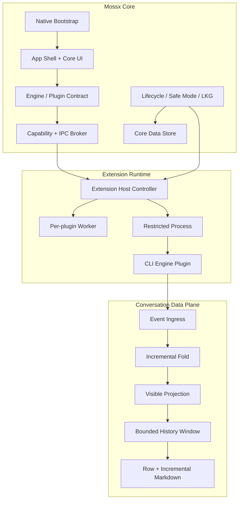
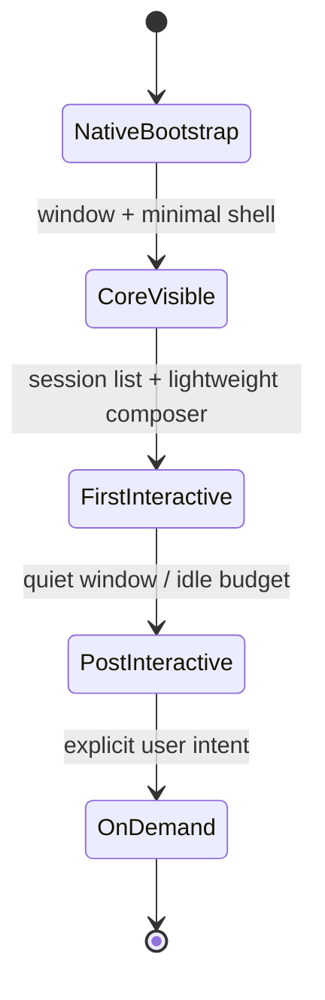

# 01 · Scope and System Map

> 主线入口：[Client Modernization](README.md)

## 1. 改善范围

本主线处理三个相互耦合的系统面：

### 1.1 Cold-start Reliability

- packaged native process 是否 crash、stack overflow、deadlock 或被 child process 拖住；
- WebView 创建、CSSOM、字体、缩放、bundle 与 hydration 是否阻塞首屏；
- engine/history/git/model/skill/catalog 等 source work 是否竞争启动资源；
- AppShell、Composer、Conversation Canvas 是否过早 full mount；
- watchdog、diagnostics、durable write 是否反向加剧卡顿。

### 1.2 Long-session Performance

- engine event 如何从 ingress 进入 store、projection 和 renderer；
- reasoning/toolOutput/text delta 是否扩大根状态更新；
- Markdown 是否每次全量重新解析；
- timeline 是否把全部历史变成常驻 DOM；
- grouping、projection、selector、persistence、compaction 是否随历史长度线性增长；
- session close / switch / plugin disable 后资源是否真正释放。

### 1.3 Plugin-era Performance Governance

- Extension Host、Worker、受限进程何时启动；
- manifest、lockfile、signature、Marketplace、Registry 如何退出冷启动链；
- plugin IPC、DOM、memory、CPU、storage migration 如何设预算；
- plugin failure 如何被隔离且不阻塞 Core first-interactive；
- Engine Plugin 如何做到 on-demand activation 和 session resource cleanup。

## 2. 不在本轮直接实施的内容

- 不直接编写 OpenSpec proposal；
- 不修改 runtime code、UI 或 build config；
- 不决定 Marketplace 的最终视觉；
- 不一次性迁移所有 CLI/Feature Plugin；
- 不把报告中的数值直接升级为 release SLO；
- 不以替换 state library、照搬 Cordis 或引入通用微内核框架作为默认解法。

上述内容在对应 Workstream 进入实施时单独决策。

## 3. Logical System Map

## 4. Ownership Boundary

| 层 | Core owns | Plugin owns | 禁止 |
|---|---|---|---|
| Bootstrap | window/process、safe mode、local lock、crash recovery | 无 | plugin 网络或代码阻塞 Core 启动 |
| Contract | versioned API、capability、schema、quota | declared contributions | engine-specific branch 回流 Core |
| Runtime | supervisor、broker、generation、kill switch | feature/engine execution | plugin 直接访问 Core table/global state |
| Data | canonical session identity、visible-window contract | plugin namespace、engine payload adapter | Core/Plugin 双 owner 长期双写 |
| UI | stable slots、Error Boundary、renderer budget | contribution implementation | plugin 无撤销句柄挂全局 listener |
| Update | signature、checkpoint、LKG、atomic switch | compatible migration | code 回退但数据不回退 |

## 5. Startup Phase Model

| Phase | 允许工作 | 默认禁止工作 |
|---|---|---|
| `native-bootstrap` | crash guard、window、local config、safe-mode decision | catalog scan、Marketplace、plugin process fan-out |
| `core-visible` | skeleton、local recent index、minimal route | full Composer、nonessential plugin UI |
| `first-interactive` | 会话选择、轻量输入、用户可操作恢复入口 | remote registry、全量历史扫描 |
| `post-interactive` | bounded background indexing、Extension Host、预热 | 无预算并发启动全部插件 |
| `on-demand` | CLI process、feature plugin、full history、heavy renderer | 与用户意图无关的 speculative work |

## 6. Data Growth Model

长会话成本必须按三个维度分别治理：

| 维度 | 变量 | 正确目标 |
|---|---|---|
| Durable history | `N_total` | 可持续增长，但不全部常驻 renderer |
| Loaded data window | `N_loaded` | bounded，可语义化向前加载 |
| Active live tail | `N_live` / bytes | small、增量更新、settle 后冻结 |

目标不是让所有操作都变成理论 O(1)，而是保证高频路径只与 active tail 或 visible rows 有关：

- delta ingress：`O(delta)`；
- current-node update：不依赖 `N_total`；
- visible projection：依赖 `N_loaded`，且可增量；
- prepend older：保持 scroll anchor；
- persistence：append/suffix update，不重写全量历史；
- settle：一次性完成低频昂贵工作。

## 7. Success Criteria

### Reliability

- packaged Windows cold launch 不再出现 stack overflow/crash loop；
- macOS/Windows hang 能区分 native、WebView、renderer 与 diagnostics；
- Safe Mode 能绕过非核心插件和危险 startup state；
- first-interactive 与 background activation 解耦。

### Performance

- 高频 delta 不触发随全历史增长的根级工作；
- timeline DOM 与 loaded data 有明确上限；
- Markdown active tail 只重算必要 block；
- plugin activation 与 IPC 有独立 budget 和 attribution。

### Governance

- 每项结论有 current evidence；
- 每项变更有 OpenSpec、rollback 和跨平台 matrix；
- historical snapshot 不再被误当 current baseline；
- 新插件不能绕过 performance contract。

## 8. Architecture Non-goals / Anti-patterns

以下方案不能作为主线替代品：

- 再加一层 debounce/throttle 后宣布解决；
- 把 `VISIBLE_MESSAGE_WINDOW` 从一个大常量改成另一个大常量；
- 只用 React.memo 掩盖上游全量 projection；
- 只启用 `content-visibility` 而保留无限 DOM；
- 启动时全量验证每个已安装插件 artifact；
- Marketplace unavailable 导致 Core startup 等待；
- 对所有平台使用同一 native/WebView workaround；
- watchdog 为判断 blank screen 主动触发布局和同步磁盘写；
- 只看开发模式或 browser reload，不测 packaged cold launch。
