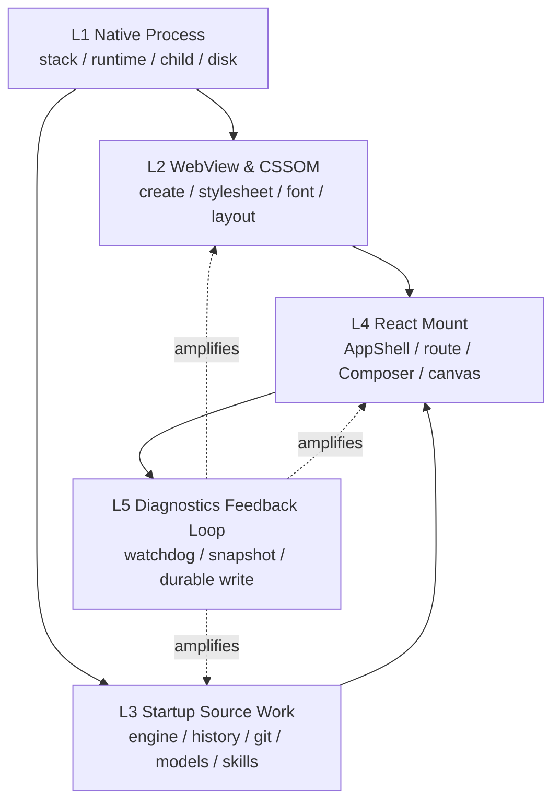
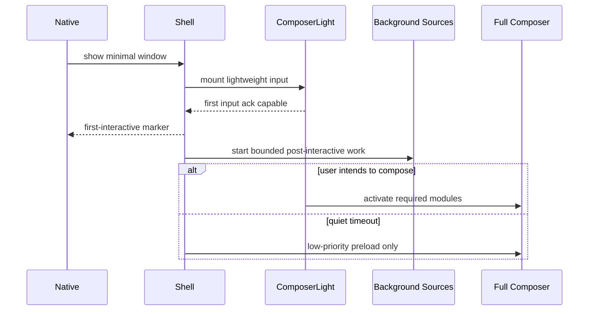

# 03 · Cold-start Freeze Causal Model

> 主线入口：[Client Modernization](README.md)
> 核心判断：白屏、假死、点击无响应、窗口消失可能来自不同进程和不同 phase，必须先分类再优化。

## 1. 症状分类

| 用户看到的症状 | 可能故障域 | 不能直接得出的结论 |
|---|---|---|
| 窗口未出现 / 立即消失 | native crash、stack overflow、single-instance、runtime load | “React 没渲染” |
| 窗口白屏但进程存活 | WebView init、JS bootstrap、CSSOM、renderer crash | “接口慢” |
| UI 出现但点击无响应 | main-thread long task、sync IPC、full mount、layout storm | “网络卡” |
| 首次点击后冻结 | deferred heavy mount 被用户事件触发、Composer activation、source fan-out | “按钮 bug” |
| 15s 后更卡或磁盘繁忙 | watchdog、diagnostics、durable writes 反馈放大 | “检测机制正在修复” |
| 仅 Windows 发生 | stack size、WebView2、Defender、NTFS、DPI | “跨平台代码一定相同” |
| 仅 macOS 发生 | WKWebView、App Nap、font/layout、prewarm 差异 | “Windows workaround 可复用” |

## 2. 五层因果链

诊断顺序必须遵循 L1 → L5。L1 未排除时，前端 profiler 可能根本采不到真正的失败；L5 未隔离时，观测动作本身可能污染测量。

## 3. L1 · Native Process

### 3.1 已知事故

Windows packaged v0.8.9 启动曾出现：

- exit `0xc00000fd`；
- `__chkstk`；
- deep async future 产生较大的 stack frame；
- Windows 默认主线程 stack 约束比开发环境更容易暴露问题。

当前 `HEAD` 已采用两层处理：

1. 在深调用点用 `Box::pin` 缩小 future 在当前 stack frame 的占用；
2. Windows linker 设置 `/STACK:8388608`。

这属于 `fixed-needs-regression`，不是已经完成的跨平台结论。必须验证 clean machine、升级安装、首次启动、多 workspace、异常 session 恢复等场景。

### 3.2 Native 风险清单

- recursive/deep async chain 与大型 enum/future；
- main thread synchronous filesystem traversal；
- child process spawn/stdio pipe 阻塞；
- single-instance lock 与 stale lock；
- plugin restricted process fan-out；
- crash handler/diagnostic writer reentrancy；
- updater、signature、Defender 扫描；
- WebView runtime 缺失或版本差异。

### 3.3 Gate

- crash dump/exit code 必须可归属；
- native bootstrap marker 必须先于 WebView/JS marker；
- packaged release 必须有 Windows stack regression fixture；
- plugin runtime 默认不得在 native bootstrap fan-out；
- Safe Mode 必须在加载非核心 plugin 前决定。

## 4. L2 · WebView and CSSOM

历史上 Windows WebView2 native zoom、CSS mutation 和 layout 路径，以及 macOS WKWebView 的不同预热行为，曾形成相反的平台表现。当前产品已将 UI scale 固定为 100% 并清理残留 scale，因此：

- 旧的 “Windows native zoom / macOS no zoom” 方案只保留为 incident history；
- 新代码不得重新把不可自救的 zoom/DPI 状态放入启动关键链；
- 任意 native/WebView API 必须按平台 × value × system DPI 验证；
- CSSOM 变更、主题、字体和大型 stylesheet 必须在 timeline 中独立标记。

### WebView 证据

| Marker | 目的 |
|---|---|
| `native.webview.create.start/end` | 区分 native bootstrap 与 WebView 创建 |
| `renderer.script.bootstrap` | 判断 JS 是否开始执行 |
| `renderer.css.ready` | stylesheet/font 基础就绪 |
| `renderer.first.paint` | 首次视觉反馈 |
| `renderer.first.interactive` | 能处理轻量用户输入 |
| `renderer.longtask.*` | 识别 paint 后假死 |

## 5. L3 · Startup Source Work

启动 source 不是越早越好。多个 engine、workspace、history provider、git/model/skill/catalog 同时开始，会造成：

- disk random I/O 竞争；
- child process fan-out；
- IPC message burst；
- JSON decode/index projection；
- React state commit 竞争；
- diagnostics event 暴增。

### 5.1 Source 分级

| 级别 | 示例 | 启动策略 |
|---|---|---|
| S0 Core critical | local config、safe mode、window state、recent index header | bounded sync/read-through cache |
| S1 First-interactive | visible workspace、recent sessions preview | local bounded preview，允许 placeholder |
| S2 Post-interactive | active engine metadata、git summary、skills/model cache | quiet window + concurrency limit |
| S3 On-demand | full catalog、all engine histories、deep search index | 用户意图触发 |
| S4 Maintenance | compaction、cleanup、signature recheck | idle/maintenance window |

### 5.2 规则

1. 启动只读 local lock/manifest cache，不访问 Marketplace/Registry 网络。
2. Signature full verify 在 install/update 完成；启动只核对 atomic lock、hash cache 与 revocation snapshot。
3. 默认只加载 visible workspace 的 bounded recent preview。
4. Full catalog scan 必须可取消、限并发、可断点，并在 UI first-interactive 后开始。
5. Engine process 只在 send/resume/explicit selection 时启动。
6. Extension Host 默认 post-interactive；只有极少 `bootstrap-critical` system contribution 可例外。
7. 后台 source event 不得逐项挂到 AppShell 根状态。

## 6. L4 · React Mount and First Interaction

当前 `ComposerGate` / `ComposerLight` 已避免 cold start 直接 full mount Composer，full activation 大致由用户交互 quiet window 或无交互延迟触发。这是正确方向，但需要验证：

- 首次点击是否意外触发多个 deferred module 同时 mount；
- AppShell root bag/context 是否因 source event 广播重渲染；
- full Composer import、model list、skills、attachment、terminal bridge 是否在同一 frame 激活；
- conversation projection 和 Markdown 是否在 route restore 时全量建立；
- `first-interactive` 是否被定义为“按钮可见”而不是“输入得到 ack”。

### 6.1 Activation Ladder

### 6.2 First-interaction Budget 的对象

必须分别记录：

- input event received；
- handler start/end；
- state commit；
- paint/ack；
- deferred activation start/end。

只测 “DOMContentLoaded” 或 “first paint” 无法解释点击冻结。

## 7. L5 · Diagnostics Feedback Loop

诊断机制最危险的行为是：系统卡顿 → watchdog 触发布局/抓取大量状态/同步写盘 → 主线程与磁盘更拥堵 → watchdog 采到更差结果。

当前 blank-screen watchdog 已延后约 15s，是缓解而非完整保证。设计要求：

- watchdog 判断优先读取预先维护的 marker，不主动做昂贵 DOM traversal/layout；
- runtime event 先写 bounded memory ring buffer；
- durable flush 走低优先级、批量和 crash-safe append；
- 同类 hang 只生成一次 incident，避免 retry storm；
- diagnostics failure 不得影响 product state；
- plugin diagnostics 按 plugin id/generation 分桶；
- Safe Mode 可禁用非必要 diagnostics extension。

## 8. Cross-platform Diagnosis Matrix

| 场景 | Windows | macOS | Linux | Evidence |
|---|---|---|---|---|
| packaged clean cold launch | 必测 | 必测 | 支持则必测 | native + renderer trace |
| upgrade + persisted state | 必测 | 必测 | 必测 | state migration + startup |
| 100% UI scale / system DPI matrix | 必测 | 必测 | 必测 | screenshot + input |
| Defender/Gatekeeper/signature overhead | 必测 | 必测 | N/A/对应机制 | phase delta |
| 1/10 workspaces | 必测 | 必测 | 必测 | source concurrency |
| 0/10/50 plugins installed | 必测 | 必测 | 必测 | startup delta |
| Registry offline | 必测 | 必测 | 必测 | Core remains interactive |
| corrupt plugin/checkpoint | 必测 | 必测 | 必测 | safe isolation |
| engine missing/hanging | 必测 | 必测 | 必测 | on-demand failure only |

## 9. Triage Runbook

1. 固定 commit、build type、OS、WebView/runtime version、install state。
2. 先看 process exit/crash dump，排除 L1。
3. 对齐 native/WebView/JS/paint/interactive markers。
4. 禁用全部非核心 plugin，再对比 normal mode。
5. 禁止 Registry/network，确认是否仍能 first-interactive。
6. 以 source phase 开关二分 engine/history/git/skill/model/catalog。
7. 对首次交互采 main-thread long task 与 React commit。
8. 关闭 diagnostics writer 但保留 marker，判断反馈环污染。
9. 同机重复至少多次，区分 cold/warm cache。
10. 只有定位到具体 phase 后才进入代码优化。

## 10. Completion Evidence

冷启动 Workstream 结束时应交付：

- current commit 的 cross-platform startup waterfall；
- crash/hang 分类表与已排除项；
- source activation 清单；
- first input ack 分解；
- safe mode / registry offline / corrupt plugin fault-injection 结果；
- 新旧 build 对比及噪声说明；
- 未验证平台明确标注，而不是默认通过。
