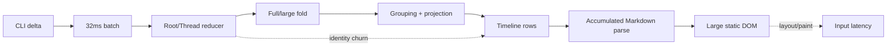
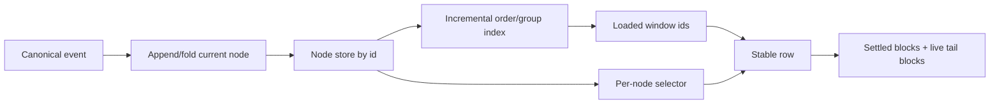
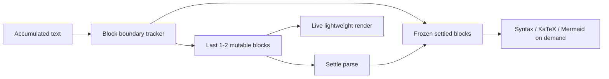

# 04 · Long-session Render Economics

> 主线入口：[Client Modernization](README.md)
> 核心判断：长会话变慢不是单个组件慢，而是高频事件乘上全历史派生、全文解析与常驻 DOM 后的复合成本。

## 1. 当前成本传播



当事件频率为 `F`，loaded items 为 `N`，active Markdown 长度为 `T`，粗略成本可表达为：

```text
Cost ≈ F × (reducer + projection(N) + render(changed identities) + markdown(T) + layout(DOM))
```

Throttle 只能降低 `F`，不能改变 `projection(N)`、`markdown(T)` 或 `layout(DOM)` 的增长性质。

## 2. 三条数据边界

### 2.1 Durable History

完整历史属于 durable store 和搜索/恢复系统，不属于 renderer 常驻内存的默认输入。

### 2.2 Loaded History Window

renderer 只消费 bounded window。窗口必须具备：

- 初始围绕 recent/active anchor 加载；
- `load older`/`load newer`；
- prepend 时保持 semantic scroll anchor；
- unread、jump-to-message、search hit 能重新定位；
- window eviction 不丢 durable data；
- active stream row 不被错误驱逐。

### 2.3 Live Tail

高频更新只作用于：

- 当前 assistant text；
- 当前 reasoning segment；
- 当前 tool execution/output；
- 少量尚未 settle 的 Markdown blocks。

settled 内容转为 immutable snapshot，退出高频订阅。

## 3. Target Data Flow



关键变化：row 订阅自身 node id；order/group index 只有结构变化时更新；live delta 不重新构造所有 row props。

## 4. Event Channel 分级

| Event class | 频率 | State strategy | Render strategy |
|---|---:|---|---|
| assistant text delta | 很高 | external live channel，settle 后 commit | active tail only |
| reasoning delta | 很高 | 独立 live channel / segment buffer | 当前 reasoning segment |
| toolOutput delta | 高且可能很大 | bounded chunk store、spill/summary policy | visible tail + expand on demand |
| item lifecycle | 低 | canonical reducer/store | incremental index update |
| permission/approval | 低、关键 | canonical durable state | immediate stable row |
| usage/metadata | 中低 | coalesced side channel | targeted badge/footer |
| diagnostics | 高峰值 | bounded ring buffer | 不进入 conversation root render |

外置不等于丢失 canonical truth：live channel 是 transient write path，settle/recovery 时必须形成 durable canonical fact。

## 5. Incremental Fold and Projection

### 5.1 Fold

应维护：

- `nodeById`；
- stable `orderedNodeIds`；
- group boundary index；
- current live node/segment；
- revision/generation；
- loaded window anchor。

新增 delta 只更新 current node；新增 item 才改变 order/group index；修改历史 item 只 invalidate 受影响 group。

### 5.2 Projection Cache

cache key 至少包括：

- canonical revision；
- window id/range；
- filter/mode；
- engine/provider presentation policy；
- plugin contribution generation。

禁止以整个数组 identity 作为唯一失效条件。

### 5.3 Row Selector

每个 row 只订阅：

- 自身 node snapshot；
- 必需的邻接/group metadata；
- 自身 UI state；
- 对应 plugin/renderer generation。

顶层 timeline 只订阅 visible id list 和全局布局必要状态。

## 6. Incremental Markdown

当前 staged/lightweight render 不等价于 incremental Markdown。目标架构：



### 6.1 Rules

1. settled block 的 AST/render result 可按 content hash 冻结；
2. 只重新解析最后 1-2 个可能未闭合 block；
3. syntax highlight、KaTeX、Mermaid 等昂贵 enrichment 默认在 block settle 或进入 viewport 后执行；
4. code fence、table、HTML、nested list、math delimiter 跨 chunk 的边界必须有 fixture；
5. generation/version 变化时 cache 可精确失效；
6. fallback 必须能回到 full parser，不能以错误渲染换性能。

### 6.2 Large Tool Output

Tool Output 不应无上限拼入 Markdown：

- store 按 chunk/segment 保存；
- UI 默认展示 bounded tail/summary；
- 展开时分页或窗口化；
- copy/export 从 durable source 读取；
- binary/ANSI/invalid UTF-8 有明确 adapter；
- plugin quota 超限时停止 UI fan-out，而非拖垮 Core。

## 7. Bounded History Window

### 7.1 为什么不是旧式“尾窗”回归

旧 tail-window/summary-wall 常把不可见历史从产品语义上砍掉，造成滚动、搜索、跳转和阅读连续性问题。新方案是 data-layer window：

- 完整历史仍存在；
- 用户可向前加载；
- search/jump 可定位任意历史；
- prepend 保持锚点；
- renderer 不默认持有所有数据与 DOM。

### 7.2 Window State

```ts
type LoadedHistoryWindow = {
  sessionId: string;
  startCursor: string | null;
  endCursor: string | null;
  orderedNodeIds: string[];
  anchorNodeId: string | null;
  hasOlder: boolean;
  hasNewer: boolean;
  generation: number;
};
```

以上仅表达 contract 形状，不是本轮代码提案。实际 schema 必须进入 OpenSpec。

## 8. Persistence and Compaction

目标：写入成本与新增内容相关，读取成本与所需窗口相关。

- append-first event/chunk persistence；
- current mutable suffix 可覆盖或 journal；
- periodic compact 在 idle/maintenance 发生；
- packed row/chunk 必须有 version、checksum、migration、rollback；
- search/index 使用 metadata，不为标题/列表读取全文；
- provider-aware context compaction 与 UI loaded window 分离；
- code/data rollback 能恢复对应 plugin/session generation。

## 9. Resource Lifecycle

Session switch、close、plugin disable/update 时必须释放：

- event subscriptions；
- rAF/microtask notifier；
- timers/intervals；
- Markdown/highlight workers；
- IPC streams/backpressure queues；
- child process/PTY；
- object URLs/large buffers；
- projection/AST caches；
- plugin UI listeners 和 DOM handles。

每个资源应绑定 `sessionId + pluginId + generation`，由 disposable scope 统一回收。

## 10. Performance Scenarios

| ID | Fixture | 目的 |
|---|---|---|
| LS-200 | 200 normal messages | 日常基线 |
| LS-1K | 1,000 mixed messages | loaded-window 与 projection |
| LS-10K | 10,000 durable messages | open/jump/load older，不要求全部加载 |
| ST-TEXT | high-rate assistant text | live channel 与 input latency |
| ST-REASON-100K | 100k reasoning chunks | ingestion/fold stress，browser harness strict `<250ms` 作为候选 microbenchmark |
| ST-TOOL-50MB | large tool output | chunk/store/expand/backpressure |
| MD-EDGE | split fences/table/math/html | incremental correctness |
| SWITCH-50 | 连续切换 50 sessions | resource release/memory plateau |
| PLUGIN-UPDATE | streaming 时插件升级/禁用 | generation isolation |

`ST-REASON-100K <250ms` 只能成为明确 producer/hardware 的 microbenchmark，不可直接等价为 packaged UI SLO。

## 11. Reject List

- 恢复逐 delta 根 reducer dispatch；
- 只扩大 batching interval；
- 只做 row memo；
- 用 10,000 或更大的静态 window 假装 bounded；
- 用 CSS 隐藏无限 DOM；
- streaming 期间每 delta syntax highlight/KaTeX；
- 为性能永久丢失 reasoning/tool output；
- UI window 与 provider context compaction 共用一个隐式策略；
- 没有 correctness fixture 就切 incremental parser。

## 12. Completion Evidence

- event class × frequency × update path flamegraph；
- 200/1k/10k fixture 的 open、scroll、jump、load older 指标；
- active tail 与 settled block 的 parse/commit attribution；
- DOM/heap/IPC backlog 随时间曲线达到平台预算；
- session switch/close 后资源回到稳态；
- incremental Markdown edge fixture 全部正确；
- rollback 可切回旧 renderer/data path，且 durable history 不损坏。
