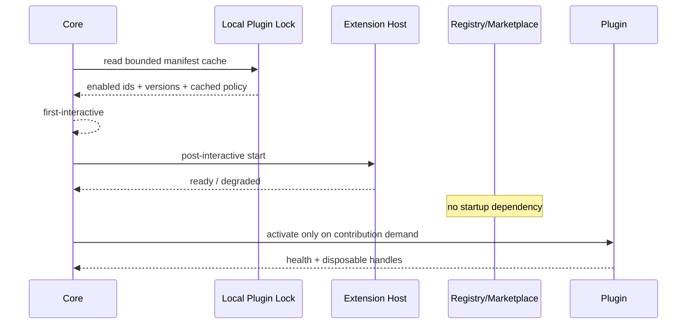

# 05 · Plugin Runtime Performance Contract

> 主线入口：[Client Modernization](README.md)
> Plugin Platform 基线：[Mossx Plugin Platform](../plugin-platform/README.md)

## 1. 目标

插件化不能只保证“能动态注册”，还必须保证：

- 没装插件时 Core 不为生态预付明显成本；
- 装了很多插件但未激活时，冷启动成本仍 bounded；
- 激活一个插件只承担该插件的可归属成本；
- 插件 crash、hang、IPC flood、DOM storm 或 migration 不拖垮 Core；
- disable/update/rollback 后资源可快速释放；
- Marketplace 和 Registry 故障不影响本地核心能力。

## 2. Activation Phases

每个 contribution 必须声明 activation phase，不允许隐式 `onStartup`。

| Phase | 适用对象 | 约束 |
|---|---|---|
| `bootstrap-critical` | 极少数 system recovery/core bridge | 静态白名单；无网络；无 third-party；有硬预算 |
| `post-interactive` | Extension Host、轻量本地索引、非关键 system plugin | Core first-interactive 后；限并发；可取消 |
| `on-demand` | CLI Engine、Browser、Canvas、Notes、Project Map、heavy UI | 用户触发、session resume 或明确 contribution 被使用 |
| `maintenance` | compaction、full signature recheck、cleanup | idle/charging/policy window；不得抢首交互 |

### 2.1 默认规则

1. 普通插件默认 `on-demand`。
2. Extension Host Controller 默认 `post-interactive`。
3. CLI Engine process 只在 send、resume、explicit engine selection 时启动。
4. feature plugin 的 bundle 不进入 Core initial bundle。
5. `bootstrap-critical` 只能由 Core 发布且每项都需 architecture review。
6. plugin activation promise 不得阻塞 Core route、session list 或 lightweight composer。

## 3. Startup Contract

### 3.1 Install-time vs Startup-time

| 工作 | Install/Update | Cold Startup |
|---|---|---|
| download artifact | 必须 | 禁止 |
| full signature/provenance verify | 必须 | 默认禁止重复全量扫描 |
| permission diff | 必须 | 读取已确认 local policy |
| unpack/index | 必须，staged path | 禁止全量重建 |
| checkpoint/migration | 必须，事务化 | 只处理未完成 recovery |
| lockfile/hash cache | 原子写入 | bounded 读取 |
| revocation | 刷新 snapshot | local snapshot；网络异步 |
| Marketplace metadata | 可缓存 | 不影响 Core startup |

如果 local lock/cached manifest 损坏，Core 进入 Plugin Safe Mode，不能同步重扫全部仓库来“自愈”。

## 4. Runtime Placement Contract

| Plugin class | Placement | 性能隔离 | 安全定位 |
|---|---|---|---|
| trusted low-privilege | per-plugin Worker | event loop/heap/quota attribution | Worker 不是完整安全沙箱 |
| high-permission C | restricted process | OS process CPU/memory/kill | capability broker + OS restriction |
| local plugin | restricted process | 避免未知代码进入 renderer/host | 默认不因本地来源获得信任 |
| trusted React UI | renderer contribution + controller | Error Boundary、render budget、fuse | 仅白名单 slot/bundle |
| declarative/sandbox UI | schema renderer / sandbox surface | DOM/event/message quota | 默认第三方 UI 模式 |

Extension Host 是控制进程，不是所有插件代码共享执行的“大 Worker”。普通插件仍需 per-plugin Worker；高权限/local 升级受限进程。

## 5. Resource Budget Dimensions

具体阈值必须由 W0/W9 current benchmark 确认；Contract 先固定 metric 和处置语义。

### 5.1 CPU / Event Loop

- activation CPU time；
- steady-state CPU when idle；
- event handler p50/p95/p99；
- long task count；
- Worker/Host event-loop lag；
- restricted process CPU burst。

超限策略：warn → throttle/coalesce → circuit open → disable generation。

### 5.2 Memory

- per-worker heap；
- restricted process RSS；
- Core retained objects by plugin generation；
- AST/projection/cache bytes；
- large payload spill bytes。

超限策略：evict cache → deny new large payload → restart isolated runtime → disable plugin。Core 不为插件 OOM 自动无限重启。

### 5.3 IPC

- messages/sec；
- bytes/sec；
- queue depth；
- oldest pending age；
- request timeout/cancel rate；
- dropped/coalesced low-priority events。

必须有 bounded queue 与 backpressure。Diagnostics、progress、streaming delta 分优先级；permission/approval/control message 不得被 bulk output 饿死。

### 5.4 UI / DOM

- mount/commit duration；
- DOM node count by contribution；
- listener/timer/subscription count；
- layout/paint attribution；
- hidden/inactive surface resource retention。

Trusted React 进入白名单后仍必须有 Error Boundary、render budget、circuit breaker、快速拔除、safe reload 与 LKG rollback。

### 5.5 Storage and Migration

- namespace bytes；
- read/write throughput；
- migration wall time；
- checkpoint size/time；
- rollback restore time；
- compaction debt。

Migration 不得在普通 cold startup 静默执行不可逆长任务。破坏性 migration 必须明确提示；失败恢复到 old code + corresponding checkpoint。

## 6. IPC Data-plane Contract

### 6.1 Envelope

所有 message 至少携带：

- `pluginId`；
- `pluginVersion`；
- `generation`；
- `sessionId` / `requestId`（适用时）；
- `priority`；
- `payloadBytes` 或可核算大小；
- `deadline/cancellation`；
- schema version。

### 6.2 Streaming

- text/reasoning/toolOutput 分 channel；
- high-volume output 使用 chunk/stream handle，不复制巨大 JSON；
- progress/diagnostics 可 coalesce；
- control/approval 有独立优先级；
- stale generation message fail closed；
- consumer 慢时必须背压或落盘，禁止无界内存队列。

### 6.3 Zero-copy 的边界

可以用 transferable/shared buffer 降低复制，但不能牺牲 ownership、lifetime 与 security。任何共享内存都必须具备 size limit、generation、read-only/ownership transition 和 cleanup。

## 7. Engine Plugin Contract

具体 CLI 全部插件化后，Core 只保留 Engine Contract。性能要求：

1. Engine metadata 从 local manifest/cache 读取，不启动进程获取显示信息。
2. Engine availability probe 必须有 TTL、timeout、concurrency limit。
3. CLI process on-demand，idle/close 后按 policy 回收。
4. Streaming delta 直接进入分类型 channel，不因插件边界恢复根 reducer 高频更新。
5. History discovery bounded preview；full import/onboarding 按需。
6. provider-specific compaction 位于 Engine policy，不污染 Core renderer window。
7. Engine crash/hang 只影响对应 session/plugin generation。
8. process/PTY/stdout/stderr 必须绑定 disposable scope。

## 8. UI Contribution Contract

| 模式 | 初始 bundle | Mount | Update | Failure |
|---|---|---|---|---|
| declarative | Core renderer only | on-demand schema | diff/replace | reject invalid node |
| sandbox | sandbox runtime lazy load | visible/explicit | message protocol | destroy surface |
| trusted React | versioned plugin chunk | on-demand slot | generation swap | boundary + fuse + safe reload |

所有模式都必须返回 `DisposableContribution`，撤销时同步清理 DOM、events、timers、stores、IPC 和 cache。

## 9. Failure and Safe Mode

### 9.1 Core Safe Mode

- minimal Core only；
- 跳过所有非必要 plugin；
- 不访问 Registry；
- 提供 Extensions recovery、disable、rollback、export diagnostics；
- 不删除 plugin data。

### 9.2 Plugin Circuit Breaker

按 `pluginId + generation + contribution` 计数：

- repeated crash；
- activation timeout；
- IPC flood；
- renderer error；
- budget violation；
- migration recovery failure。

熔断后立即撤销 contribution、停止 runtime、标记 degraded，并允许用户回退 LKG。

## 10. Marketplace Contract

- Marketplace 是 discovery/control UI，不是 Core 启动依赖；
- inventory 来自可过期 cache，离线时明确显示 freshness；
- install/update 在 staged area 完成验证后才写 atomic lock；
- permission expansion 必须重新授权；
- revoke/blocklist 可异步刷新并具有本地 emergency snapshot；
- 第三方插件默认不能 `bootstrap-critical`；
- ranking/telemetry 不进入核心会话数据域。

## 11. Conformance Gate

每个插件发布前必须运行：

- manifest/schema/version compatibility；
- activation phase audit；
- capability and permission diff；
- idle CPU/memory baseline；
- IPC flood/backpressure fixture；
- UI mount/unmount leak fixture；
- storage namespace and migration rollback；
- crash/hang/timeout/corrupt payload；
- Core first-interactive with plugin unavailable；
- disable/update/LKG restore。

## 12. Prohibited Actions

- `activateOnStartup: *` 类无边界注册；
- startup 访问 remote Registry；
- 每次启动全量 signature/unpack/index；
- 插件直接修改 Core 或其他插件表；
- Worker 被宣传为强安全边界；
- high-volume tool output 通过无界 JSON IPC；
- plugin UI 挂 AppShell 根级高频 state；
- disable 后遗留 child/worker/listener/timer；
- plugin failure 阻塞 Core first-interactive；
- 只回退代码、不恢复对应数据 checkpoint。
