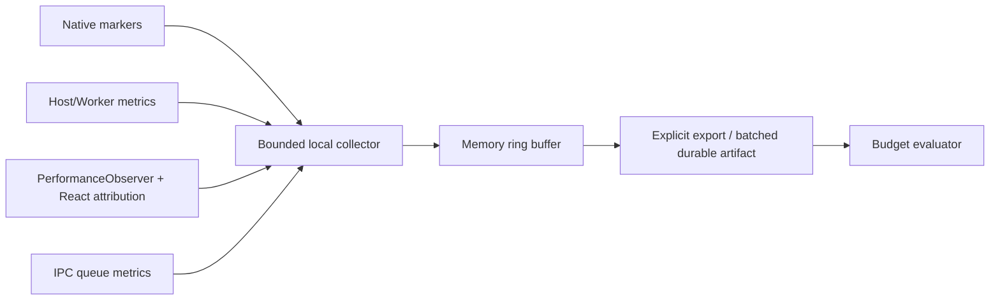

# 06 · Observability and Performance Budgets

> 主线入口：[Client Modernization](README.md)
> 原则：没有 current evidence 的优化结论只能叫 hypothesis；没有 attribution 的 budget 只能制造争议。

## 1. Measurement Contract

每份 evidence 必须携带：

- commit SHA、app version、dirty state；
- build mode（dev/release/packaged）；
- OS/version/arch；
- WebView/runtime version；
- CPU/RAM/disk；
- install type（clean/upgrade）；
- cache state（cold/warm）；
- workspace/session/plugin fixture；
- run count 与统计方法；
- collector overhead；
- generated timestamp；
- schema version。

缺失这些 metadata 的数字不得进入 release comparison。

## 2. Trace Correlation

统一 correlation dimensions：

```text
startupId
sessionId
threadId
engineId
pluginId
pluginGeneration
requestId
windowId
platform
buildId
```

Native、Extension Host、Worker、restricted process、IPC、renderer marker 应能在同一 monotonic timeline 对齐。wall clock 只用于跨进程辅助，不能单独承担 duration 计算。

## 3. Metric Families

### 3.1 Startup

| Metric ID | 定义 |
|---|---|
| `startup.native_ready_ms` | process entry → native bootstrap ready |
| `startup.webview_ready_ms` | WebView create start → JS bootstrap |
| `startup.first_paint_ms` | process entry → first paint |
| `startup.first_interactive_ms` | process entry → lightweight user action 可被 ack |
| `startup.first_input_ack_ms` | first input event → visible/semantic ack |
| `startup.full_composer_ready_ms` | activation start → full Composer ready |
| `startup.source_phase_ms` | 每个 source phase duration |
| `startup.main_thread_blocked_ms` | first-interactive 前 main-thread blocked total |
| `startup.crash_rate` | scenario launches 中 crash 比例 |
| `startup.hang_rate` | 超过定义 deadline 且无进展 marker 的比例 |

### 3.2 Long Session

| Metric ID | 定义 |
|---|---|
| `stream.event_ingress_rate` | 按 event class 的 events/sec |
| `stream.reducer_commit_rate` | canonical/root commits/sec |
| `stream.input_latency_ms` | streaming 时 input ack |
| `render.root_commit_ms` | AppShell/root commit duration |
| `render.row_commit_ms` | changed row commit duration |
| `markdown.live_parse_ms` | active tail parse duration |
| `markdown.settle_enrich_ms` | settle enrichment duration |
| `timeline.loaded_rows` | loaded data rows |
| `timeline.dom_nodes` | conversation surface DOM nodes |
| `projection.update_ms` | order/group/window projection duration |
| `memory.renderer_heap_mb` | renderer heap |
| `ipc.queue_oldest_ms` | oldest pending message age |

### 3.3 Plugin Runtime

| Metric ID | 定义 |
|---|---|
| `plugin.activation_ms` | demand → contribution ready |
| `plugin.idle_cpu_pct` | inactive/idle CPU |
| `plugin.worker_heap_mb` | per-worker heap |
| `plugin.process_rss_mb` | restricted process RSS |
| `plugin.ipc_messages_per_sec` | per-plugin IPC rate |
| `plugin.ipc_bytes_per_sec` | per-plugin IPC throughput |
| `plugin.ipc_queue_depth` | bounded queue usage |
| `plugin.ui_commit_ms` | contribution render commit |
| `plugin.dom_nodes` | contribution-owned DOM |
| `plugin.dispose_ms` | disable/update → resource released |
| `plugin.migration_ms` | migration duration |
| `plugin.rollback_ms` | code+data restore duration |

## 4. Budget Hierarchy

预算分四级，不允许一开始拍脑袋写一个全局毫秒数：

1. **Safety redline**：crash、deadlock、data corruption、unbounded queue，必须为零/硬失败。
2. **Phase budget**：native、WebView、source、React、plugin activation 各自预算。
3. **Resource budget**：CPU、memory、IPC、DOM、I/O。
4. **Scenario SLO**：真实用户场景的 end-to-end percentile。

### 4.1 Initial Policy（待 W0 校准）

| 对象 | 初始判定策略 |
|---|---|
| native crash / stack overflow | 任何可重复 occurrence 立即阻断 release |
| Core first-interactive | 相对 current accepted baseline 不得显著回归；阈值由 W0 artifact 固化 |
| plugin unavailable | 不得增加 Core first-interactive critical dependency |
| root high-frequency update | 禁止按每 delta / 每日志 / 秒级 polling 挂根链 |
| IPC queue | 必须 bounded；oldest age 超 deadline 触发 backpressure/circuit |
| DOM/data window | 必须存在可验证上限，不接受“通常不会到” |
| memory after dispose | 多轮 activate/disable 后应达到 plateau，不能线性增长 |
| 100k reasoning microbenchmark | Harness 候选 strict `<250ms`，仅在固定 producer/hardware 下使用 |

本文不伪造未测绝对阈值。W0 需要把当前分布、噪声和可接受 bound 写入 generated artifact，再由各 OpenSpec change 收紧。

## 5. Scenario Matrix

### 5.1 Startup

| Scenario | Dimensions |
|---|---|
| CS-CLEAN | clean install, no session, 0 plugins |
| CS-UPGRADE | upgrade with persisted state/migrations |
| CS-RECENT-1K | large recent index, bounded preview |
| CS-WS-10 | 10 workspaces, source concurrency |
| CS-PLUGIN-50 | 50 installed, none demanded |
| CS-SAFE | corrupt plugin/lock, Safe Mode |
| CS-OFFLINE | Registry/network unavailable |
| CS-ENGINE-MISSING | selected CLI unavailable |

### 5.2 Runtime

沿用 [Long-session Render Economics](04-long-session-render-economics.md) 的 LS/ST/MD/SWITCH/PLUGIN fixtures，并增加正常用户 session 作为 control。

### 5.3 Platform

至少覆盖：

- Windows x64 packaged；
- macOS Apple Silicon packaged；
- Linux 当前声明支持的主要组合；
- system DPI / scale；
- cold/warm filesystem cache；
- clean/upgrade state。

## 6. Instrumentation Architecture



### Rules

- hot path marker 必须低分配、低锁竞争；
- collector 自身开销要可测；
- ring buffer bounded；
- durable artifact 在安全时机批量落盘；
- sensitive plugin/session payload 不进入性能 artifact；
- unsupported metric 用 `null + unsupportedReason`，禁止写 0；
- artifact schema major version 不兼容时 consumer fail clearly。

## 7. Hang and Crash Evidence

### Hang

以“progress marker 停滞 + heartbeat/event-loop lag + phase deadline”判定，不能只看窗口是否白色。采集：

- last native/renderer/plugin marker；
- main thread long tasks；
- host/worker heartbeat；
- IPC queue depth/oldest；
- source operations in flight；
- bounded stack/profile snapshot（平台允许时）。

### Crash

- exit code/signal；
- stack/minidump；
- build symbols/version；
- startupId/plugin generation；
- last durable-safe marker；
- recovery mode outcome。

## 8. React and Renderer Attribution

保留 React profiler 与 updater attribution 能力，但测量时注意：

- react-scan 等工具可能放大 2-3 倍，不能与 release baseline 混合；
- 记录 commit owner、changed props/state/context；
- root commit 与 row commit 分开；
- Markdown parse、syntax、KaTeX、Mermaid 分段；
- layout/paint 与 JS task 对齐；
- development Strict Mode 行为不能冒充 packaged release。

## 9. CI and Release Gates

### Per-PR

- deterministic microbench；
- architecture/static guard（禁止 root high-frequency patterns、unbounded queue、startup remote dependency）；
- targeted fixture correctness；
- budget delta 与 baseline freshness check。

### Nightly

- 1k/10k session；
- 100k reasoning chunks；
- plugin activate/disable loops；
- memory plateau；
- fault injection。

### Release Rehearsal

- packaged Win/mac/Linux scenario matrix；
- clean/upgrade/safe/offline；
- current artifact signed/archived；
- regression triage owner；
- known unsupported rows 显式记录。

## 10. Evidence Acceptance

一个 Workstream 可以关闭，必须同时满足：

1. current commit artifact；
2. baseline 与 candidate 同环境对比；
3. correctness 没有回退；
4. performance improvement 超过噪声；
5. cross-platform 状态明确；
6. rollback 演练通过；
7. artifact 可由他人按命令重现；
8. historical docs 未被改写成 current claim。

## 11. Existing Documentation Baseline

本轮设计落盘前，`npm run check:docs` 已存在 31 个历史问题，包括 `.DS_Store`、部分 cold-start 文档缺 frontmatter/可达性、invalid status 与 broken prototype link。本轮门禁是：

- 新文档 frontmatter/status/link 全部合规；
- 不扩大既有失败集；
- 新增索引可达；
- `git diff --check` 通过。

后续若专门治理 docs debt，应单独建立任务，避免把已有失败错误归因给本主线。
