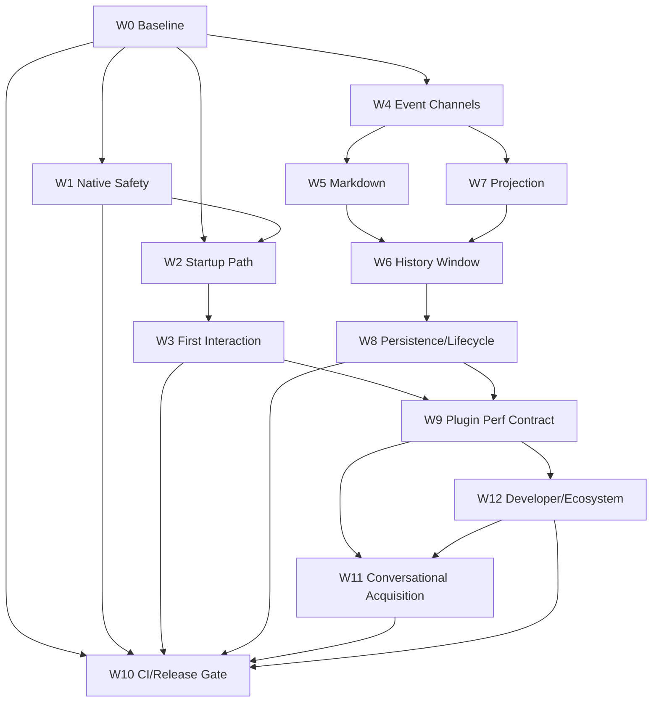

# 07 · Workstreams and Dependencies

> 主线入口：[Client Modernization](README.md)
> 任务明细：[Executable Task Backlog](08-executable-task-backlog.md)

## 1. 拆分原则

每个 Workstream：

- 解决一个可测量的 failure/cost domain；
- 单独建立 OpenSpec change；
- 单独 feature flag / compatibility adapter / rollback；
- 不要求在一个长期分支中等待其他全部工作完成；
- 只有 evidence gate 通过后才允许成为下一层依赖。

## 2. Workstream Map

| ID | 名称 | Outcome | 主要依赖 |
|---|---|---|---|
| W0 | Current Baseline & Fixtures | current HEAD 同机、跨平台、可重复证据 | 无 |
| W1 | Native Crash/Hang Safety | packaged startup crash/hang 可归属、可恢复 | W0 |
| W2 | Cold-start Critical Path | source/diagnostics/registry 退出首交互关键链 | W0，部分 W1 |
| W3 | Composer/AppShell/WebView First Interaction | 首次输入不被 deferred mount/layout 阻塞 | W0-W2 |
| W4 | Reasoning/ToolOutput Externalization | 高频 event 不再扩大根 reducer 工作 | W0 |
| W5 | Incremental Markdown | active tail 增量解析，settled blocks 冻结 | W0、W4 |
| W6 | Bounded History Window | loaded data/DOM bounded，semantic prepend | W0、W5、W7 |
| W7 | Incremental Projection & Row Selector | 更新成本与 changed nodes 相关 | W0、W4 |
| W8 | Persistence/Compaction/Resource Release | I/O/window/session lifecycle 成本 bounded | W4-W7 |
| W9 | Plugin Activation Performance Contract | plugin 不污染启动/长会话，资源可归属 | W1-W3，Plugin P0-P2 |
| W10 | CI Stress & Cross-platform Release Gate | regression 自动阻断，release 有 current evidence | W0，逐步吸收 W1-W12 |
| W11 | Conversational Acquisition & Task Resume | 对话内安全补齐 capability 并续跑原任务 | W9、W12 |
| W12 | Developer Platform & Ecosystem Governance | 独立仓库、SDK、依赖、publisher 与团队治理可持续 | Plugin P0-P6、W9 |

## 3. Dependency Graph

W6 需要 W5/W7 提供 stable block/node boundary，否则窗口化只会把全量成本换成复杂滚动 bug。W9 需要 W3 保证 Core first-interactive phase，也需要 W8 的 resource lifecycle，避免插件 disable 后泄漏。W11 必须建立在 W12 的 Capability/Manifest/Resolver contract 上；否则“聊天里装插件”只是让模型执行不透明安装命令。

## 4. Delivery Waves

### Wave A · 先把“卡死”变成可定位事件

- W0 baseline/fixture；
- W1 native crash/hang safety；
- W2 startup source waterfall；
- W10 最小 release smoke gate。

Outcome：不再把 Windows native crash、WebView 白屏、React long task 混为一个“冷启动卡”。

### Wave B · 保护 First Interaction

- W3 Composer/AppShell/WebView activation；
- W2 diagnostics feedback isolation；
- W9 activation phase contract skeleton。

Outcome：窗口出现后，最小会话/输入能力可用；后台工作和 plugin host 不抢首交互。

### Wave C · 拆除高频根链

- W4 reasoning/toolOutput externalization；
- W7 incremental fold/projection/selectors；
- W10 deterministic streaming fixtures。

Outcome：stream rate 增长不再线性放大 root work。

### Wave D · 控制长历史和富文本成本

- W5 incremental Markdown；
- W6 bounded history window；
- W8 persistence/compaction/resource release。

Outcome：长会话成本由 active tail/loaded window 决定，不由全部 durable history 决定。

### Wave E · Plugin Platform 与 Developer Platform 收口

- W9 Extension Host/Worker/process/Marketplace budgets；
- W12 SDK、dependency resolver、capability binding、publisher/team policy；
- 与 [Plugin Migration Roadmap](../plugin-platform/08-migration-roadmap-and-tasks.md) 的 pilot 同步。

Outcome：插件数量、权限和故障不会无边界侵入 Core；独立仓库不会变成 distributed monolith。

### Wave F · 对话式安装与生态 Release Gate

- W11 capability gap → discovery → consent → install → refresh → resume；
- W10 conversational install、plugin conformance 与 packaged release matrix。

Outcome：达到“在当前对话里安全补齐缺失能力并继续原任务”的体验，且不允许 Agent 绕过 deterministic policy。

## 5. Parallelism

可安全并行：

- W1 native safety 与 W4 event-channel research；
- W2 source orchestration 与 W7 projection prototype；
- W5 Markdown correctness fixtures 与 W6 semantic scroll research；
- W9 conformance schema 与 W8 resource lifecycle instrumentation。
- W11 continuation correctness fixtures 与 W12 Developer CLI/testkit。

不可盲目并行：

- 未冻结 event/node contract 前同时重写 W4/W7；
- 未定义 semantic anchor 前直接上 W6；
- 未有 current baseline 前同时改 bundle、Composer、source scheduler 后宣布效果；
- Plugin Platform runtime 未有 isolation/storage transaction 前开放 Marketplace install。
- Capability Graph/InstallPlan/consent 未冻结前让 Agent 直接调用安装 API。

## 6. Workstream Gate Template

每个 Workstream 的 OpenSpec proposal/design/tasks 必须回答：

1. **Baseline**：current commit 的什么场景失败或超预算？
2. **Owner**：native/Core/renderer/engine/plugin 哪一层拥有修复？
3. **Contract**：哪些 schema/API/lifecycle 改变？
4. **Boundary**：明确不改什么，避免横向重写。
5. **Non-regression**：A1-A4 与现有产品语义如何保留？
6. **Platform**：Win/mac/Linux 的已证实/未验证结论。
7. **Verification**：自动化、目视、fault injection、packaged evidence。
8. **Rollback**：flag、adapter、LKG、data checkpoint。
9. **Completion evidence**：artifact、命令、commit、统计与判定。
10. **Documentation**：ADR/main spec/perf index/decision log 如何校准。

## 7. Stop-the-line Conditions

任何 Workstream 遇到以下情况立即停止扩大 rollout：

- crash/data corruption；
- Core first-interactive 依赖 plugin/Registry；
- unbounded queue/DOM/memory；
- rollback 不能恢复 code + data；
- Windows/macOS 表现相反但仍使用统一 workaround；
- benchmark 输入、commit 或环境不可追溯；
- improvement 低于噪声但 correctness/complexity 成本显著增加；
- 破坏已有 live text externalization 或 event-driven store。

## 8. Program-level Exit Criteria

- W0 artifact 成为 current release baseline，且有 freshness policy；
- W1-W3 在 packaged Win/mac 通过冷启动与 first-interaction matrix；
- W4-W8 在 large-session fixture 中证明成本 bounded；
- W9 插件 activation/conformance/safe-mode 完成两个 pilot 演练；
- W11 对话式安装与 task resume 完成 capability 缺口、拒绝、失败、重启、回退演练；
- W12 独立仓库 SDK/dependency/publisher/team policy 通过两个 pilot；
- W10 能阻断可重复 regression；
- Core/Plugin/Engine owner 没有双写；
- 所有 deferred/unsupported 项有明确 owner 和后续，不用“优化完成”掩盖。
