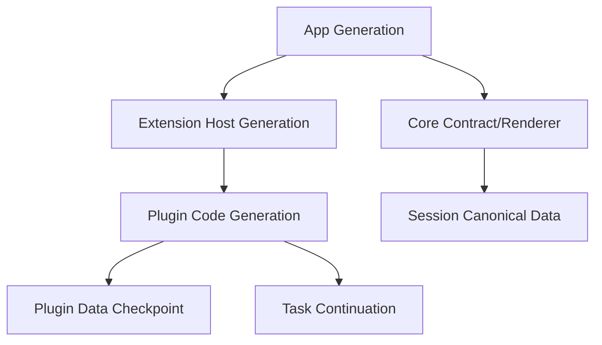
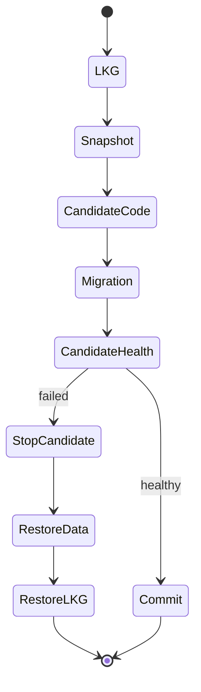

# 09 · Platform Risk and Rollback

> 主线入口：[Client Modernization](README.md)
> 原则：rollback 不是“把代码切回去”，而是恢复可解释、可启动、数据一致的 last-known-good system generation。

## 1. Failure Domains

每个 generation 必须能回答：

- 运行的 code/contract/plugin exact versions；
- 对应的数据 schema/checkpoint；
- 已注册的 capabilities/contributions；
- 正在进行的 session/task；
- 可回退到哪个 LKG；
- 回退后哪些操作需要用户重新确认。

## 2. Risk Register

| ID | Risk | Detection | Prevention | Recovery |
|---|---|---|---|---|
| R-01 | Windows native stack overflow | exit code/minidump/__chkstk | pin deep futures、stack regression | 回退 build，Safe Mode |
| R-02 | WebView/CSSOM platform-specific hang | phase marker/long task/layout | platform gate、pure Web first | 清理危险 state、safe UI |
| R-03 | startup source I/O/process storm | in-flight/source waterfall | S0-S4、concurrency/cancel | 禁用 phase、bounded preview |
| R-04 | diagnostics feedback loop | collector overhead/disk burst | ring buffer、async flush | diagnostics degraded mode |
| R-05 | root render storm | updater attribution/commit rate | external channel/selectors | feature flag old stable path |
| R-06 | incremental Markdown correctness | differential fixture | edge corpus/full fallback | clear cache/use full parser |
| R-07 | history window navigation loss | anchor/search/jump tests | semantic cursor contract | full-load compatibility mode |
| R-08 | persistence migration corruption | checksum/replay/fault injection | checkpoint/journal/version | old reader + data restore |
| R-09 | plugin crash/hang/flood | heartbeat/quota/queue | isolation/circuit/backpressure | kill generation/LKG |
| R-10 | permission/supply-chain escalation | signature/permission diff | policy/consent/provenance | block/revoke/uninstall |
| R-11 | capability conflict/wrong provider | binding/schema mismatch | deterministic resolver/lock | restore prior binding |
| R-12 | conversational install repeats side effect | idempotency/audit | continuation effect record | stop resume, user decision |
| R-13 | Registry/publisher unavailable | health/revocation snapshot | offline local lock/cache | local LKG / disable discovery |
| R-14 | plugin data inaccessible after rollback | schema compatibility failure | code+data transaction | matching checkpoint restore |
| R-15 | performance gate false positive/negative | variance/freshness | repeat/statistics/metadata | advisory downgrade/remeasure |

## 3. Rollback Levels

| Level | Target | 用户影响 | 数据动作 |
|---|---|---|---|
| L0 Contribution | command/slot/provider | 局部能力消失 | 无 |
| L1 Plugin Runtime | Worker/process generation | 单插件短暂不可用 | 保持 namespace |
| L2 Plugin Version | exact plugin artifact | 回到 LKG | 恢复匹配 checkpoint |
| L3 Extension Host | host protocol/runtime | 所有插件短暂停止 | plugin data 不变 |
| L4 Renderer Safe Reload | trusted UI/render state | UI 重载，会话恢复 | canonical session 不变 |
| L5 App Version | Core/native build | App 重启/版本回退 | 执行 compatible app migration rollback |
| L6 Safe Mode | minimal Core | 非核心能力全部停用 | 数据只读保留、提供恢复入口 |

默认选择最小 Level。不得因为一个 Worker 插件 crash 就重启整个 App。

## 4. Code + Data Rollback Transaction

### Invariants

1. checkpoint 与 old/new code digest 关联；
2. migration 输入 schema 明确；
3. candidate health 前 old generation 不被不可恢复删除；
4. rollback 先停止 candidate 写入，再恢复数据；
5. restore 后 capability graph 回到旧 generation；
6. corrupt checkpoint 进入 Safe Mode，不继续猜 schema；
7. retention cleanup 只删除超出恢复窗口且无 active reference 的 checkpoint。

## 5. Cold-start Rollback

冷启动优化通常跨 native、source、renderer，回退需要独立开关：

- native linker/stack build 可独立回退；
- startup source phases 可逐项关闭；
- Composer activation ladder 可回到已知稳定 gate；
- diagnostics collector 可进入 memory-only degraded mode；
- Registry/Marketplace 永远可完全离线；
- plugin runtime 可在启动前全局禁用。

持久化 startup setting 若可能导致无法进入设置页，必须使用 startup guard：危险值先 pending，未证明健康则下次临时回到安全值，不能静默覆盖用户存储。

## 6. Long-session Rollback

- event externalization：per-channel flag，settle/recovery 保持同一 canonical schema；
- incremental Markdown：full parser fallback，cache 可无损清空；
- incremental projection：测试期 differential dual-run，生产只保留单 owner；
- history window：full-load compatibility mode 仅用于恢复/诊断；
- persistence：old reader + versioned journal/checkpoint；
- compaction：可中断、可从 last committed segment 恢复。

回退不能恢复已禁止的反模式作为永久状态。Compatibility path 必须有删除条件和期限。

## 7. Conversational Install Rollback

如果对话式安装失败：

1. 原任务保持 suspended，不伪装成功；
2. 停止新 plugin generation；
3. 撤销新 capability/contribution；
4. 恢复 old lock + checkpoint；
5. continuation 标记 install failure；
6. 告知用户原因、当前系统状态和可选替代；
7. 不自动尝试下一个高权限插件。

如果安装成功但原任务执行失败，不应自动卸载插件；执行失败与安装失败属于两个 incident，用户可以选择保留、禁用或回退。

## 8. Rollout Strategy

| Ring | Audience | Gate |
|---|---|---|
| R0 | deterministic CI | correctness/safety/microbench |
| R1 | internal developer profile | diagnostics + manual recovery |
| R2 | internal daily users | current data + rollback drill |
| R3 | opt-in preview | signed artifact + telemetry-free evidence export |
| R4 | stable rollout | packaged platform matrix |

每个 ring：

- 单独 rollout flag/channel；
- 明确 sample/build；
- 自动 stop condition；
- 一键回到 prior generation；
- 不因“已经发布”跳过 data rollback。

## 9. Emergency Controls

- Core Safe Mode；
- Plugin Safe Mode / `--disable-extensions` 等等价入口；
- per-plugin kill switch；
- Registry blocklist/revocation snapshot；
- rollback to exact LKG；
- export bounded diagnostics；
- recovery UI 查看 crash loop、permissions、versions、checkpoints；
- offline installer for trusted recovery artifacts。

Emergency control 必须无需依赖故障插件或 Marketplace 才能工作。

## 10. Platform Evidence Status

所有风险结论统一使用：

- `verified-current`：current packaged build 可重复；
- `fixed-needs-regression`：已修代码，尚缺 release matrix；
- `historical`：仅历史 incident/measurement；
- `excluded-current`：current evidence 已排除；
- `unverified`：未测。

禁止把 macOS 通过外推为 Windows，也禁止把 Windows workaround 静默应用到 WKWebView/Linux WebKit。

## 11. Rollback Drill Matrix

| Drill | Expected result |
|---|---|
| kill Worker during activation | old generation continues / contribution absent |
| crash restricted process while streaming | corresponding session degraded，Core interactive |
| disk full during migration | transaction abort，old data readable |
| corrupt checkpoint | Safe Mode，不运行未知 schema |
| Registry offline/revoked version | local LKG 可用，禁止新装 |
| renderer crash from trusted React | fuse + safe reload + plugin disabled |
| app restart during conversational install | transaction recovery + continuation safe state |
| rollback after destructive migration approval | restore matching checkpoint |
| stale generation sends IPC | fail closed，不污染 current state |
| performance regression after rollout | stop ring + exact artifact rollback |

## 12. Definition of Recoverable

只有同时满足以下条件，系统才叫“可回退”：

- 用户能重新进入 Core；
- 当前运行版本可识别；
- canonical session/plugin data schema 一致；
- capability registry 与实际 runtime 一致；
- orphan process/worker 不再写入；
- pending task 不会重复外部副作用；
- 恢复动作有 audit trail；
- 用户知道哪些功能暂时不可用。
