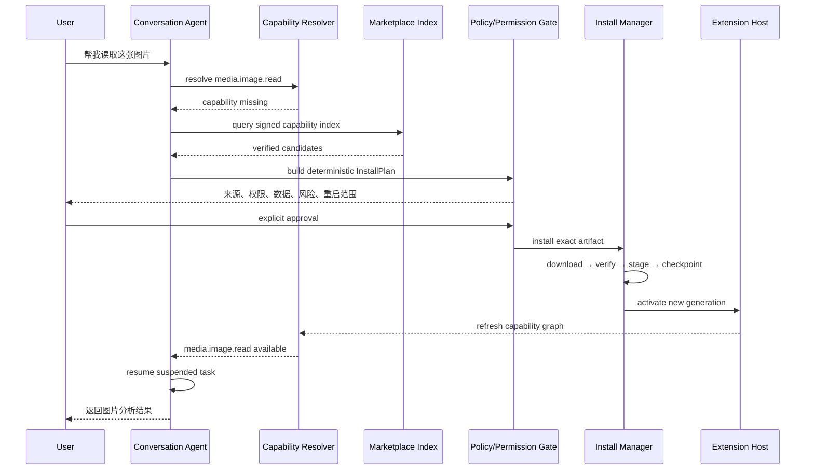
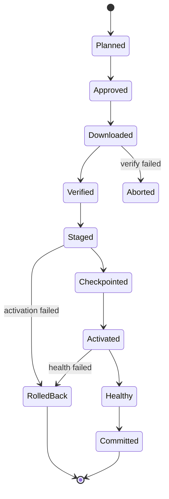

# 11 · Conversational Plugin Acquisition and Task Resume

> 主线入口：[Client Modernization](README.md)
> 目标体验：用户不需要离开当前对话，就能安全地补齐缺失能力，并在安装后继续原任务。

## 1. 目标体验

以“当前 CLI 不能读取图片”为例，理想链路不是简单执行一条安装命令，而是：



用户看到的是一次自然对话；系统内部必须是确定性的 control plane。LLM 可以建议，不能直接绕过权限和安装事务。

## 2. Screenshot Goal 的准确拆解

截图中的体验包含六个独立能力：

1. **Capability Gap Detection**：识别当前 runtime 缺少“读图”能力，而不是普通执行失败。
2. **Discovery**：从已安装插件、本地仓库、curated Registry/Marketplace 找到候选。
3. **Decision Support**：解释插件来源、publisher、权限、数据去向、维护状态和替代方案。
4. **Transactional Install**：验证、安装、checkpoint、activate，失败回到原状态。
5. **Capability Refresh**：让当前会话/Agent 看到新 tool schema，不必重新开一个完全无上下文的会话。
6. **Task Resume**：恢复“读取这张图片”这个原始意图，且不重复已经发生的副作用。

只实现 Marketplace UI 或 `install(pluginId)`，还达不到这个效果。

## 3. Capability Graph

插件发现不能主要依赖自然语言关键词。Core 维护 versioned Capability Graph：

```text
capability id: media.image.read
input schema: ImageReference
output schema: ImageUnderstandingResult
constraints: local-file | clipboard | remote-url
permissions: filesystem.read, media.decode
provider: plugin id + version + generation
availability: installed | activatable | marketplace-only | blocked
quality: verified level + conformance + platform support
```

### 3.1 Resolver Order

1. 当前 session 已绑定 provider；
2. 已安装且 policy 允许的 provider；
3. 已安装但未激活的 provider；
4. organization-curated candidate；
5. public verified Marketplace candidate；
6. local/community source，仅在用户明确选择时考虑。

Resolver 返回结构化候选，不允许让 Agent 根据 Marketplace 描述中的营销文案直接决定安装。

## 4. InstallPlan

Agent 只能请求生成 `InstallPlan`，不能直接获得写权限。Plan 至少包含：

```ts
type PluginInstallPlan = {
  pluginId: string;
  exactVersion: string;
  source: {
    registryId: string;
    publisherId: string;
    artifactDigest: string;
    signatureStatus: "verified" | "local" | "blocked";
  };
  capabilitiesAdded: string[];
  permissionsAdded: PluginPermission[];
  networkEgress: NetworkPolicy[];
  dataScopes: DataScope[];
  storageNamespace: string;
  activationPhase: "post-interactive" | "on-demand";
  restartScope: "none" | "plugin" | "extension-host" | "renderer" | "app";
  rollback: { lastKnownGood: boolean; checkpointRequired: boolean };
  taskContinuationId: string;
};
```

以上是 architecture contract 示例，实际 schema 需要 OpenSpec 固化。

## 5. Consent Model

### 5.1 必须显式确认

- 第一次安装；
- 新增 filesystem/network/clipboard/process/secret 权限；
- publisher/signing identity 改变；
- destructive migration；
- 从 verified 降为 local/unverified；
- 需要 renderer/app restart；
- 付费、license 或外部账号连接。

### 5.2 可由策略预授权

组织策略可以预批准特定 publisher、exact capability 与 permission ceiling，但 UI 仍需留下可见 audit trail。预授权不是让模型静默扩大权限。

### 5.3 Consent UI 必须说明

- “为什么需要这个插件”；
- “它能访问什么”；
- “数据是否离开本机”；
- “谁发布、签名是否可信”；
- “安装后是否需要重载”；
- “如何禁用和回退”；
- “有没有权限更小的替代方案”。

## 6. Transactional Installation



规则：

1. exact artifact digest 固定，防止 discovery 后下载内容漂移；
2. install/update 使用 staging directory；
3. full signature/SBOM/provenance 在安装事务中验证；
4. 需要 migration 时先创建 plugin storage checkpoint；
5. 新 generation 通过 health gate 后原子切换 lockfile/capability graph；
6. 任一步失败都恢复 old code + matching data checkpoint；
7. 事务日志 crash-safe，重启后能判定 resume 或 rollback。

## 7. Hot Activation and Restart Scope

“装完必须重启 App”不是理想目标。系统应重启最小故障域：

| 变化 | 默认动作 |
|---|---|
| 新 Worker 插件 | 启动新 Worker，动态注册 capability |
| 新 restricted-process 插件 | 启动新受限进程，注册 endpoint |
| CLI Engine Plugin | on-demand 启动进程，无需 Core restart |
| declarative/sandbox UI | 动态挂载，无需 renderer restart |
| trusted React contribution | generation swap；失败时 renderer safe reload |
| Extension Host protocol minor | host restart，Core 保持运行 |
| Core/Contract major/native library | app restart，持久化 continuation 后恢复 |

如果确实需要 restart，必须先保存 `TaskContinuation`，重启后恢复当前对话、用户引用的附件和未完成动作。

## 8. Task Suspension and Resume

### 8.1 Continuation Envelope

```ts
type TaskContinuation = {
  id: string;
  sessionId: string;
  originalIntent: string;
  requiredCapability: string;
  inputReferences: StableResourceReference[];
  completedEffects: IdempotencyRecord[];
  pendingStep: string;
  pluginPlanDigest: string;
  expiresAt: string;
};
```

### 8.2 Resume Rules

- 不重新执行已完成的外部副作用；
- attachment 使用 stable reference，不把大文件复制进 prompt；
- 安装后的 provider 必须满足原 required capability/schema；
- 用户在安装期间修改/取消原意图时，continuation 失效；
- restart 后先恢复会话，再询问是否继续高风险动作；
- resume 失败时提供明确的手工入口，不陷入自动安装循环。

## 9. Dynamic Tool/Capability Refresh

安装成功后需要同时刷新：

1. Core Capability Graph；
2. Extension Host route table；
3. 当前 session provider binding；
4. Agent 可见的 tool schema snapshot；
5. UI contribution registry；
6. diagnostics/permission attribution。

刷新必须按 generation 原子化。旧 generation 的迟到消息 fail closed；Agent 只能调用当前 snapshot 中存在的 capability。

为控制 context，Agent 不应每轮收到全部 manifest。只注入与当前 intent 相关的 capability 摘要，按需展开 schema。

## 10. Security Boundaries

### 10.1 Marketplace Content Is Untrusted

插件名称、README、description、review 和搜索结果可能包含 prompt injection。它们只能作为展示数据，不能被拼进 system/developer instruction，也不能改变 Policy Engine。

### 10.2 Model Is Not the Authority

- Agent 提议 capability 和候选；
- Resolver 验证 schema/compatibility；
- Policy Engine 计算权限；
- 用户/组织策略授权；
- Install Manager 执行签名事务；
- Capability Broker 执行 runtime 权限。

### 10.3 No Silent Fallback

缺少能力时，禁止：

- 静默安装 unknown plugin；
- 自动放宽网络/文件权限；
- 把本地文件上传到未知服务；
- 用名称相似但 schema 不兼容的插件；
- 连续尝试多个插件形成 supply-chain spray。

## 11. Candidate Selection

多个插件提供相同 capability 时，排序依据是确定性 policy：

- user/team preferred provider；
- trust/signature/publisher；
- permission minimization；
- local-only vs cloud egress；
- platform/contract compatibility；
- conformance/performance record；
- installed/activation cost；
- license/price；
- freshness/deprecation。

Agent 可以解释 trade-off，但默认 provider 由 policy + 用户选择写入 binding。

## 12. Failure UX

| Failure | 用户结果 |
|---|---|
| Marketplace offline | 展示已安装/缓存候选，原任务保持 suspended 或取消 |
| signature invalid | 阻止安装，不提供“忽略继续”快捷入口 |
| permission denied | 保持原任务，不重复弹窗；给权限更小替代方案 |
| activation crash | 熔断新 generation，恢复 LKG + checkpoint |
| capability schema mismatch | 不绑定，不调用；回退候选选择 |
| restart failed | Core Safe Mode 恢复，保留 continuation 但不自动高风险重试 |
| original resource expired | 请求用户重新提供资源，不重装插件 |

## 13. Audit Trail

每次对话式安装记录：

- 谁/哪个 session 提议；
- capability gap；
- 候选与选择理由；
- exact version/digest/publisher；
- permission diff 与用户决定；
- checkpoint/activation/health/rollback；
- capability graph generation；
- task resume 结果。

Audit 不记录敏感文件正文、prompt 私密内容或插件 secret。

## 14. Acceptance Scenario

“读取图片”场景完成标准：

1. 当前无 image capability；
2. Agent 正确报告缺口，不编造已支持；
3. Resolver 给出 verified/local-only/cloud 三类候选及权限差异；
4. 用户选择后 exact artifact 事务化安装；
5. 普通 Worker/进程插件无需 App restart；
6. capability graph/tool schema 动态刷新；
7. 原图片 reference 和任务自动续跑；
8. 安装/执行失败均可回退且不丢当前对话；
9. 插件 disable 后 capability 立即撤销；
10. audit trail 可解释全过程。

达到以上标准，Mossx 才真正实现截图中的“未来潮流”；只做到聊天里调用 `install` 命令，还不够。
