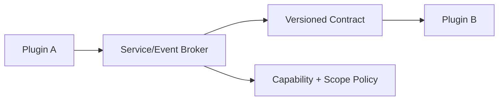

# 12 · Plugin Developer Platform and Ecosystem Governance

> 主线入口：[Client Modernization](README.md)
> 目标：让独立 Git 仓库的插件可开发、可组合、可分发、可治理，而不是把 Core monorepo 的耦合搬到很多仓库。

## 1. 当前仍需明确的设计面

插件 runtime 只是地基。生态能长期运行，还需要：

- Manifest/SDK/Contract versioning；
- dependency resolution 与 lockfile；
- capability provider 冲突与用户 binding；
- cross-plugin service/event contract；
- user/workspace/project/session scope；
- secret、network egress、外部账号连接；
- developer CLI、local dev、hot reload、debug、conformance；
- publisher identity、审核、撤回、deprecation、key rotation；
- team policy、私有 Registry、审计与合规；
- license/entitlement 的预留边界；
- 数据 export/uninstall/sync/backup 语义。

## 2. Repository Model

第一方和第三方业务插件最终都可位于独立 Git 仓库。Core 仓库只保留：

- versioned Contract/SDK packages；
- schemas 与 conformance fixtures；
- Extension Host/Broker/Registry client；
- system recovery contributions；
- architecture/main specs。

独立插件仓库保留：

- feature/engine implementation；
- manifest；
- permission/capability declarations；
- storage schema/migrations；
- UI bundles；
- tests/SBOM/provenance；
- release workflow。

独立仓库不是复制 Core source。插件只能依赖 published SDK/Contract，禁止 Git submodule 到 Core 内部 implementation。

## 3. Manifest Surface

Manifest 至少应表达：

| 域 | 字段 |
|---|---|
| Identity | id、publisher、version、display name、license |
| Compatibility | contract range、host range、platform/arch |
| Runtime | worker/process/UI entry、resource limits |
| Capabilities | `provides`、`requires`、schema version |
| Contributions | UI slots、commands、engine、search/provider 等 |
| Activation | phase、events、timeout、idle policy |
| Permissions | filesystem/network/process/clipboard/secrets/data scopes |
| Storage | namespace schema、migration、checkpoint policy |
| Dependencies | exact/range、optional/peer、service contracts |
| Distribution | artifact digest、signature、SBOM、provenance、channel |
| Recovery | LKG compatibility、safe-mode behavior、uninstall/export |

Manifest 只声明权限，实际访问仍必须经过 Capability Broker。

## 4. Dependency Model

### 4.1 Default: Self-contained Plugin

普通 JS/Rust 依赖尽量 bundle 到插件 artifact，避免所有插件共享可变 `node_modules` 或动态运行 `npm install`。

### 4.2 Plugin-to-plugin Dependency

只允许依赖 versioned service/capability contract：

```text
plugin A requires service project.graph.query ^1
plugin B provides service project.graph.query 1.2
Core Broker resolves and binds
```

禁止 A 直接 import B 的内部源码、访问 B 的 storage 或持有 B 的 raw process handle。

### 4.3 Resolution Rules

- install plan 先解完整 dependency graph；
- 检测 cycle、platform conflict、permission escalation；
- lockfile 固定 exact version/digest/provider binding；
- update 生成新 lock generation，health 后原子切换；
- optional dependency 不得阻塞基础 activation；
- shared service provider disable 前先处理 dependents；
- Core 不自动安装未向用户展示的新高权限 transitive dependency。

## 5. Scope and Profiles

| Scope | 示例 | 所有权/生命周期 |
|---|---|---|
| machine | WebView/native integration | 设备级，管理员策略 |
| user | Notes、personal image tool | 用户 profile |
| workspace | project map、repo-specific tool | workspace trust/policy |
| project | project-local extension recommendation | project config + user approval |
| session | temporary provider binding | 会话结束可释放 |

需要 `Plugin Profile` 表达一组 enabled ids、exact versions、bindings 和 permission grants。团队可发布推荐/强制 profile，但不能静默覆盖用户个人数据。

## 6. Capability Conflict and Routing

多个插件声明同一 command/slot/provider/capability 时：

- command id 全局 namespaced；
- exclusive slot 由 policy 决定唯一 owner；
- multi-contribution slot 按 stable order + user customization；
- capability provider 通过 binding 选择，禁止随机抢占；
- engine/session binding 持久化 exact provider；
- provider update 不得静默改变数据 egress/permission；
- fallback provider 只有在 schema/semantics compatible 且用户 policy 允许时生效。

## 7. Cross-plugin Communication



通信类型：

- request/response service；
- bounded event topic；
- stream handle with backpressure；
- declarative resource reference。

每种类型必须支持 version negotiation、timeout/cancel、quota、generation 和 tracing。默认不提供全局 event bus 通配订阅。

## 8. Secrets, Accounts and Network Egress

- 插件只拿 opaque secret handle，不读取 Core secret store 全表；
- OAuth/account connection 是独立 capability 与 consent；
- network domain/目的声明，支持 allowlist；
- local-only capability 与 cloud capability 在 UI 明确区分；
- secret grant 可按 user/workspace/session scope；
- logs/diagnostics 自动 redaction；
- uninstall 默认 revoke grants，数据保留/删除由用户选择。

## 9. Developer Experience

### 9.1 SDK Packages

- `@mossx/plugin-contract`：schemas/types；
- `@mossx/plugin-sdk`：runtime client/disposable helpers；
- `@mossx/plugin-ui`：declarative UI/trusted slot adapters；
- `@mossx/plugin-testkit`：host simulator/fault injection；
- Engine-specific conformance package。

包名仅是设计占位，进入实现时再确认。

### 9.2 Plugin CLI

Developer flow 应支持：

1. scaffold 独立仓库；
2. manifest/schema validation；
3. local restricted dev install；
4. Worker/process/UI hot reload；
5. capability/permission inspector；
6. deterministic session fixture replay；
7. conformance/performance tests；
8. build/sign/SBOM/provenance；
9. publish to private/curated channel；
10. rollback/revocation drill。

Local dev plugin 始终按 `local` trust 运行，不因开发者身份进入 renderer 高权限路径。

## 10. Contract Evolution

- Contract 遵守 SemVer，但 breaking 的判断由 executable conformance 定义；
- Core 支持明确的 compatibility window；
- deprecated API 有 telemetry-free local usage inventory、deadline 和 migration guide；
- plugin artifact 声明 min/max host/contract；
- Registry 拒绝发布已知不兼容组合；
- Core upgrade 前检查 enabled lock graph；
- compatibility adapter 有删除条件，禁止永久堆积。

## 11. Marketplace Governance

### 11.1 Publisher

- publisher identity verification；
- signing key rotation/recovery；
- organization ownership transfer；
- compromised publisher emergency revoke。

### 11.2 Review and Risk

- automated malware/static/dynamic scan；
- permission/capability diff；
- sandbox/conformance/performance fixture；
- human review for trusted React/high-permission plugins；
- reproducible provenance/SBOM；
- vulnerability disclosure and patch SLA。

### 11.3 Listing

- search/ranking 不能只按安装量；
- 显示 publisher、trust、permissions、data egress、platform、last update、deprecation；
- review 内容视为 untrusted data；
- paid placement 与技术推荐明确区分；
- revoked/yanked version 不再新装，但已安装用户有安全迁移路径。

## 12. Private Registry and Team Policy

企业/团队需要：

- private Registry mirror；
- approved publisher/plugin/version list；
- permission ceiling 和 egress policy；
- mandatory/recommended/blocked profile；
- staged rollout/ring/channel；
- audit export；
- offline bundle；
- emergency revoke/disable；
- exception approval with expiry。

Team policy 与 user choice 冲突时必须显示原因，不能表现为随机安装失败。

## 13. Data Lifecycle

### Install/Update

- 独立 Storage Namespace；
- migration checkpoint；
- compatible migration 默认；
- destructive migration 明示；
- rollback code + data 同步。

### Disable

- 停止 runtime/contribution；
- 保留数据和 grant 状态；
- capability graph 立即撤销。

### Uninstall

用户明确选择：

- 保留数据以便重装；
- export 后删除；
- 立即删除（仍可受 checkpoint retention policy 保护）；
- revoke secrets/accounts；
- 处理 dependent plugins。

插件不能在 uninstall hook 中直接清理其他 namespace。

## 14. Licensing and Entitlement Boundary

首个 pilot 不必实现收费市场，但 Contract 应允许独立 entitlement provider：

- license 不改变 capability permission；
- payment/entitlement failure 不损坏本地数据；
- Core 只消费 entitlement result，不保存第三方支付秘密；
- 已购买插件的 offline grace、refund、publisher disappearance 需要产品政策；
- 不让付费逻辑进入 cold-start critical path。

## 15. Ecosystem Acceptance Gate

第一阶段生态可开放前至少证明：

- 两个独立 Git 仓库 pilot（一个 Engine、一个 Feature）；
- SDK/CLI/testkit 可在无 Core source import 下完成开发；
- dependency/conflict/binding 可重复解析；
- install/update/disable/uninstall/rollback 全链；
- private/public/local 三类来源信任边界；
- cross-plugin service 经过 Broker；
- publisher revoke、Registry offline、key rotation 演练；
- team policy 不破坏 Core recovery；
- performance conformance 不让插件污染 first-interactive。

## 16. 仍待产品确认的问题

1. 是否允许 organization policy 对低风险 verified 插件自动安装，还是所有首次安装都必须人工点确认？
2. 插件安装 scope 默认是 user 还是 workspace？
3. 同一 capability 多 provider 时默认由用户选择，还是 policy 自动选最小权限 provider？
4. local plugin 是否允许 trusted React，若允许需何种额外白名单？
5. 第一期是否支持 plugin-to-plugin dependency，还是只允许依赖 Core capability？
6. 第一期 Marketplace 是否只做 curated first-party/verified，何时开放社区自助发布？
7. 插件数据是否进入 Mossx account sync，若进入如何处理 encryption/schema/version？
8. 是否规划 paid plugin/entitlement，还是长期只做免费/私有 Registry？
9. app restart 后自动续跑任务的风险阈值：哪些动作必须再次确认？
10. 插件推荐是纯本地 policy，还是允许匿名 telemetry 参与排序？
