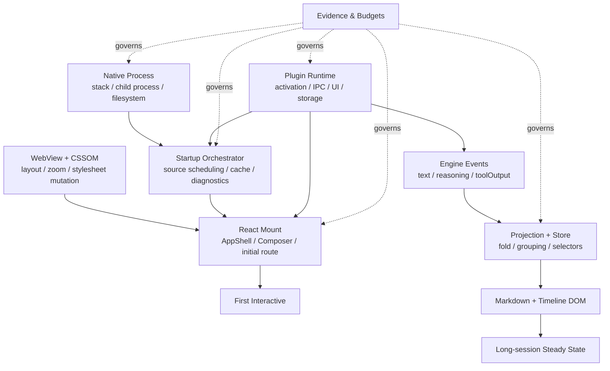
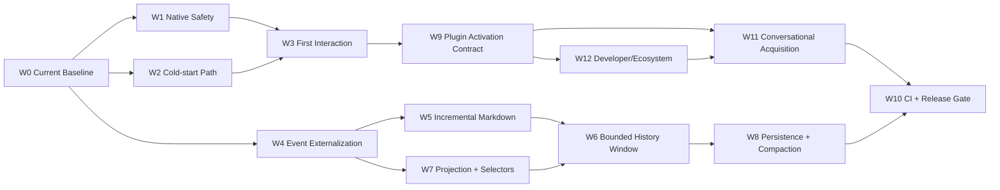

# Mossx Client Modernization 综合改善主线

> **状态**：Architecture baseline，待拆成独立 OpenSpec changes 后实施
> **最后更新**：2026-08-14
> **目标读者**：客户端架构、性能、Extension Platform、CLI Engine、Release、QA
> **一句话目标**：在不回退已落地优化的前提下，同时解决冷启动卡死、长会话退化和插件化带来的新风险，把 Mossx 演进成可测量、可隔离、可回滚的桌面平台。

## 1. 为什么单独建立这条主线

Mossx 正在同时经历三类变化：

1. 从“大一统客户端”演进为 Core + Plugin Platform；
2. Windows/macOS 冷启动存在隐藏很深的 crash、hang、首交互冻结问题；
3. 长会话、Streaming、Markdown、Tool Output 会随数据量增长逐渐放大 renderer 成本。

这三件事不能分别优化。插件化会新增进程、IPC、manifest、签名、storage migration 和 UI contribution；如果没有性能契约，它会把冷启动与长会话问题进一步放大。反过来，如果只做局部节流，不重建数据窗口、增量投影和激活边界，现有性能债也会迁移到插件系统。

本目录负责统一：

- 事实与证据；
- 因果模型；
- 架构约束；
- Performance Budget；
- Workstream 依赖；
- 可执行任务与回退门禁。

真正修改产品行为前，仍需为对应 Workstream 建立小而独立的 OpenSpec change。本目录不是“已经实现”的行为声明。

## 2. 总体因果图

## 3. 已确认的架构原则

1. 冷启动不是一个 metric，而是 Native Process、WebView/CSSOM、Startup Source Work、React Mount、Diagnostics Feedback Loop 五层链路。
2. “窗口白了/卡住了”不能直接归因给 React；Windows 已出现 native stack overflow，macOS 与 Windows 的 WebView 行为也不相同。
3. 历史报告里的行号、版本和性能数值只能作为 hypothesis；current fact 必须由当前代码与同机复测确认。
4. 已落地的 A1-A4 优化必须保留，禁止为了简化重构恢复根链高频 dispatch、秒级 polling 或逐 delta reducer 更新。
5. 长会话优化的主线是：bounded data window、incremental fold/projection、row-level subscription、incremental Markdown，而不是只加 throttle。
6. 插件 Marketplace、Registry 网络、Extension Host 和非核心 Plugin UI 不得进入默认冷启动 critical path。
7. Core first-interactive 不得依赖任何非核心插件成功启动。
8. Plugin update/rollback 必须同时服从 code + data transaction 和 performance gate。
9. 所有跨平台结论都必须标注 `已证实 / 已排除 / 未验证`，不能用“没有投诉”替代证据。
10. 所有任务都必须具备 rollback、completion evidence 和 failure ownership。

## 4. 文档导航

| 文档 | 主要问题 |
|---|---|
| [01 · Scope & System Map](01-scope-and-system-map.md) | 综合改善覆盖什么、不覆盖什么，Core/Plugin/Engine/Renderer 如何分层？ |
| [02 · Evidence Cross Review](02-evidence-cross-review.md) | 五份审查报告有哪些共识、分歧、过期结论与当前代码证据？ |
| [03 · Cold-start Freeze Causal Model](03-cold-start-freeze-causal-model.md) | Win/mac 冷启卡死如何分层定位，哪些路径会互相放大？ |
| [04 · Long-session Render Economics](04-long-session-render-economics.md) | 长会话为什么随数据增长变慢，正确的数据与渲染架构是什么？ |
| [05 · Plugin Runtime Performance Contract](05-plugin-runtime-performance-contract.md) | 插件化后如何避免启动、IPC、DOM、存储和进程成本失控？ |
| [06 · Observability & Performance Budgets](06-observability-and-performance-budgets.md) | 采什么证据、预算如何定义、CI 与 Release 如何判定？ |
| [07 · Workstreams & Dependencies](07-workstreams-and-dependencies.md) | W0-W12 如何依赖、如何分批交付？ |
| [08 · Executable Task Backlog](08-executable-task-backlog.md) | 具体任务、前置、验证、平台矩阵与回退是什么？ |
| [09 · Platform Risk & Rollback](09-platform-risk-and-rollback.md) | crash/hang、数据、供应链、平台差异如何止损和恢复？ |
| [10 · Decision Log](10-decision-log.md) | 已确认决策、证据校准与仍待确认项是什么？ |
| [11 · Conversational Plugin Acquisition](11-conversational-plugin-acquisition.md) | 如何在对话中发现、授权、安装、热激活插件并续跑原任务？ |
| [12 · Developer Platform & Ecosystem Governance](12-plugin-developer-platform-and-ecosystem-governance.md) | 独立仓库之后，SDK、依赖、冲突、发布与团队策略如何治理？ |

## 5. 与既有文档的关系

| 事实域 | Single source / 入口 | 本目录职责 |
|---|---|---|
| Plugin Platform 边界、隔离、Storage、Marketplace | [Plugin Platform](../plugin-platform/README.md) | 增加 performance contract、activation budget 与冷启动集成 |
| 运行时历史实验与 evidence artifact | [Performance Documents](../../perf/README.md) | 统一 current re-baseline 与跨 Workstream gate |
| 幕布结构、滚动与已有旋钮 | [Analysis](../../analysis/README.md) | 设计 bounded data window、projection 与 incremental rendering |
| Engine onboarding | [Multi-CLI foundation](../../research/mossx-multi-cli-provider-session-foundation-design.md) | 增加 Engine Plugin activation/IPC/resource budget |
| 产品行为与实施变更 | [OpenSpec](../../../openspec/README.md) | 只提供进入 OpenSpec 前的架构基线与任务拆分 |

## 6. 执行顺序

Critical Path 是 `W0 → W1/W2 → W3 → W9/W12 → W11 → W10` 与 `W0 → W4/W5/W7 → W6/W8 → W10` 两条链并行收敛。没有 current baseline，不允许用历史数值宣布改善；没有 native safety，不允许把 blank screen 当普通前端卡顿；没有 W9/W12，不允许 Marketplace 或对话式安装进入生产链。

## 7. Definition of Done

综合改善完成不等于“某台开发机感觉快了”。至少需要：

- Windows/macOS/Linux 明确的支持矩阵与 current build evidence；
- cold launch、warm launch、reload、first interaction、large session、streaming、plugin activation 场景覆盖；
- crash、hang、main-thread long task、event-loop lag、IPC backlog、memory、DOM、storage migration 的统一证据；
- Core Safe Mode 和 Plugin Safe Mode 可恢复；
- 失败能归属到具体 phase、plugin、engine、platform 和 generation；
- Performance Budget 能在 CI 或 release rehearsal 中重复执行；
- 对话中缺失 capability 时能完成受控 discovery、consent、事务化安装、动态刷新与 idempotent task resume；
- 独立仓库插件通过 SDK/conformance/Registry 治理，不依赖 Core internals；
- 新架构不会恢复已有明确禁止的性能反模式；
- 相应 OpenSpec change 已实施、验证、同步并归档。

## 8. 当前事实声明

截至 2026-08-14：

- Windows packaged startup 曾由 deep async future 的大 stack frame 触发 `0xc00000fd / __chkstk`；当前 `HEAD` 已通过 deep callsite `Box::pin` 与 Windows `/STACK:8388608` 处理，但仍需 packaged regression matrix 证明闭环。
- UI scale 当前固定为 100%，并清理残留 scale；旧报告中的平台分流方案已不再代表 current product behavior。
- full Composer 已由 `ComposerGate` / `ComposerLight` 延后，但 first-interaction 与 full activation 的 current timing 仍需复测。
- reasoning/toolOutput 仍可能通过 32ms batching 进入根 reducer；全文 Markdown reparse、超大静态 timeline window 和全量 projection 仍是主要架构候选。
- 2026-07-08 的 100-350ms root render 与 FPS 改善值是历史实验，不是 current baseline。

> 🛠 **深度推演**：三个表象背后其实是同一个设计问题——工作量没有被明确归属到 phase、owner 和 budget。冷启动把所有能力挤进一次启动，长会话把全部历史挤进一次投影，插件化若不设门禁又会把全部扩展挤进 Core 生命周期。综合改善的本质，是让每一份工作都具备明确的触发时机、资源上限、故障边界与撤销路径。
