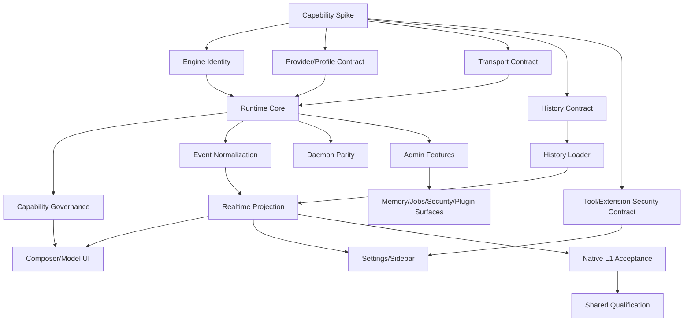

# OMP CLI 全功能独立引擎接入总架构与实施蓝图

- **文档类型**：Technical Architecture / Capability Map / Implementation Plan
- **适用项目**：`codemoss / mossx`
- **目标读者**：架构评审者、Frontend/Rust/Daemon 开发者、QA、Release 与安全审计人员
- **文档目标**：以一个完整 Agent Host/Runtime 的视角，设计 OMP CLI 在 mossx 中的独立接入方式。
- **核心约束**：OMP 是独立 Engine；核心代码、协议适配、Provider/Profile/Session、History、Control Plane、Feature Projection 必须与 PI 分离。
- **状态标签**：`verified` = 已通过代码或本机命令验证；`inferred` = 基于现有接口的设计推断；`requires-spike` = 接入前必须实测；`unsupported` = 当前阶段明确不接入。

---

## 0. Executive Decision

### 0.1 最终架构结论

OMP 不是 PI 的替代 binary，也不是单纯的“第十个文本流 CLI”。OMP 是一个带有多 Provider、Profile、Session、Plugin、Skill、Agent、Memory、Browser、Security、ACP 和 Native RPC 的 **Agent Host Platform**。

因此接入方式必须是：

```text
新增 EngineType::Omp
  ├─ OMP Engine Registry
  ├─ OMP Runtime Owner
  ├─ OMP Provider/Profile/Auth Domain
  ├─ OMP Session/History Domain
  ├─ OMP ACP Transport
  ├─ OMP Native RPC Transport
  ├─ OMP Tool/Extension/Plugin Boundary
  ├─ OMP Realtime/History Projection
  ├─ OMP Feature-local UI Stores
  └─ OMP Governance / Audit / Recovery
```

### 0.2 首期交付范围

首期目标不是一次打开所有 OMP UI，而是完成完整的 Runtime foundation，并按功能能力逐步解锁：

```text
L0  Engine discovery + Native session + prompt + basic text streaming
L1  ACK + terminal + cancel + resume + history + model/provider catalog
L2  tools + reasoning + image/file + todo/plan + compact
L3  background jobs + agents + skills/rules + plugins/extensions
L4  memory + advisor + browser/computer + SSH + collaboration
L5  security + usage/stats + share/export + worktree/git + admin surfaces
```

每一层必须具备明确的 capability state。未验证能力保持 `unknown`，不因为 UI 需要而标记为 `supported`。

### 0.3 Transport 决策

```text
默认主通道：omp acp
能力扩展：omp --mode rpc
```

二者必须是两个独立 Transport Adapter：

```text
OmpAcpClient  ≠  OmpRpcClient  ≠  PiRpcClient
```

不允许为了减少文件数量，让 `pi_rpc.rs` 同时解析 PI 和 OMP。

### 0.4 Shared Session 决策

首期 OMP 只作为 Native Session 使用，不加入 Shared Session 支持集合。

原因：OMP 自己已经具有 Provider routing 和 Agent orchestration。只有在 terminal、context handoff、provider binding、resume、cancel、tool exchange 和 recovery 全部通过 Spike 后，才评估 OMP 作为 Shared target。

---

## 1. 调研基线

### 1.1 当前项目已接入的同级 Engine

| Engine | Runtime 形态 | 当前项目参考价值 |
|---|---|---|
| Claude | stream-json、Native resume、typed result | Native terminal、resume、history |
| Codex | app-server JSON-RPC、persistent、structured history | persistent owner、provider binding |
| Gemini | registry 存在，runtime policy 默认 disabled | capability gating、disabled engine |
| Kimi | stream-json、spawn-per-turn、Native resume | L0/L1 prompt wrapper |
| Grok | stream-json/ACP content block | attachment 与 ACP content block |
| OpenCode | stream-json、runtime catalog | provider/model runtime catalog |
| Qoder | ACP over stdio、spawn-per-turn | OMP ACP transport 的最近邻参考 |
| DSH | host RPC、persistent host | daemon parity、host lifecycle |
| PI | PI-native RPC、persistent resident、steer/fork/tree | resident lifecycle 思路，禁止复用业务实现 |

完整接入矩阵见：

```text
docs/research/mossx-new-cli-onboarding-guide.md
```

### 1.2 本机 OMP 已验证事实

本机命令结果：

```text
omp --version
→ omp/18.0.11

omp --help
→ 支持 text/json/rpc/rpc-ui、--profile、--cwd、--model、--thinking、--resume、--continue、--add-dir

omp acp --help
→ Run OMP CLI as an ACP (Agent Client Protocol) server over stdio

omp --mode rpc
→ 输出 ready frame，并接受 get_state 请求
```

OMP RPC 启动 frame：

```json
{
  "type": "ready",
  "protocolVersion": 1,
  "supportedProtocolVersions": [1, 2],
  "maxFrameBytes": 1048576,
  "maxReassembledFrameBytes": 67108864
}
```

之后实测会出现：

```text
extension_ui_request
available_commands_update
response
Agent events
```

这证明 OMP 具有独立的 runtime handshake、command discovery 和 extension UI 控制面。

### 1.3 OMP help 暴露的功能面

下表来自本机 `omp --help` 的 command/flag surface；协议级细节仍需 Phase 0 Spike。

| 功能域 | OMP 能力 | 接入判断 |
|---|---|---|
| Core interaction | interactive、print、json、rpc、rpc-ui | `verified`，需分别设计 transport |
| Model | model selection、model cycling、smol/slow/plan roles | `verified`，需 catalog/profile 映射 |
| Thinking | thinking level `off` 到 `max`、`auto` | `verified`，真实 ACP/RPC payload `requires-spike` |
| Provider | OpenAI、Anthropic、Gemini、Copilot、Azure、OpenRouter、Mistral、MiniMax、OpenCode 等 | `verified`，需 Provider/Profile domain |
| Auth | api keys、OAuth、auth broker、auth gateway、provider tokens | `verified`，权限和存储边界 `requires-spike` |
| Profile | `--profile`、`OMP_PROFILE`、profile alias | `verified`，runtime identity `requires-spike` |
| Session | continue、resume、session dir、no-session | `verified`，native schema `requires-spike` |
| Workspace | cwd、add-dir、home allow、worktree | `verified`，workspace grants `requires-spike` |
| Prompt input | text、`@file`、image、message args | `verified`，附件协议 `requires-spike` |
| Tools | read、bash、edit、write、LSP、python、notebook、browser、inspect_image、task | `verified`，逐工具投影 `requires-spike` |
| Agent | bundled agents、task delegation、join | `verified`，collab ownership `requires-spike` |
| Skills/rules | skill discovery、filter、disable | `verified`，需安全和版本治理 |
| Extensions | `--extension`、extension discovery、disable extensions | `verified`，需 headless/UI policy |
| Plugins | install、link、marketplace、enable/disable | `verified`，需 capability sandbox |
| Memory | view、stats、diagnose、queue、sync、clear、rebuild、mental models | `verified`，需和 mossx memory 分域 |
| Todo | edit、copy、expand、collapse、export、import、append、start、done、drop、rm | `verified`，可映射 feature-local state |
| Plan | plan model、plan-yolo、prewalk | `verified`，需和 mossx Plan contract 区分 |
| Advisor | on/off/status/dump/configure | `verified`，需 policy 和 transcript boundary |
| Compact | soft、remote、snapcompact | `verified`，terminal/history 影响 `requires-spike` |
| Handoff | summarize + compact in place | `verified`，需 canonical event/history contract |
| Browser | headless/visible browser relay | `verified`，当前 Desktop/WebView boundary `requires-spike` |
| Computer | computer use toggle | `verified`，权限与平台门禁 `requires-spike` |
| MCP | add/list/remove/test/reauth/enable/disable/reconnect/resources/prompts | `verified`，需 security boundary |
| SSH | add/list/remove | `verified`，需 secret/key boundary |
| Security | native security plan/scan/status/cancel/scans/show/import/export/validate/compare/disposition | `verified`，需独立 security domain |
| Usage | provider usage、limits、reset | `verified`，需 usage attribution |
| Stats | local stats dashboard | `verified`，可作为外部 surface 或 integration |
| Export/share | HTML export、encrypted share | `verified`，需数据脱敏与权限确认 |
| Jobs | background job listing/control | `verified`，需 background task contract |
| Git | interactive fullscreen git UI | `verified`，不应直接嵌入 Conversation runtime |
| Worktree | list/clear agent-managed worktrees | `verified`，需 workspace mutation guard |
| Bench | provider/model benchmark | `verified`，首期非 Conversation path |
| Setup/install/update | setup、install、plugin、update、gc | `verified`，首期 admin/maintenance surface |
| Search | search providers | `verified`，Tool/Network policy `requires-spike` |
| TTS | say、tts | `verified`，首期 optional capability |
| Diagnostics | cleanse、grievances、doctor-like commands | `verified`，需独立 diagnostics surface |

---

## 2. 总体架构：六大 Plane

### 2.1 总体结构

```text
┌─────────────────────────────────────────────────────────────────────┐
│                         mossx Desktop                                │
├─────────────────────────────────────────────────────────────────────┤
│ Projection Plane                                                    │
│ Composer / Timeline / Sidebar / Settings / Inspector / Status       │
├─────────────────────────────────────────────────────────────────────┤
│ Capability Plane                                                     │
│ Provider / Model / Auth / Tools / MCP / Plugins / Skills / Memory   │
├─────────────────────────────────────────────────────────────────────┤
│ Canonical Event & Context Plane                                     │
│ EngineEvent / NormalizedThreadEvent / ContextPackage / Usage Fact   │
├─────────────────────────────────────────────────────────────────────┤
│ Control Plane                                                        │
│ ACP / Native RPC / command discovery / extension UI / job control    │
├─────────────────────────────────────────────────────────────────────┤
│ Runtime Plane                                                        │
│ process owner / profile owner / session owner / workspace owner     │
├─────────────────────────────────────────────────────────────────────┤
│ Governance Plane                                                     │
│ capability matrix / audit / security / recovery / CI / telemetry     │
└─────────────────────────────────────────────────────────────────────┘
                              │
                ┌─────────────┴─────────────┐
                │                           │
          omp acp over stdio        omp --mode rpc
```

### 2.2 Plane 职责

#### Engine Plane

回答“谁在执行”：

```text
engine = omp
```

不负责 Provider 选择、不负责判断终态、不负责渲染。

#### Runtime Plane

回答“进程和 session 归谁”：

```text
workspace × runtimeProfile × providerProfile × session
```

负责：

- spawn/reuse/stop
- runtime key
- process lifecycle
- session binding
- profile home
- environment assembly
- daemon/app parity

#### Control Plane

回答“如何控制 OMP”：

- ACP initialize/session/prompt/cancel
- OMP RPC ready/request/response/events
- command discovery
- extension UI request
- background jobs
- compact/handoff/model/provider controls

Control event 默认不能直接进入 Conversation timeline。

#### Capability Plane

回答“OMP 能做什么”：

- Provider/model
- tools/MCP
- image/file
- skills/rules/extensions/plugins
- agents/tasks
- memory/advisor
- browser/computer
- security
- collaboration

所有能力必须有 capability state 和 owner。

#### Projection Plane

回答“用户看到什么”：

- conversation timeline
- live streaming
- history
- sidebar
- composer
- model/provider selector
- todo/plan cards
- background job cards
- security findings
- usage/status

Projection 只消费 canonical facts，不直接解析 OMP raw protocol。

#### Governance Plane

回答“是否安全可交付”：

- registry parity
- capability matrix
- permission policy
- audit trail
- recovery
- performance
- feature flags
- CI gates
- release compatibility

---

## 3. Identity 与数据模型

### 3.1 四层 identity

OMP 至少需要以下四个独立 identity：

```text
Engine Identity
  = omp

Runtime Profile Identity
  = OMP --profile / OMP_PROFILE 作用域

Provider Binding Identity
  = OMP 当前 Provider 配置与凭据作用域

Native Session Identity
  = OMP 原生 session id / session file identity
```

推荐前端 thread key：

```text
omp:<runtimeProfileId>:<nativeSessionId>
```

如果 native session id 在多个 profile 中全局唯一，仍建议持久化 profile-qualified identity，避免 profile root 变化后串台。

### 3.2 Runtime owner

```rust
OmpRuntimeOwnerKey {
    workspace_id,
    engine: Omp,
    runtime_profile_id,
    provider_profile_id,
    native_session_id,
}
```

注意：

- `runtime_profile_id` 不等于 `provider_profile_id`。
- `provider_profile_id` 不等于 model id。
- model 切换不应创建新 session，除非 OMP 协议明确要求。
- profile 切换必须阻止复用旧 resident。
- session 切换必须阻止跨 tab 共享错误 process。

### 3.3 ExecutionTarget

Native OMP：

```text
ExecutionTarget {
  engine: "omp",
  runtimeProfileId,
  providerProfileId,
  modelCatalogEntryId,
  model,
  reasoning,
}
```

Shared OMP（后置）：

```text
SharedTarget {
  engine: "omp",
  providerProfileId,
  modelCatalogEntryId,
  model,
  reasoning,
  contextCapabilities,
}
```

### 3.4 OMP feature state

OMP-specific state 不进入 AppShell domain bag，使用 feature-local store：

```text
src/features/omp-session/
├─ ompSessionStore.ts
├─ ompRuntimeStore.ts
├─ ompProfileStore.ts
├─ ompCommandStore.ts
├─ ompJobStore.ts
├─ ompTodoStore.ts
├─ ompMemoryStore.ts
├─ ompSecurityStore.ts
└─ ompCapabilitySelectors.ts
```

理由：

- OMP control-plane churn 高。
- 不应把 command list、job events、memory queue 等高频数据打入 AppShell 根链。
- 避免违反 AppShell Structure Gate 和 Render Perf Baseline。

---

## 4. OMP Runtime 与双协议设计

### 4.1 ACP Adapter

建议模块：

```text
src-tauri/src/engine/omp_acp.rs
```

职责：

```text
OmpAcpClient
├─ spawn `omp acp`
├─ initialize
├─ session/new
├─ session/resume
├─ session/prompt
├─ session/cancel
├─ notification/update
├─ request/response correlation
├─ terminal evidence
├─ extension/UI request policy
└─ process cleanup
```

注意：上述 method 名是架构角色，不代表 OMP ACP 一定使用这些精确方法；必须以 Spike 结果为准。

### 4.2 Native RPC Adapter

建议模块：

```text
src-tauri/src/engine/omp_rpc.rs
```

职责：

```text
OmpRpcClient
├─ ready frame negotiation
├─ protocolVersion validation
├─ maxFrameBytes validation
├─ request id correlation
├─ command field routing
├─ Agent event stream
├─ available_commands_update
├─ extension_ui_request
├─ job/control events
├─ typed terminal detector
└─ process/reconnect policy
```

OMP RPC 与 PI RPC 的分界：

| 项目 | PI | OMP |
|---|---|---|
| ready frame | 当前 PI adapter 未依赖 | OMP 必须处理 |
| command discovery | PI-specific | OMP 明确推送 |
| extension UI | PI contract | OMP contract 需重测 |
| provider model | PI native model config | OMP host multi-provider |
| session profile | PI home | OMP `--profile`/agent root |
| terminal | `agent_settled` | OMP-specific evidence |

### 4.3 Transport selection

```text
transport=acp
  → 基础 Native Session

transport=rpc
  → OMP-specific control surface

transport=auto
  → 只有两个 transport 的能力差异、回退条件、幂等行为全部通过 Spike 后才允许
```

禁止：

- ACP 失败后静默切换到 PI。
- RPC 失败后把 OMP 当 Claude/Kimi 处理。
- 同一个 native session 同时由 ACP 和 RPC 两个 resident 控制。
- 用固定 timeout 代替 terminal/recovery 判断。

### 4.4 ACK / Terminal contract

每种证据必须单独建模：

```text
Spawn ACK       = process started
Write ACK       = stdin accepted by OS
Input ACK       = OMP accepted this user input
Run Started     = OMP started this logical run
Terminal        = OMP declared logical run complete
Cleanup         = process/stdio/extensions/jobs finished
```

硬规则：

```text
Input ACK ≠ Run Started ≠ Terminal ≠ Cleanup
```

OMP response 如果只代表 accepted/queued，则不得结算 Conversation turn。必须寻找：

- typed completed/result event
- ACP prompt result
- explicit agent end/settled event
- history read-back proof
- OMP command-specific terminal evidence

最终判断必须写入 capability spike。

---

## 5. OMP 功能全量接入设计

本节是功能接入主清单。每一项都明确：用户能力、runtime 载体、mossx 投影、首期策略和关键风险。

### 5.1 Core Interaction

#### Interactive / Print / JSON / RPC / RPC-UI

| OMP surface | mossx 设计 |
|---|---|
| interactive | OMP Native Session 的 backend-owned process，不直接嵌入 TUI |
| `-p/--print` | 仅作为 probe、fallback 或 one-shot utility；不能作为主 session terminal 依据 |
| `--mode json` | 仅适合 diagnostics/export，不作为 live conversation 主通道，除非 Spike 证明有稳定 event schema |
| `--mode rpc` | 独立 OMP Native RPC control plane |
| `--mode rpc-ui` | 不直接接管 mossx UI；转换为 headless policy 或独立 OMP surface |
| `omp acp` | 首期主 transport |

#### Message / File / Image input

输入模型：

```text
UserMessage
├─ text
├─ file references
├─ image content
├─ workspace add-dir references
└─ execution metadata
```

要求：

- `@file` 的文本和二进制语义必须分别处理。
- image 不能无界放入 argv。
- base64 image 必须限制大小、mime type 和 IPC payload。
- 非 ASCII 路径按字符边界处理，禁止 byte slicing panic。
- history 必须能还原 image/file provenance。
- 用户气泡不能与 assistant 尾包合并。

### 5.2 Provider / Model / Auth

#### Provider Catalog

OMP 的 Provider 不是 mossx Engine；建模为 OMP Runtime 下的 Provider binding：

```text
OMP
├─ provider: openai
├─ provider: anthropic
├─ provider: gemini
├─ provider: copilot
├─ provider: azure
├─ provider: openrouter
├─ provider: mistral
├─ provider: minimax
├─ provider: opencode
└─ custom/provider extensions
```

首期职责：

- runtime probe 获取 provider/model catalog。
- 用 `last-good` 防止暂时不可用导致 selector 空白。
- catalog 必须带 provenance、profile、provider、model、reasoning capabilities。
- 禁止将 OMP provider rows 混入 PI provider rows。

#### Model roles

OMP 暴露：

```text
main model
smol model
slow model
plan model
```

建议 Mossx ExecutionTarget 显式增加 role metadata，但不要把 role model 冒充普通当前 model：

```text
selectedModelRole = main | smol | slow | plan
```

`smol/slow/plan` 可能影响：

- plan generation
- prewalk
- advisor
- task worker
- title generation

需要按 invocation scope 记录，不能只存一个全局 model。

#### Auth / Broker / Gateway

必须分离：

```text
mossx settings credential
OMP profile credential
OMP auth-broker credential
process environment credential
```

凭据优先级必须由 Spike 和安全评审确定。默认采用：

```text
explicit managed binding
  > selected OMP profile credential
  > stored provider credential
  > process environment
```

要求：

- UI 不回显完整 token。
- auth status 只返回 presence/source/expiry/diagnostic，不返回 secret。
- provider 之间不能共享错误 token。
- OMP `auth-broker` 进程生命周期不应阻塞 conversation terminal。
- auth gateway 的网络和端口权限需要审计。

### 5.3 Profile / Workspace / Runtime

#### Profile

`--profile` 影响范围至少可能包括：

```text
auth
sessions
settings
caches
models
plugins
skills
rules
```

必须通过 Spike 确认真实范围，并写进 `OmpRuntimeProfile`。

#### Workspace

支持：

- `--cwd`
- `--allow-home`
- `--add-dir`
- managed worktree
- workspace-specific rules/skills/plugins

Mossx 需要将这些映射到现有 workspace grant 和 file interaction evidence contract。禁止 OMP 自己绕过 mossx workspace permission。

### 5.4 Session / History / Continuation

#### Session lifecycle

```text
create
→ bind profile/provider/workspace
→ prompt
→ stream
→ terminal
→ persist
→ resume/list/load/delete
```

必须验证：

- 新建 session id 由哪里返回。
- session id 是否 profile-scoped。
- `--continue` 选择规则。
- `--resume` 支持 id/path/picker 哪些形式。
- `--no-session` 是否完全不落盘。
- session directory 是否可自定义。
- profile 切换是否可恢复旧 session。

#### History

新增：

```text
src-tauri/src/engine/omp_history.rs
src/features/threads/loaders/ompHistoryLoader.ts
src/features/threads/loaders/ompHistoryParser.ts
```

历史需支持：

- user/assistant text
- reasoning/thinking
- tool call/result
- image/file provenance
- todo/plan
- background jobs
- compact/handoff markers
- provider/model metadata
- error/aborted turn
- profile/session identity

禁止复用 PI JSONL parser，除非经过 schema fingerprint 和 read-back 验证；默认视为不兼容。

#### Continuation / Handoff

OMP 的 `handoff` 不是 mossx Native Provider Continuation 的自动替代品。必须区分：

```text
OMP local handoff
  = OMP 自己生成 handoff 并 compact 当前 session

mossx provider continuation
  = Mossx 创建另一 Provider 的 native continuation

Shared context handoff
  = Mossx Context Compiler 向另一个 ExecutionTarget 投影
```

三者不能共用一个 parent/child 字段。

### 5.5 Tool Runtime

OMP help 暴露工具：

```text
read
bash
edit
write
lsp
python
notebook
browser
inspect_image
computer
web_search
ask
```

每个工具都必须经过：

```text
OMP raw tool event
→ OmpToolNormalizer
→ Canonical Tool Fact
→ NormalizedThreadEvent
→ Timeline / Inspector / Status
```

工具映射原则：

| Tool | 首期策略 |
|---|---|
| read | 接入标准 tool item |
| bash | 标准 tool item + permission/audit |
| edit/write | 标准 file mutation evidence + change ledger |
| lsp | 标准 tool item，不进入 root hot chain |
| python/notebook | `requires-spike`，隔离执行环境必须明确 |
| browser | 独立 browser surface，不能把页面截图当普通文本 |
| inspect_image | image capability + payload guard |
| computer | 平台权限门禁，首期 optional |
| web_search | network/tool policy，保留 source/provenance |
| ask | 统一 user-input elicitation contract |

### 5.6 MCP

OMP MCP surface：

```text
add/list/remove/test/reauth/unauth
enable/disable/reconnect/reload
resources/prompts/notifications
smithery-search/smithery-login/smithery-logout
```

架构：

```text
OMP MCP Config
  → OmpMcpRuntime
  → Mossx policy/audit boundary
  → canonical tool/resource/prompt facts
```

安全要求：

- MCP server scope 明确区分 project/user。
- OAuth reauth 不阻塞 turn settlement。
- MCP resource/prompt 不自动进入 system prompt，必须有 provenance 和 size budget。
- MCP tools 不能绕过 mossx user approval policy。
- disconnect/reconnect 作为 control-plane event，不当作 assistant text。

首期可以支持 OMP MCP runtime 的基础 tool events，但不首期完整重做 Mossx MCP management UI。

### 5.7 Agent / Task / Background Jobs

OMP 提供：

```text
omp agents
omp task
omp join
omp ps
```

必须区分：

```text
OMP internal worker
Mossx Shared Squad worker
Mossx SubAgent
Background job
```

不允许把 OMP task 自动映射成 mossx SubAgent parent/child。建议 canonical model：

```text
OmpJob {
  jobId,
  ownerSessionId,
  ownerProfileId,
  kind,
  status,
  startedAt,
  finishedAt,
  resultSummary,
  fullOutputRef,
}
```

投影：

- active job：Composer status pill / BackgroundTaskCard。
- finished job：timeline summary + collapsible detail。
- orphan job：只进入 diagnostics，不污染新 session。
- job stop：必须指定 exact owner，禁止 workspace-wide kill。

### 5.8 Skills / Rules / Extensions / Plugins

#### Skills

支持：

- discovery
- `--skills` filter
- `--no-skills`

Mossx 需要决定：

```text
OMP skill
  = OMP runtime resource

Mossx skill
  = host-level behavior capability
```

两者不能自动合并成一个无 provenance 的 prompt block。

#### Rules

`--rules` / `--no-rules` 必须进入 Runtime Launch Profile。规则来源需记录：

```text
system
project
workspace
profile
session
```

安全要求：

- 显示 effective rules source。
- 禁止 hidden rule 静默修改权限 policy。
- rules 不能绕过 mossx system conventions。

#### Extensions

`--extension`、extension discovery、`--no-extensions`：

- extension 是运行时代码，不是普通 session metadata。
- extension UI request 默认不能阻塞 headless host。
- extension output 必须有 source identity。
- extension crash 不能杀死 mossx root session。
- extension-generated tool 必须重新走 capability/audit gate。

#### Plugins / Marketplace

Plugin surface：

```text
install/link/uninstall/list
enable/disable
marketplace add/remove/update/list/discover/install/uninstall
installed/upgrade
```

首期建议：

- 只支持 runtime discovery/status。
- plugin install/uninstall 走独立 Settings/Admin surface。
- 不在 Composer send 热路径安装插件。
- plugin code 不允许直接获取 mossx secret、workspace grant 或 native window 权限。
- plugin update 需要版本锁定、来源、checksum、rollback。

### 5.9 Todo / Plan / Prewalk / Advisor

#### Todo

OMP Todo 是独立的任务状态机，不能直接覆盖 mossx todo。

建议：

```text
OMP Todo state → OmpTodoStore
                   ├─ timeline projection
                   ├─ composer status pill
                   └─ history snapshot
```

字段保留：

```text
phase
item
status
createdAt
updatedAt
source
```

#### Plan

区分：

```text
OMP plan model
Mossx implementation plan
OpenSpec artifact
```

OMP plan 只作为 Agent conversation/runtime artifact；不自动修改 OpenSpec 或项目 task registry。

#### Prewalk

`--prewalk` 是 OMP 在计划完成后的模型切换策略。接入时必须：

- 保留 model role transition event。
- 不能改变 mossx active execution target 的语义。
- 不能在 first click 触发重型 store 初始化。
- 不能造成 root AppShell 高频更新。

#### Advisor

Advisor 是被动审阅/注入运行时，需：

- 独立 advisor transcript。
- 明确注入点。
- 不把 advisor note 当作 assistant final。
- 不影响 logical terminal。
- 支持关闭/导出/诊断。

### 5.10 Memory

OMP Memory surface：

```text
view/stats/diagnose/queue/sync/clear/reset
enqueue/rebuild
mental model list/show/refresh/history/seed/delete/reload
```

必须与 mossx Project Memory 分域：

```text
OMP Memory
  = OMP runtime-owned memory

Mossx Project Memory
  = mossx workspace/conversation-owned memory
```

禁止：

- OMP 自动写入 mossx memory store。
- mossx memory 注入无 source metadata 地传给 OMP。
- memory sync 阻塞 turn terminal。
- memory clear 误删 mossx project memory。

建议 canonical envelope：

```text
MemoryFact {
  source: omp
  profileId
  workspaceId
  sessionId?
  scope: session | profile | project | user
  contentRef
  checksum
}
```

### 5.11 Browser / Computer / Browser Relay

OMP 支持 headless/visible browser 和 computer use。当前项目已有 Browser/Computer Use bridge，必须经过现有 Native WebView/API 与权限 gate。

架构：

```text
OMP browser tool
  → Browser capability adapter
  → browser session owner
  → screenshot/navigation/action evidence
  → Browser Dock / inspector / timeline
```

要求：

- browser child WebView 不与 OMP root process 混为一个 lifecycle。
- visible/headless 切换不靠固定 timeout。
- browser relay 的真实用户 tab 操作必须显示 scope。
- computer use 需要平台能力、权限和 fail-safe。
- screenshot/base64 进入 IPC 前必须瘦身。
- browser network/auth cookies 不进入普通 transcript。

### 5.12 SSH / Shell / Web Search

#### SSH

OMP SSH 管理：

```text
add/list/remove
```

必须单独建模 SSH host config，不把私钥内容进入 session log。Mossx 不应替 OMP 复制 secret；只传 allowlisted reference。

#### Shell

Bash/PTY 执行要复用 mossx command permission/audit contract：

```text
OMP tool request
→ Mossx approval policy
→ exact process owner
→ output cap
→ canonical tool result
```

#### Web Search

Search provider、cookies、API keys 归 OMP profile；搜索结果必须保留：

```text
provider
query
source URLs
retrievedAt
content budget
```

防止将外部网页内容误识别为系统规则或项目事实。

### 5.13 Security

OMP security command surface：

```text
plan
scan
status
cancel
scans
show
import
export
validate
compare
disposition
```

安全功能不能作为普通 tool card 处理，应建立独立 domain：

```text
src/features/omp-security/
├─ securityPlanStore.ts
├─ securityScanStore.ts
├─ securityFindingStore.ts
├─ securityDispositionStore.ts
└─ securityProjection.ts
```

Canonical finding 最低字段：

```text
scanId
findingId
lineageId
severity
confidence
ruleId
location
evidence
status
disposition
rationale
source
createdAt
```

安全要求：

- SARIF/import bundle 必须 schema validate。
- finding disposition 必须保留 rationale 和 actor。
- scan cancel 不得误杀普通 OMP turn。
- security export 必须脱敏 workspace secrets。
- security scan status 不能污染 Conversation terminal。

### 5.14 Usage / Stats / Export / Share

#### Usage

OMP usage 可能有 provider limit、account、reset 等语义。必须与 mossx usage attribution 分离：

```text
reportSubjectId
provider
profileId
sessionId?
model
window
inputTokens
outputTokens
cacheTokens
limit
```

#### Stats

OMP `stats` 可启动本地 dashboard。首期可以：

- 作为外部 OMP surface 打开。
- 由 mossx 提供 link/entry。
- 不将 dashboard 数据复制进 AppShell root。

#### Export / Share

- HTML export：只读生成，不修改 session。
- encrypted share：必须显式用户动作。
- share payload 需要敏感信息扫描。
- provider token、MCP OAuth、SSH key、workspace secret 不能进入 export。
- share lifecycle 与 Native Session identity 分开。

### 5.15 Git / Worktree / Bench / Setup / Update

这些是 OMP host/admin surface，不应全部塞进 Conversation：

| 功能 | 建议归属 |
|---|---|
| `omp git` | 独立 Git UI/terminal surface |
| worktree list/clear | Workspace management，需 exact owner |
| bench | Diagnostics/benchmark surface，不进普通 session |
| setup | Setup/doctor flow，不进 Composer 热路径 |
| install/plugin | Admin surface，需 permission |
| update | Release/update surface，需版本/rollback |
| gc | Maintenance，不能误删 active sessions |
| cleanse | Diagnostics，保留变更证据 |
| grievances | OMP tool/runtime issue ledger |
| TTS/say | Optional desktop capability |

---

## 6. Mossx 接入点全量矩阵

### 6.1 Identity / Runtime

| 编号 | 文件/模块 | OMP 工作 |
|---|---|---|
| A1 | `src/types/engine.ts` | 新增 `omp` union |
| A2 | `src/features/engine/engineIds.json` | registry metadata |
| A3 | `src/features/engine/engineRegistry.ts` | builtin registry |
| A4 | `src-tauri/src/engine/mod.rs` | Rust enum、features、display/icon |
| A5 | `src-tauri/src/bin/cc_gui_daemon/engine_bridge.rs` | daemon 平行 enum/payload |
| A6 | `src-tauri/src/engine/adapter_registry.rs` | protocol family、execution model |
| B1 | `manager.rs` | OMP session/runtime collections |
| B2 | `status.rs` | binary/version/auth/model detection |
| B3 | `commands.rs` | send/sync/interrupt/models dispatch |
| B4 | `events.rs` | OMP event envelope mapping |
| B5 | `command_registry.rs` | list/load/delete/OMP commands |
| B6 | `workspaces/commands.rs` | workspace detection gate |
| B7 | `state.rs` | prewarm policy |
| B8 | `session_management.rs` | OMP config/session counts |
| B10 | `engine/omp*.rs` | runtime/history/profile/transport |

### 6.2 Capability Governance

| 编号 | 文件/模块 | OMP 工作 |
|---|---|---|
| C1 | capability matrix fixture | 逐 capability 填值 |
| C2 | capability generator | 增加 `omp` variant |
| C3 | registry checker | 增加 `omp` expected builtin |
| C4 | catalog checker | runtime-only/static fallback 决策 |
| C5 | engine branch scanner | 增加 policy allowlist/decision |
| C6 | tool policy | OMP tool list 与 permission mapping |
| C7 | extension policy | extension/plugin sandbox |
| C8 | security policy | OMP security domain gate |

### 6.3 Projection

| 编号 | 文件/模块 | OMP 工作 |
|---|---|---|
| D1 | `ompRealtimeAdapter.ts` | OMP event → normalized event |
| D2 | `ompHistoryLoader.ts` | history loader |
| D3 | `conversationCurtainContracts.ts` | event dictionary/engine union |
| D4 | `TimelineRowRenderer.tsx` | streaming whitelist |
| D5 | `MessagesCore.tsx` | tool/plan/todo/job/usage whitelist |
| D6 | `useAppServerEvents.ts` | raw method/thread inference |
| D7 | presentation profile | OMP cadence if necessary |
| D10 | user input contract | OMP `ask`/elicitation |
| D11 | attachment chain | image/file round-trip |
| D12 | job projection | background jobs |
| D13 | security projection | findings surface，不进普通 timeline |

### 6.4 Composer / Provider / Model

| 编号 | 文件/模块 | OMP 工作 |
|---|---|---|
| E1 | `ChatInputBoxAdapter.tsx` | engine/provider/model mapping |
| E2 | `ChatInputBox/types.ts` | OMP provider/profile entries |
| E3 | `modelOptions.ts` | model roles / catalog |
| E4 | engine catalog controller | runtime catalog projection |
| E5 | `EngineIcon.tsx` | OMP icon |
| E6 | reasoning selector | thinking role/capability |
| E7 | engine visibility store | OMP enable/disable |
| E8 | image input labels | OMP attachment copy |
| E10 | feature-local OMP selectors | profile/provider/job/todo/memory state |

### 6.5 Shared / Context

| 编号 | 文件/模块 | OMP 工作 |
|---|---|---|
| F1 | shared supported engines | 首期保持不加入 |
| F2 | `shared_session_v2.rs` | 后置 context/runtime match |
| F3 | `shared_runtime_coordinator.rs` | 后置 pending/owner match |
| F4 | `shared_projection/commands.rs` | 后置 projection capability |
| F5 | `shared_sessions.rs` | 后置 pending prefix/dispatch |
| F6 | native continuation | OMP handoff 与 continuation 分离评估 |
| F7 | Context Compiler | 仅在 Shared qualification 后增加 OMP transformer |

### 6.6 Settings / Sidebar / Admin

| 编号 | 文件/模块 | OMP 工作 |
|---|---|---|
| G1 | Vendor Settings | provider/auth/profile management |
| G2 | `CliCustomPathDialog.tsx` | OMP binary path |
| G3 | Settings doctor | OMP doctor/status |
| G4 | Sidebar menu | OMP new-session entry |
| G5 | ThreadList | OMP badge/title/profile |
| G6 | Session Management | OMP history list/load/delete |
| G7 | HomeChat/PromptEnhancer | OMP label |
| G8 | session index | profile/session/derived rows |
| G9 | OMP Admin surface | plugin/memory/security/usage/setup |

### 6.7 i18n

至少新增以下 namespace：

```text
workspace
providers
sidebar
settings
runtimeNotice
security
memory
jobs
plugins
browser
ssh
usage
```

10 locale parity 必须通过。原始 OMP command 名保留 English，用户文案走 i18n。

---

## 7. 全量任务拆分与依赖 DAG



### Workstream W0：Capability Spike

交付：`docs/research/mossx-omp-cli-capability-spike.md`

任务：

1. binary/version/install channels。
2. ACP protocol and initialization。
3. native RPC ready/request/response/event schema。
4. session create/resume/list/load/delete。
5. profile/auth/session/cache isolation。
6. provider/model catalog。
7. model roles and thinking levels。
8. prompt/image/file/add-dir input。
9. tool/MCP/browser/computer event schema。
10. extension/plugin/skill/rules loading。
11. agent/task/job semantics。
12. todo/plan/compact/handoff。
13. memory/advisor。
14. security scan lifecycle。
15. usage/stats/export/share。
16. terminal/ACK/cancel/recovery。
17. long-turn and response/update interleaving。
18. profile migration and version compatibility。

### Workstream W1：Engine Registry

任务：

- 增加 `EngineType::Omp`。
- 增加 `builtin.omp`。
- 选择 protocol family。
- 选择 execution model。
- 更新 app/daemon exhaustive match。
- 更新 icon/display/visibility。
- 更新 serialized engine compatibility fixture。

### Workstream W2：OMP Runtime Core

任务：

- `omp.rs`：session/run orchestration。
- `omp_acp.rs`：ACP transport。
- `omp_rpc.rs`：native RPC transport。
- `omp_provider_profile.rs`：profile/provider launch descriptor。
- `omp_runtime_owner.rs`：owner key/lifecycle。
- process spawn/stop/reconnect。
- environment and credential assembly。
- model/provider reconcile。
- typed ACK/terminal waiter。
- watchdog/recovery。

### Workstream W3：History / Session Index

任务：

- `omp_history.rs`。
- session list/load/delete commands。
- history schema parser。
- profile-qualified identity。
- resume/read-back。
- compact/handoff marker。
- parent/derived relationship。
- session index writer。
- sidebar top-level filtering。

### Workstream W4：Canonical Event Pipeline

任务：

- OMP raw event parser。
- conversation/control/extension 三路分流。
- text/reasoning/tool/job/todo/plan normalization。
- terminal/cleanup separation。
- user input elicitation。
- usage facts。
- unknown event diagnostics。
- malformed payload handling。

### Workstream W5：Capability Governance

任务：

- matrix fixture。
- generator variant。
- registry checker。
- catalog checker。
- policy router allowlist。
- tool capability profile。
- extension/plugin security capability。
- OMP-specific feature flags。

### Workstream W6：Frontend Native Session

任务：

- `ompRealtimeAdapter.ts`。
- `ompHistoryLoader.ts`。
- thread id routing。
- streaming whitelist。
- model/provider/profile selection。
- cancel/resume UI。
- todo/plan/job status。
- OMP feature-local stores。
- OMP icon/labels/i18n。

### Workstream W7：Provider/Auth/Profile UI

任务：

- OMP profile selector。
- provider catalog。
- auth status。
- profile health/doctor。
- model role selector。
- token redaction。
- env-vs-stored credential precedence。
- custom binary path。

### Workstream W8：Tools/MCP/Attachments

任务：

- tool event projection。
- bash/edit/write permission mapping。
- LSP/python/notebook strategy。
- MCP status and resource/prompt boundaries。
- image/file/add-dir handling。
- attachment history round-trip。
- payload cap and audit。

### Workstream W9：Agent/Jobs/Skills/Plugins

任务：

- OMP jobs store。
- task lifecycle。
- agent delegation projection。
- orphan job handling。
- skills/rules provenance。
- extension UI headless policy。
- plugin status/admin surface。
- plugin permission sandbox。

### Workstream W10：Memory/Advisor/Plan/Compact

任务：

- OMP memory domain。
- mossx memory isolation。
- advisor transcript/projection。
- todo/plan separation。
- prewalk model transition。
- compact/handoff events/history。
- control-plane UI。

### Workstream W11：Browser/Computer/SSH/Search

任务：

- Browser capability adapter。
- browser relay ownership。
- visible/headless state。
- computer permission gate。
- SSH config and key references。
- search provenance and network policy。
- output/image/session evidence。

### Workstream W12：Security / Usage / Admin

任务：

- security plan/scan/status/cancel。
- finding lineage/disposition。
- SARIF/import/export validation。
- usage attribution。
- stats entry。
- share/export redaction。
- git/worktree integration。
- bench/setup/update/gc/diagnostics。

### Workstream W13：Shared Qualification

仅在 Native L1 通过后开始：

- Shared target capability profile。
- OMP context transformer。
- provider binding isolation。
- portable transcript/checkpoint。
- tool exchange policy。
- context resume integrity。
- retry/recovery classification。
- Shared sidebar hide/spawn。

---

## 8. 版本与兼容策略

### 8.1 OMP protocol compatibility

OSP/OMP 版本变化可能影响：

- ready protocol version。
- RPC command/event schema。
- ACP method/schema。
- model catalog。
- plugin/extension API。
- session file schema。
- default profile root。

建议持久化：

```text
ompBinaryVersion
ompProtocolFamily
ompProtocolVersion
ompSchemaFingerprint
ompRuntimeProfileId
ompProviderProfileId
```

### 8.2 Minimum version

最小版本不能只依据 `--version` 字符串。必须建立 capability-based minimum：

```text
required:
  acp or rpc handshake
  stable session identity
  terminal evidence
  cancel
  model discovery
```

低版本处理：

- status 标记 outdated。
- 显示 remediation command。
- 不自动切换到 PI。
- 仅当兼容 matrix 明确允许时启用降级 transport。

### 8.3 Profile migration

OMP profile root 或 schema 变化时：

```text
旧 profile
  → read-only inspect
  → migration plan
  → user approval
  → atomic migration
  → health probe
```

禁止在启动时静默重写用户 profile/session 数据。

---

## 9. 安全架构

### 9.1 Permission domains

OMP 功能不能共享一个粗粒度 `allow/deny`：

```text
process spawn
filesystem read
filesystem write
shell/pty
network/search
MCP server
browser
computer
SSH
credential/auth
plugin/extension code
security scan
share/export
worktree mutation
```

每项都需要：

- source
- requested scope
- effective scope
- user approval
- audit event
- failure reason

### 9.2 Secret boundary

禁止进入 transcript/history/log/export：

- API keys
- OAuth tokens
- auth broker secrets
- SSH private keys
- MCP OAuth secrets
- browser cookies
- environment secret values

日志只允许输出：

```text
present: true/false
source: profile/env/managed/broker
provider
profileId
redacted diagnostic
```

### 9.3 Plugin/Extension boundary

插件和 extension 视为 executable code：

- 独立版本与来源。
- 独立 crash boundary。
- 独立 permission scope。
- 不自动获取 mossx secrets。
- 不自动获取 native window/WebView 权限。
- 不绕过 file/network/user input policy。
- 输出必须带 source identity。

### 9.4 Security feature isolation

OMP security scan 可读 workspace，但不能自动修改代码、Git 或 session。mutation 必须经过：

```text
finding disposition
→ explicit user action
→ exact target
→ change fence
→ audit
```

---

## 10. 性能与可观测性

### 10.1 Render performance

OMP 高频事件包括：

- token/text deltas
- tool output
- job progress
- command discovery
- todo updates
- memory queue updates
- browser events

硬规则：

- 不把高频 OMP events 直接打入 AppShell root。
- live text 走 `liveAssistantTextChannel`。
- tool/thinking 走 `liveItemDeltaChannel`。
- command/job/memory/security 使用 feature-local stores。
- IPC payload 前剥离 base64、截断文本、压平深结构。

### 10.2 Metrics

建议 metrics：

```text
omp_spawn_latency_ms
omp_handshake_latency_ms
omp_first_event_latency_ms
omp_input_ack_latency_ms
omp_terminal_latency_ms
omp_cleanup_latency_ms
omp_history_load_latency_ms
omp_model_catalog_latency_ms
omp_rpc_response_late_count
omp_rpc_unknown_event_count
omp_extension_ui_cancel_count
omp_job_orphan_count
omp_profile_isolation_violation_count
omp_attachment_decode_error_count
omp_payload_oversize_count
omp_watchdog_reconcile_count
omp_fallback_count
```

每项必须包含：

```text
workspaceId hash
runtimeProfileId hash
providerProfileId hash
engineVersion
transport
sessionId hash
```

禁止记录 secret、完整 prompt、完整 tool output。

### 10.3 Health state

OMP runtime status：

```text
not-installed
installed
outdated
profile-unavailable
auth-required
catalog-loading
ready
running
degraded
recovering
failed
```

`degraded` 必须有可行动 remediation，不得只显示 generic error。

---

## 11. 测试与验收矩阵

### 11.1 Protocol contract tests

- ACP initialize。
- RPC ready frame。
- protocol version mismatch。
- max frame size。
- CRLF/空行 framing。
- malformed JSON。
- request id correlation。
- response/update interleaving。
- late response。
- unknown event。
- extension UI request。
- command discovery。
- process EOF。

### 11.2 Runtime contract tests

- workspace × profile × provider × session isolation。
- parallel profiles。
- parallel sessions。
- model role transition。
- provider switch。
- prompt accepted but no terminal。
- terminal before process exit。
- non-zero exit after successful terminal。
- cancel before input ACK。
- cancel after run started。
- long turn >5 minutes。
- resident/process crash。
- daemon/app parity。
- old OMP version。
- missing binary。
- corrupted profile.

### 11.3 History tests

- list/load/delete。
- resume identity。
- profile-qualified session id。
- compact/handoff。
- aborted/error turn。
- reasoning/tool pairing。
- image/file round-trip。
- non-ASCII file path。
- large history。
- derived session visibility。
- history read-back after terminal。

### 11.4 Feature tests

- provider/model catalog provenance。
- model roles main/smol/slow/plan。
- thinking level fallback。
- todo lifecycle。
- plan vs OpenSpec separation。
- job start/update/settle/orphan。
- skill/rule provenance。
- plugin status and permission denial。
- MCP resource/prompt/tool boundary。
- browser headless/visible.
- SSH secret redaction。
- security finding disposition。
- usage attribution。
- export/share redaction。

### 11.5 Frontend projection tests

- control events do not render as messages。
- extension UI request does not block headless session。
- streaming whitelist includes OMP。
- OMP history loader never falls into PI/Codex loader。
- todo/plan/job cards are stable across reload。
- security findings stay out of normal assistant transcript。
- profile/session switch does not leak state。
- feature-local store does not enter AppShell domain bag。
- locale parity across all ten languages。

### 11.6 Manual golden scenarios

1. OMP new Native session。
2. OMP resume session。
3. OMP two profiles in one workspace。
4. OMP two Providers in parallel。
5. OMP main/smol/slow/plan model roles。
6. OMP thinking level selection。
7. text + reasoning + tool streaming。
8. image and non-ASCII file attachment。
9. long-running shell tool。
10. cancel before and after ACK。
11. todo/plan/compact/handoff。
12. background task and orphan recovery。
13. MCP add/test/disable/reconnect。
14. plugin/extension UI request。
15. memory sync and clear isolation。
16. browser headless/visible。
17. computer-use permission denial。
18. SSH host/key reference redaction。
19. security scan/cancel/import/export/disposition。
20. usage/stats/export/share。
21. daemon installation path。
22. ACP failure and explicit degraded state。
23. Native RPC OMP-only feature path。
24. old version/outdated remediation。

---

## 12. CI 与交付门禁

### 12.1 Engine gates

```bash
npm run check:engine-capability-matrix
npm run check:engine-adapter-registry
npm run check:model-provider-catalog
npm run check:capability-aware-policy-router
npm run check:engine-controller-facade
npm run typecheck
```

### 12.2 Rust gates

```bash
cargo test --manifest-path src-tauri/Cargo.toml omp --lib
rustfmt --edition 2021 --check <changed-omp-file.rs>
```

### 12.3 Frontend gates

```bash
pnpm vitest run src/features/threads/adapters/realtimeAdapters.test.ts
pnpm vitest run src/features/threads/loaders
pnpm vitest run src/features/composer
pnpm vitest run src/features/omp-session
```

### 12.4 Review gates

PR 必须附：

- Engine Onboarding Matrix A-H 完成度。
- OMP capability spike 链接。
- app/daemon parity 说明。
- terminal/ACK 证据。
- provider/profile/session isolation 结果。
- render layer 目视验收。
- feature flag 与 rollback 方案。
- 安全权限矩阵。
- 既有 gate 失败集是否扩大。

---

## 13. Feature Flags 与回滚

建议 flags：

```text
omp.enabled
omp.transport = acp | rpc | auto
omp.nativeRpcEnabled
omp.providerCatalogEnabled
omp.profileIsolationEnabled
omp.toolsEnabled
omp.mcpEnabled
omp.jobsEnabled
omp.skillsEnabled
omp.pluginsEnabled
omp.memoryEnabled
omp.advisorEnabled
omp.browserEnabled
omp.computerEnabled
omp.securityEnabled
omp.adminSurfacesEnabled
omp.sharedSessionEnabled
```

默认策略：

```text
omp.enabled = false，直到 registry/status/runtime foundation 通过
omp.transport = acp
omp.nativeRpcEnabled = false
omp.sharedSessionEnabled = false
```

每个 optional feature 失败时：

- 关闭该 feature，不杀死基础 session。
- 保留诊断和 remediation。
- 不静默转换成另一个 Engine。
- 不污染已有 Native history。

### Rollback levels

```text
R0 关闭单个 OMP feature
R1 切换 OMP transport
R2 禁用 OMP model/provider catalog refresh
R3 禁止新 OMP session，保留既有 session read-only
R4 全局关闭 OMP Engine
```

Profile/session migration 不允许通过 rollback flag 伪造成功；必须保留原数据并支持 read-only recovery。

---

## 14. ADR

### ADR-OMP-001：OMP 是新 Engine

**Decision**：新增 `EngineType::Omp`。

**Reason**：OMP 是 Agent Host，Provider/Profile/Session/Control Plane 与 PI 不同。

### ADR-OMP-002：PI 与 OMP RPC 完全分离

**Decision**：`PiRpcClient` 不支持 OMP；新增 `OmpRpcClient`。

**Reason**：ready frame、command discovery、extension UI、Provider/Profile、terminal 语义均不同。

### ADR-OMP-003：ACP 作为首期主通道

**Decision**：首期主 transport 使用 `omp acp`。

**Reason**：OMP 明确提供 ACP server；先建立标准 Native Session，再按 capability 增加 OMP-native RPC。

### ADR-OMP-004：Profile 与 Provider 分开

**Decision**：`runtimeProfileId` 与 `providerProfileId` 独立持久化。

**Reason**：OMP profile 隔离 auth/session/settings/cache，不等于一次 Turn 的 Provider。

### ADR-OMP-005：OMP feature state 使用 feature-local stores

**Decision**：command/jobs/memory/security/plugin/browser 等状态不进入 AppShell domain bag。

**Reason**：降低根链 churn，满足 AppShell Structure Gate 和 Render Perf Baseline。

### ADR-OMP-006：Native-first，Shared-later

**Decision**：OMP 首期不进入 Shared Session。

**Reason**：OMP 内部已有 orchestration；跨 Runtime context、terminal、retry、recovery 未证明前，不引入嵌套调度。

### ADR-OMP-007：Admin surfaces 与 Conversation 分离

**Decision**：security、plugin、memory、usage、stats、git、bench、setup、update 作为独立 surface。

**Reason**：这些是 control/admin/diagnostics 能力，不是普通 assistant timeline item。

---

## 15. 未决问题与必须完成的 Spike

以下问题不能靠代码猜测：

1. OMP ACP 的真实 initialize/session/prompt/cancel 方法。
2. ACP 是否 persistent，还是 spawn-per-session/turn。
3. OMP ACP authoritative terminal 是什么。
4. OMP RPC `ready` 后的 protocol negotiation 规则。
5. `response.command` 与 `response.data` 的完整 schema。
6. OMP RPC Agent event 类型清单。
7. `available_commands_update` 是否可能频繁推送。
8. extension UI request 的 cancel response 格式。
9. `omp --profile` 具体隔离哪些目录和状态。
10. `PI_CODING_AGENT_DIR` 与 OMP session root 的实际优先级。
11. OMP provider credentials 与 environment precedence。
12. provider/model catalog 的稳定 API。
13. `--model`、`--smol`、`--slow`、`--plan` 是否共用 session state。
14. thinking level 是否按 provider/model 动态变化。
15. session id 是否跨 profile 唯一。
16. session history 的文件格式、cursor 和 append semantics。
17. compact/handoff 是否改变 native session identity。
18. fork/clone/tree 是否存在及其 parent semantics。
19. task/job 是否有 stable id 和 durable state。
20. background job 是否能跨进程恢复。
21. plugin/extension 是否能注入 tools/system prompt。
22. MCP server 的 process ownership 和 OAuth storage。
23. browser relay 与 mossx Browser Dock 的权限边界。
24. computer use 在 macOS/Windows/Linux 的差异。
25. security scan 的 findings schema 与 SARIF fidelity。
26. usage API 的 subject identity。
27. share/export 是否会包含 hidden context、memory、tool output。
28. OMP 版本升级后的 session/profile migration。
29. daemon 模式是否需要独立 OMP runtime bootstrap。
30. OMP Native RPC 是否比 ACP 提供不可替代的功能。

Spike 未完成前的设计状态统一为：

```text
requires-spike
```

---

## 16. 最终实施顺序

```text
P0  OMP Capability Spike
 ↓
P1  OMP Engine Identity / Registry / Feature Matrix
 ↓
P2  OMP Runtime Owner / Profile / Provider / Auth boundary
 ↓
P3  OMP ACP Transport + Native Session
 ↓
P4  OMP Native RPC Transport（仅必要能力）
 ↓
P5  ACK / Terminal / Cancel / Recovery / History
 ↓
P6  Realtime / Canonical Event / Frontend Projection
 ↓
P7  Model / Provider / Profile / Composer UI
 ↓
P8  Tools / MCP / Attachment / User Input
 ↓
P9  Jobs / Agents / Todo / Plan / Compact / Handoff
 ↓
P10 Skills / Rules / Extensions / Plugins
 ↓
P11 Memory / Advisor / Browser / Computer / SSH / Search
 ↓
P12 Security / Usage / Stats / Export / Share / Admin
 ↓
P13 Daemon / Release / Migration / Observability hardening
 ↓
P14 Shared Session Qualification
```

### Definition of Done

OMP 接入只有同时满足以下条件才算完成：

```text
OMP 可以被独立识别和配置；
拥有独立的 Engine/Runtime/Provider/Profile/Session identity；
ACP 与 Native RPC 不与 PI 混用；
可以稳定发送、ACK、stream、terminal、cancel、resume、history；
Provider/model/auth/profile 不串台；
Tools/MCP/attachments/jobs/extensions 等能力有明确投影或明确隔离；
Admin/security/memory/browser 等非对话功能不污染 Conversation；
app 与 daemon 行为一致；
所有 unknown/unsupported 能力都有显式状态；
Shared Session 只有在 qualification 通过后才启用；
存在可验证的测试、观测、权限和回滚门禁。
```

---

## 17. 当前基线验证记录

当前项目既有基线：

```text
[engine-capability-matrix] ok (15 capabilities)
[engine-adapter-registry] ok (9 built-ins)
model provider catalog valid:
  codex=4, gemini=3, grok=1, kimi=3, opencode=17, dsh=runtime-only
cargo test ... pi_rpc --lib
  11 passed
```

OMP runtime smoke probe：

```text
omp --version → omp/18.0.11
omp --mode rpc → ready frame + get_state response
omp acp --help → ACP server over stdio
```

这些结果只证明当前 PI/Engine 基线和本机 OMP 入口可用，不证明 OMP 已接入 mossx，也不证明 ACP/RPC 的全部能力已完成。

P1/P2/P7 落地后基线刷新（2026-09-01）：

```text
[engine-capability-matrix] ok (15 capabilities)
[engine-adapter-registry] ok (10 built-ins)   // OMP 已注册为第 10 个内建引擎
npm run check:app-shell:governance           // 7 files / 22 tests 全绿
cargo check                                  // 通过（仅存量 warning）
npx tsc --noEmit                             // 0 error
```
