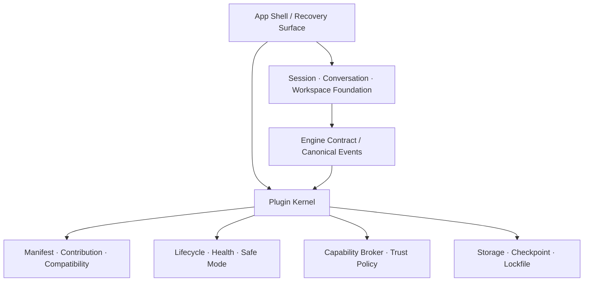

# 01 · Core Boundary：Mossx 最终还剩什么

> 主线入口：[Mossx Plugin Platform](README.md)

## 1. 边界判断原则

一个能力只有同时满足以下任一条件，才有资格留在 Core：

- 它是所有插件都依赖的稳定 primitive；
- 它拥有全局唯一事实，不能由某个插件私有化；
- 它是安全、恢复或插件治理本身的一部分；
- 它必须在所有非必要插件失效时继续工作。

“第一方开发”“当前已经内置”“使用频率高”都不是留在 Core 的充分理由。

## 2. Core / Plugin 归属矩阵

| 能力 | 目标归属 | 设计理由 |
|---|---|---|
| App lifecycle、startup recovery、safe mode | Core | 平台必须能自救 |
| App Shell 与标准 UI Slot | Core | 所有插件的装配骨架 |
| Extension Contract、Registry、Capability Broker | Core | 即“插排”本身 |
| Marketplace / Extensions 管理壳 | Core | 插件不能拥有自己的治理入口 |
| 会话 identity、生命周期、sidebar projection | Core | 跨 Engine 的全局会话事实 |
| 对话幕布、composer、canonical message model | Core | Engine 可替换时对话仍保持一致 |
| Engine Contract、runtime handle generation | Core | 统一 CLI 生命周期和 stale-handle 防护 |
| Claude、Codex、Pi 及未来具体 CLI | Plugin | 独立发布、独立回归、独立故障域 |
| Workspace grant、folder tree 基础能力 | Core | Capability Broker 的资源边界 |
| Git repository 基础状态与安全操作 | Core（当前目标） | workspace 基础设施；高级 workflow 可插件化 |
| Search query contract 与结果聚合 | Core | 给多个 provider 提供稳定协议 |
| Search provider、semantic indexer | Plugin | 可替换实现与独立资源消耗 |
| Recent open / navigation history | Core | AppShell 连续性的最小事实 |
| 内置浏览器 | Plugin | 复杂 UI，但不是平台启动前提 |
| 意图画布 | Plugin | 独立 UI 与独立数据生命周期 |
| 便签 | Plugin | 边界清晰，适合第一批迁移 |
| 项目知识地图 | Plugin | indexing、UI、data 可独立演进 |
| 高级 Git workflow | Plugin | 通过 Core Git capability 接入 |

## 3. Core 内部建议分层



Core 内部也不能重新长成单体。建议保持四条 ownership lane：

1. **Product Foundation**：session、conversation、workspace。
2. **Plugin Kernel**：manifest、registry、lifecycle、host supervision。
3. **Security & Data Plane**：broker、storage、checkpoint、audit。
4. **Host Adapters**：Tauri/WebView/OS integration，不泄漏给插件。

## 4. Contribution Point 初始集合

Core 提供有限、typed、versioned 的 extension points：

| Contribution | 用途 | 示例 |
|---|---|---|
| `command` | 命令与快捷操作 | 打开便签、执行 Engine doctor |
| `view` | 独立工作区页面 | 浏览器、项目知识地图 |
| `panel` | 白名单局部区域 | 右侧详情、诊断面板 |
| `engine` | CLI adapter/protocol | Claude、Codex、Pi |
| `searchProvider` | 搜索结果提供者 | 文件、语义、历史会话 |
| `contextProvider` | 提供上下文片段 | Git diff、项目知识 |
| `statusItem` | 低频状态展示 | Engine health、索引状态 |
| `settingsPage` | 插件设置 | 权限、模型、连接配置 |

Contribution Point 不允许插件任意插入 AppShell DOM 或访问内部 store。新增 contribution 类型必须先证明至少存在稳定 contract，而不是为单插件开后门。

## 5. 最终代码仓库形态

```text
mossx/                              # Core repository
  src/plugin-kernel/                # frontend contracts / projections
  src-tauri/src/plugin_runtime/     # host controller / broker / storage
  packages/plugin-sdk/              # SDK source（也可后续独立发布）
  packages/plugin-contract/         # schema / generated types
  tests/plugin-conformance/         # shared conformance fixtures
  plugin-lock.json                  # system/LKG pins，不含插件源码

mossx-plugin-codex/                 # independent repository
mossx-plugin-claude/
mossx-plugin-browser/
mossx-plugin-intent-canvas/
mossx-plugin-notes/
mossx-plugin-project-map/
```

Core 仓库不长期复制插件源代码。迁移期允许 compatibility adapter，但必须标记 owner、删除条件和最后期限。

## 6. 防止 Core 反向膨胀

后续应建立 architecture fitness checks：

- Core Engine registry 不得出现具体 CLI 的执行分支。
- Core database migration 不得新增 `plugin_<name>_*` 业务表。
- AppShell 不得直接 import 独立插件 package。
- 插件 contribution 只能通过 registry selector 消费。
- Core 启动测试必须在没有非必要插件时通过。
- 新 feature proposal 必须填写 Core/Plugin ownership 判定。

## 7. 当前确定与暂缓

已确定：会话、对话幕布、文件夹基础、Git 基础、Search foundation、Recent open 在第一阶段留 Core；具体 CLI 和其他业务模块插件化。

V1 归属（D-048）：Git 基础与 Search foundation **留 Core**，暂不改成 system plugin。这不影响第一阶段实现，因为无论未来归属如何，它们首先都要收敛成稳定 capability contract。
