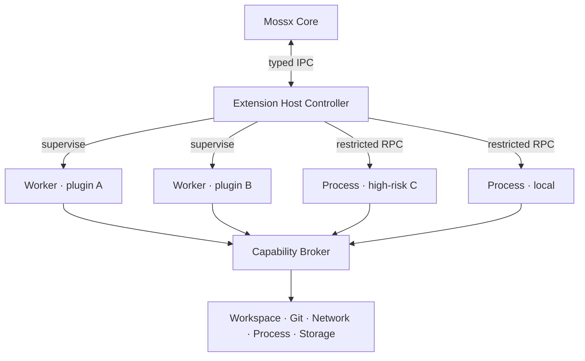
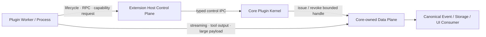
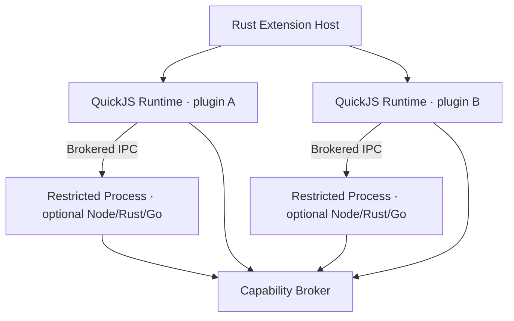

# 02 · Runtime Isolation & Trust

> 主线入口：[Mossx Plugin Platform](README.md)

## 1. 选定模型

Mossx 采用 C 型运行时：

- 一个 Extension Host Controller 负责控制面；
- 每个普通插件一个隔离 Worker；
- 高权限 C 插件和全部 `local` 插件升级成独立受限进程；
- 所有资源访问通过 Core-owned Capability Broker。



Extension Host 是 supervisor，不是所有插件共享的业务执行容器。这样单个插件的 crash、deadlock 或内存泄漏不会直接带走整个扩展系统。

### 1.1 已确认的复合 Artifact 模型

一个 Plugin Artifact 可以同时声明多个可选入口：

| Entry | 责任 | Runtime Placement |
|---|---|---|
| Worker Entry | 普通业务逻辑、Contribution Controller | per-plugin Worker |
| Process Entry | CLI Engine、native/high-permission 逻辑 | Restricted Process |
| UI Entry | Declarative、Sandbox 或 Trusted React contribution | 对应 UI Runtime |
| Migration Entry | 插件 Storage Namespace 的 versioned migration | Core-owned Migration Runner |

入口可以组合，但不能借组合关系绕过隔离。例如 Worker 不能直接加载 Process Entry 的 native library，也不能持有其 OS process handle；两者只能通过 Host/Broker 管理的 versioned IPC 通信。

Process Entry 是独立 executable，具体实现语言不属于 Core ABI。Core 永远不加载插件提供的 `.dll`、`.dylib` 或 `.so`；这条限制避免插件 native ABI、崩溃与内存安全问题进入 Mossx 主进程。

Manifest 使用 `entries[]` 表达复合入口。每项必须包含 artifact 内唯一的稳定 `id` 和严格 `kind` discriminant；Host 按 `kind` 选择对应 Closed Schema 与 placement policy。Contribution、health result、generation token、日志和诊断都引用 `entryId`，不能用相对路径充当运行时身份。完整模型见 [Manifest & Runtime Registration](11-manifest-and-runtime-registration.md)。

Entry 之间的物理关系由 Manifest Physical Entry DAG 表达，并由 Core/Host supervisor 执行。它只描述 Worker、Process、UI 等 execution unit 的启动、停止、placement 和故障传播边界；required physical edge 不允许由插件代码在运行时补充。Runtime 的 Service/Capability provide/require 形成另一张动态逻辑图，它可以使关联 Contribution 暂停、撤销或重新发布，但不能直接 spawn Process、加载 UI 或改变 sandbox placement。

### 1.2 已确认的 Control Plane / Data Plane 分离



Control Plane 负责：

- install/resolve/activate/disable/update/rollback/uninstall orchestration；
- contribution registration 与 atomic generation switch；
- capability request、permission decision 与 ordinary request/response RPC；
- heartbeat、health、quota signal、fuse、kill 与 audit identity；
- Worker/Process supervision 和 child-resource cleanup。

Data Plane 负责：

- Engine text/reasoning/tool-output streaming；
- 大型文件、blob、索引结果与其他 bulk payload；
- bounded queue、backpressure、timeout、cancel 与资源回收；
- 把高吞吐数据交给 Core-owned canonical consumer，而不阻塞 control message。

Data Plane 不是插件到 Core internals 的直通车。每个 data channel 必须由 Core 发放并至少绑定 `pluginId + version + generation + direction + scope + quota + deadline/cancellation`；插件 disable、generation swap、permission revoke 或 fuse 时必须立即撤销。

本决策冻结职责与安全不变量；physical transport 与 wire protocol 已进一步确认，详见 [IPC Transport and Wire Protocol](10-ipc-transport-and-wire-protocol.md)。

### 1.3 已确认的 QuickJS + Restricted Process 组合

普通 Worker Entry 运行在 Rust Extension Host 内嵌的 per-plugin QuickJS Runtime。每个插件拥有独立 Runtime/执行线程与 resource accounting，Host 只注入 Mossx Plugin SDK 和 Control/Data Plane bridge；默认不提供 filesystem、network、process、environment、Node builtin 或 native addon。

需要以下任一条件时，相关逻辑必须放入独立 Restricted Process Entry：

- Node/npm runtime 或 Node-specific library；
- CLI、PTY、child process 或长期 daemon；
- Rust/Go/其他 native executable；
- 无法在 QuickJS 内执行的 indexing/compute runtime；
- 任何需要 OS system capability 的实现。



这是一种组合而非互斥选型：QuickJS 提供普通插件的默认拒绝执行面；Node 继续作为 Process Entry 的重要实现语言，但不能以 `worker_threads` 形式成为 Marketplace 插件共享的 Extension Host Runtime。

QuickJS Runtime 仍不是 OS security boundary。Host/QuickJS native bug 或进程级 OOM 仍可能影响整个 Extension Host，因此 Core 必须监督 Host、维护 plugin generation 和重启恢复；真正高风险代码继续依赖 Restricted Process 与 OS-level policy。

## 2. 三个正交维度

| 维度 | 值 | 决定内容 |
|---|---|---|
| Trust Tier | `system / verified / local` | 审核等级、默认授权与 UI 模式上限 |
| Artifact Source | built-in Registry / Marketplace / Git URL / local path | provenance、更新源、签名链 |
| Runtime Placement | Worker / Restricted Process | 故障域、OS 权限边界、资源成本 |

必须避免以下错误推论：

- “在 Mossx 主仓库里”不等于自动可信；
- “是第一方仓库”不等于不需要签名和回退；
- “用户从本地加载”不等于用户已经授权全部资源；
- “运行在 Worker”不等于获得 OS 安全沙箱。

## 3. Trust Tier

### system

- Mossx 官方维护或随发行版 pin；
- 允许申请高集成度 contribution；
- 仍需 manifest、签名、capability 声明、健康检查和回退；
- 默认可自动更新与否由发布策略决定，不由 `system` 身份自动推导。

### verified

- 某个具体 artifact 版本通过 Registry 审核；
- 审核结果绑定 hash、signature 和 capability set；
- 新版本扩大权限后必须重新授权；
- 默认使用 Worker、Declarative UI 或 Sandbox UI。

### local

- local path、开发目录或未验证 Git source；
- 默认独立 Restricted Process；
- 默认不自动更新；
- 权限逐项授权，且 UI 明确展示未验证来源。

## 4. 何时强制 Restricted Process

满足任一条件即升级：

- `trustTier = local`；
- 加载 native library 或自带 executable；
- 请求高风险 `process.spawn`；
- 请求 workspace root 之外的文件访问；
- 请求非 allowlist 网络目标或长期监听端口；
- 需要无法在 Worker 内可靠限制的 CPU/内存行为；
- 安全策略明确标记该 capability 只能进程隔离。

如果当前平台无法提供要求的限制，Core 必须拒绝激活，而不是降级到更弱隔离后继续运行。

## 5. Capability Broker

插件请求资源的统一流程：

```text
plugin request
  → 校验 pluginId + active generation
  → 校验 manifest 是否声明 capability
  → 校验用户授权与 trust policy
  → 校验 workspace/path/host/command scope
  → 执行 Core-owned operation
  → 返回最小结果并写入脱敏 audit event
```

V1 Capability Catalog 的完整 ID、role、scope 与 trustMinimum 以 [`14` §9](14-v1-contract-freeze.md) 为准。本节只重复不变量：Capability 必须携带 scope，不能只表达 true/false。例如 `mossx.network.fetch` 限制 host、protocol、method；`mossx.workspace.write` 限制 workspace root 和 path pattern。未知 `mossx.*` 或跨插件 `<pluginId>.*` 一律拒绝。

### 5.1 Capability Ownership

V1 跨插件 Contract 只接受 Core Catalog 中的 `mossx.*` Platform Capability。第三方插件可以在 Manifest 授权范围内 provide/require 这些 Contract，但不能自行创建 `mossx.*` 标识。

插件可以声明 `<pluginId>.*` private Capability，用于同一插件不同 Entry 之间的 Runtime Capability Graph，例如 `com.example.notes.private.index`。V1 private Capability 不导出到其他插件，也不能被 Registry resolver 当作 plugin-to-plugin dependency。

V2 才考虑 Publisher-owned exported Capability。前置条件是 signed Capability Contract Artifact、owner verification、Contract version/schema hash、consumer dependency lock、revocation 与 offline cache 全部具备。未满足前置条件时，Manifest 出现跨插件 private Capability reference 必须 fail closed。

## 6. Permission 与版本更新

权限授予绑定：

```text
pluginId + publisher + artifact lineage + capability + scope
```

更新时只要 capability set 变大，就暂停自动激活并展示 permission diff。缩小权限可以自动继承，但仍要更新 audit record。

签名证明“谁发布了这个 artifact 且内容未被修改”，不证明“插件行为安全”。审核、最小权限、进程隔离和运行时观测缺一不可。

## 7. 资源与故障治理

每个插件按 `pluginId / version / generation` 记录：

- activation latency；
- crash/restart count；
- CPU time、memory、event-loop lag；
- IPC queue depth、timeout、cancel result；
- capability denial 与 policy breach；
- network/process audit；
- migration、checkpoint、rollback 结果。

Quota 超限处理顺序：限流或降级 → 重启 isolation unit → quarantine。任何处理都不得要求插件主动配合才能生效。

## 8. Secret 与日志边界

- 插件不能枚举宿主环境变量。
- token/credential 由 Core secret service 保存，插件只获得 capability-scoped operation。
- audit log 不记录完整 prompt、用户文件正文或 secret。
- 错误信息必须包含 plugin/generation/operation identity，但对插件隐藏其他插件的内部信息。

## 9. 验收基线

- 一个 Worker crash 不影响其他 Worker 和 Core 对话。
- stale generation token 无法访问 Broker。
- local 插件不能降级成普通 Worker 运行。
- 普通 QuickJS Worker 无法 import Node builtin、native addon 或直接取得 OS resource。
- Node Process Entry crash/OOM/exit 只能终止对应插件故障域，不能带走 Extension Host。
- capability expansion 不会继承旧授权静默上线。
- fuse 可以在插件无响应时强制终止对应故障域。
- diagnostics 能定位到具体 plugin version/generation。
