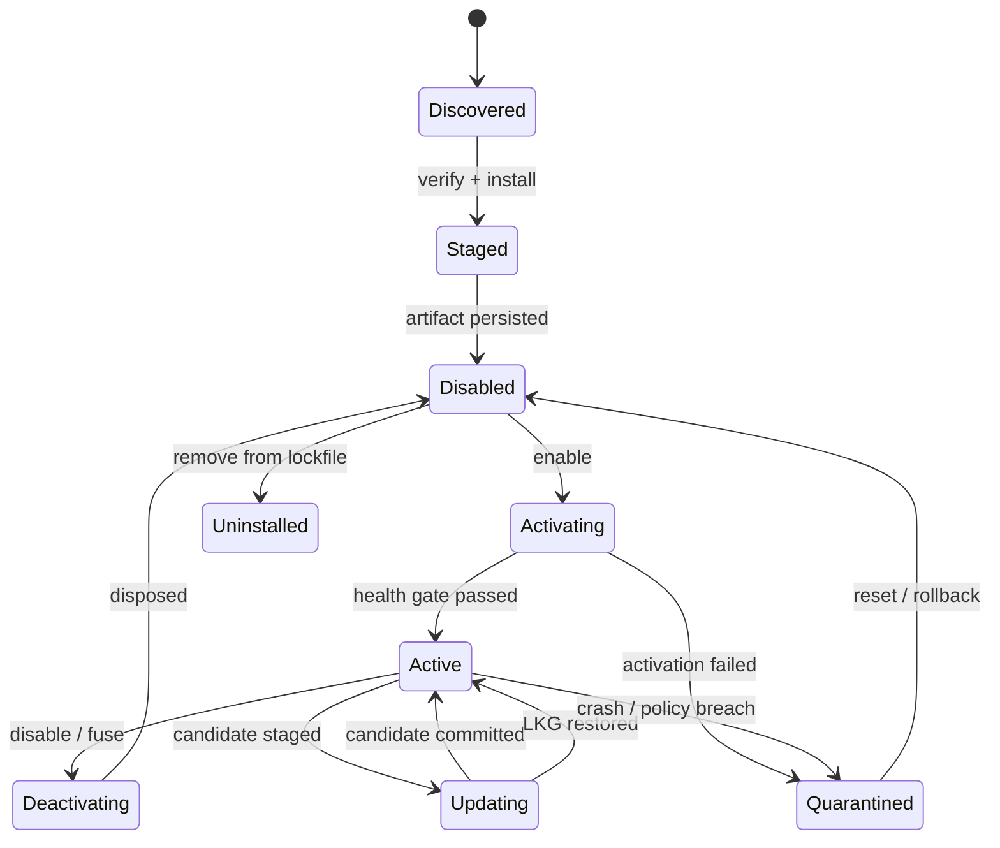
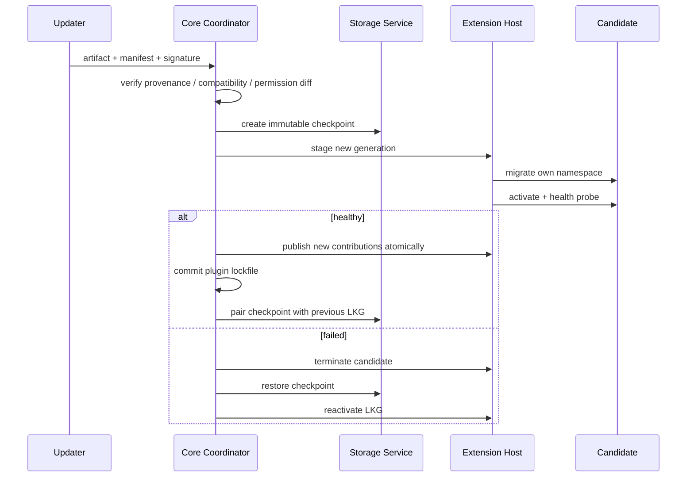

# 03 · Lifecycle, Hot Swap & Rollback

> 主线入口：[Mossx Plugin Platform](README.md)

## 1. 生命周期状态机

插件不是一个 `enabled: boolean`。Core 必须拥有显式状态机：



建议状态记录至少包含：

```text
pluginId
artifactVersion
generation
lifecycleState
activatedAt
healthState
lastKnownGoodVersion
checkpointId
quarantineReason
```

## 2. Atomic Activation

插件 activation 分为 Manifest Preflight 与 Runtime Registration 两个逻辑阶段，再由 Atomic Activation 统一发布：

1. **Manifest Preflight**：不执行插件代码，完成 artifact、compatibility、permission、entry、storage/migration 与 contribution envelope 检查。
2. **Runtime Registration**：插件启动后通过 generation-bound SDK 注册本次实际 Contribution；Host/Core 对照 Manifest envelope 校验。
3. **Atomic Publish**：所有 required Contribution 就绪并通过 health gate 后，一次性对消费者可见。

其中 Runtime Registration 可以少于 Manifest 声明的最大集合，但不得注册未声明类型、scope、placement 或 capability。Activation Unit、event catalog 与 required closure 以 [`14` §3–§4](14-v1-contract-freeze.md) 为准。

Atomic Activation 内部仍分为两段：

1. **Prepare**：启动 isolation unit、建立 IPC、注册到临时 registry、执行 health probe。
2. **Publish**：所有必需 contribution 验证成功后，一次性对消费者可见。

任何一个必需 contribution 失败，都不能留下“命令注册了但视图没注册”之类的半激活状态。

每个 contribution 返回 generation-bound disposable handle：

```text
activate(pluginGeneration)
  → validateManifestEnvelope()
  → stageRuntimeContribution(command)
  → stageRuntimeContribution(view)
  → assertRuntimeSubsetOfManifest()
  → validateAll()
  → publishAtomically()
  → return DisposableContributionSet
```

旧 generation 在 cutover 后发来的事件全部按 stale event 拒绝。

安装、权限预览和 permission diff 阶段禁止调用插件 `activate()` 或任何自定义脚本；否则 Manifest 无法成为可信的安装前审计面。

## 3. 双图生命周期联动

插件生命周期同时维护两张用途不同的图：

| 图 | Owner | 节点/边 | 决定什么 |
|---|---|---|---|
| Physical Entry DAG | Core + Host supervisor | `entryId` 与 Manifest `dependsOn` | execution unit 是否以及按什么顺序存在 |
| Runtime Capability Graph | Host + Core registries | generation-bound provider/requirement | Contribution 当前是否满足逻辑依赖并可见 |

激活顺序：

1. Core 静态校验 Physical Entry DAG 和当前平台 Entry 完整性；
2. Host 按拓扑顺序启动本 generation 的 physical entries；
3. Entry 通过 Runtime Registration 发布 provider/requirement 到 staging graph；
4. Core 验证实际能力关系未越过 Manifest envelope；
5. required logical dependencies 与 health gate 满足后 atomic publish Contribution。

停用或故障顺序：

1. 先从公开 Registry 撤销受影响 Contribution，阻止新请求进入；
2. Runtime Capability Graph 传播 provider loss，撤销或暂停依赖能力；
3. 取消 inflight work 与 Data Channel；
4. Host 按 Physical Entry DAG 的反向拓扑停止 execution units；
5. Core 冻结 generation，拒绝迟到 registration/event。

Runtime Capability Graph 只管理逻辑可用性，不替代 update transaction、Storage checkpoint 或 Process supervisor。Readiness 使用三态语义：

| Readiness | Activation 时缺失 | Provider 后续出现 | Provider 后续消失 |
|---|---|---|---|
| `required` | 在 Core-bounded deadline 内等待；超时则 candidate activation 失败 | deadline 内完成 staging/validation | 立即撤销受影响公开能力并进入恢复或隔离 |
| `deferred` | 不阻塞基础 activation；记录可观测 `waiting` | 重新验证后动态 publish 关联 Contribution | 撤销关联 Contribution，回到 `waiting` |
| `optional` | 视为合法省略，不进入 waiting | 可按声明提供增强能力 | 只撤销关联增强能力，不触发恢复义务 |

`deferred` 表示“允许晚到并承诺自动重绑定”，`optional` 表示“缺失不构成未完成状态”。两者不得用一个布尔字段混同。

Activation deadline 由 Core Policy 提供默认值和硬上限；Manifest 可以在允许范围内请求预算，但不能声明无限等待。deadline 只约束阻塞 atomic publish 的 required readiness，不把 deferred/optional 人为升级成启动失败。

三态 Readiness 主要属于 Runtime Capability Graph。Physical Entry 本身仍使用 required/optional criticality；Entry 延迟启动由 activation event/policy 表达，不使用 `deferred` 偷换 physical lifecycle。

## 4. Declarative Lazy Activation

普通插件默认保持 installed/enabled-but-inactive。Core 只读取签名 Manifest 和本地 lockfile，建立 Command/View/Engine 等轻量 placeholder；当受控 activation event 命中时，才启动对应 Physical Entry DAG：

```yaml
activationUnits:
  - id: notes-main
    entries: [notes-worker]
    events:
      - type: onView
        viewId: notes.main
      - type: onCommand
        commandId: notes.create
  - id: claude-engine
    entries: [claude-worker]
    events:
      - type: onEngine
        engineId: claude
```

规则：

- V1 event kind 仅 `onView/onCommand/onEngine/onWorkspace/onSettings/onStartup`（`14` §4），未知 event 拒绝安装；
- 多个并发事件命中同一 activation target 时必须 single-flight，共享同一 generation/result；
- 调用方取消只能取消自己的等待，是否中止共享 activation 由 Core coordinator 判断；
- activation 失败必须清理 partial physical/runtime graph，并把结构化错误交给触发 View/Command/Engine surface；
- `onStartup` 是受限 event，只允许必要 system plugin 或 policy whitelist；
- Marketplace、Registry 请求和普通插件 activation 不进入 Core first-interactive critical path；
- lazy activation 不改变权限：触发事件不是授权事件，首次所需 permission 仍按既定 consent policy 处理。

Manifest 只声明事件与目标 Entry/activation unit，禁止执行插件代码计算“自己何时应该启动”。

## 5. Hot Swap 等级

| 等级 | 操作 | Core 是否重启 | 说明 |
|---|---|---:|---|
| H1 | contribution 热启停 | 否 | 原子 publish/dispose |
| H2 | Worker generation 替换 | 否 | 新 Worker healthy 后切换 |
| H3 | Restricted Process 替换 | 否 | 新进程 healthy 后切换 RPC endpoint |
| H4 | Trusted React bundle remount | 通常否 | 无法清理时 renderer safe reload |
| H5 | Extension Host 更新 | Core 不重启，Host 重启 | Core 暂停插件投递并恢复 Host |
| H6 | Core Contract major 更新 | 是 | 正常应用升级 |

产品文案必须准确表达实际等级，不得把 H4-H6 统一宣传为“无重启热部署”。

## 6. 更新事务



更新 commit point 同时满足：

- candidate health gate 通过；
- contribution cutover 成功；
- storage schema 状态已记录；
- lockfile 原子写入成功。

commit point 之前，旧 artifact 和对应 checkpoint 不能被删除。

## 7. Fast Fuse

熔断路径由 Core 持有，不能依赖插件执行自己的 `deactivate()`：

1. 从 Contribution Registry 原子撤销该 generation 全部 handle。
2. 停止向插件投递新 event/request。
3. 取消 inflight work。
4. 在短 grace period 后强制终止 Worker/Process。
5. 冻结插件 namespace 写入。
6. 保存 crash、quota、IPC 和 policy evidence。
7. 标记 `quarantined`，按策略恢复 LKG 或保持 disabled。

触发来源：

- 用户点击“紧急停用”；
- 连续 crash；
- heartbeat timeout；
- CPU/memory/queue quota 超限；
- capability policy breach；
- UI Error Boundary 连续失败；
- migration/health probe 失败。

## 8. Last-Known-Good

LKG 不是单独的版本号，而是一个恢复单元：

```text
LKG = artifact hash
    + manifest hash
    + granted capability snapshot
    + storage checkpoint id
    + storage schema version
    + contract handshake result
```

只回退代码、不回退不兼容数据，会制造更隐蔽的数据损坏，因此被架构禁止。

## 9. Safe Mode

出现以下情况时 Core 自动进入 Plugin Safe Mode：

- 同一插件造成连续启动失败；
- Extension Host 反复崩溃；
- active lockfile 损坏或签名校验失败；
- migration 未完成且无法确认当前 schema；
- system plugin 造成 renderer 启动循环。

Safe Mode 只启动：App Shell、会话/工作区基础、Extensions recovery surface 和必要 platform services。非必要插件保持 disabled，用户可以查看诊断、回退或卸载。

## 10. Uninstall

卸载分成三步：

1. deactivate + 从 active lockfile 移除；
2. artifact 进入短期可恢复 retention；
3. 数据 namespace 按“保留数据 / 导出后删除 / 立即清除”策略处理。

默认卸载不等于删除用户数据。彻底清除必须单独确认，并明确无法回退。

## 11. 最小验证矩阵

| 场景 | 预期 |
|---|---|
| activation 中第二个 contribution 失败 | 第一个也不可见 |
| Worker update health fail | 旧 Worker 与旧数据继续可用 |
| process plugin 卡死 | Core 强杀该进程，其他插件不受影响 |
| stale generation 迟到事件 | 被拒绝且有诊断 |
| trusted React dispose 失败 | contribution 撤销，触发 safe reload |
| lockfile commit 失败 | 新 generation 不成为 active |
| Core 重启遇到半完成 migration | 进入恢复流程，不自动继续写入 |
