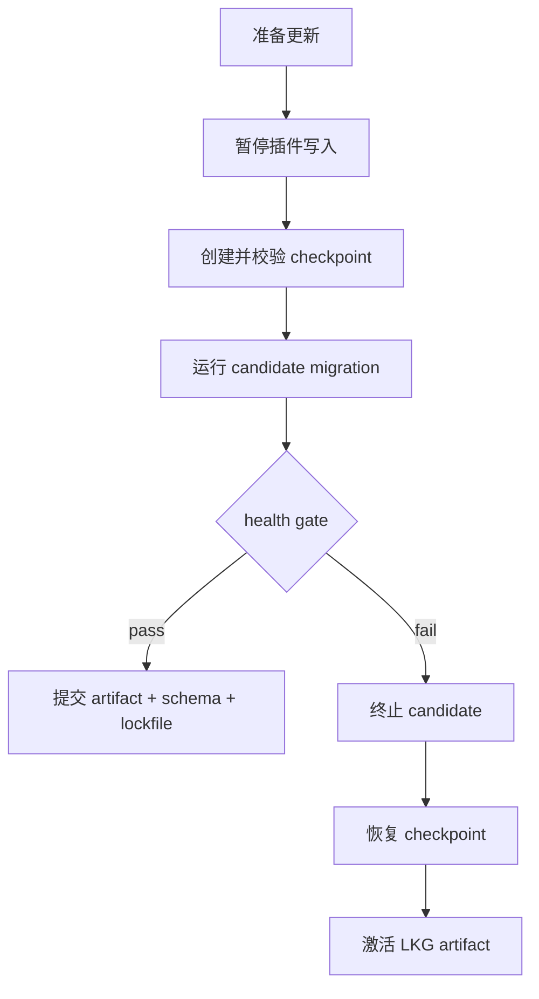

# 04 · Storage, Migration & Checkpoint

> 主线入口：[Mossx Plugin Platform](README.md)

## 1. 六条数据铁律

以下规则已确认，属于插件平台不可妥协的 data invariants：

1. 每个插件拥有独立 Storage Namespace。
2. 更新前由 Core 创建 snapshot/checkpoint。
3. 普通更新必须保持向后兼容。
4. 破坏性 migration 必须明确提示用户。
5. 回退代码时同步恢复对应数据 checkpoint。
6. 插件不能直接修改其他插件或 Core 数据表。

## 2. 物理隔离优先

优先使用每插件独立目录和数据库文件，而不是共享数据库中的表名前缀：

```text
app-data/
  plugin-runtime/
    artifacts/
      <plugin-id>/<version>/...
    data/
      <plugin-id>/store.sqlite
      <plugin-id>/blobs/...
    checkpoints/
      <plugin-id>/<checkpoint-id>/...
    runtime/
      <plugin-id>/health.json
  plugin-lock.json
```

物理隔离的价值：

- 更容易证明插件没有跨 namespace 写入；
- checkpoint/restore 粒度天然属于单插件；
- 卸载、导出、配额和磁盘统计更清晰；
- 数据损坏不会共享同一个数据库故障域。

如果某类数据必须共享，只能由 Core service 持有并通过 typed API 暴露，不能让多个插件共享表。

## 3. Core-owned Storage Service

插件不直接获得 SQLite connection 或宿主路径。Storage Service 提供 namespace-scoped API：

- key/value 与 document storage；
- plugin-owned relational storage；
- blob storage；
- transaction；
- quota/statistics；
- export/import；
- migration runner；
- checkpoint/restore。

Restricted Process 只获得短期、generation-bound RPC token。Worker 同样通过 host bridge 调用，不绕过 Core 打开文件。

## 4. 四个版本轴

必须分别记录：

| 字段 | 含义 |
|---|---|
| `pluginVersion` | 插件发布版本 |
| `contractVersion` | Core Extension Contract 兼容版本 |
| `storageSchemaVersion` | 插件数据 schema |
| `checkpointFormatVersion` | Core checkpoint 可读格式 |

不能用 `pluginVersion` 猜测数据 schema，也不能因为插件 semver 是 minor 就默认 migration 无破坏。

## 5. Checkpoint

checkpoint 至少包含：

- plugin id；
- source artifact hash/version；
- storage schema version；
- 创建时间与 transaction id；
- database/blobs 的一致性快照；
- integrity checksum；
- restore tool/checkpoint format version。

SQLite 必须使用 online backup、事务性 snapshot 或写入 quiesce 后的安全复制，禁止在活跃写入时直接复制半完成数据库文件。

checkpoint 创建或校验失败，更新立即停止，candidate 不得接触可写数据。

## 6. Migration 分类

### Compatible Migration

- 新增 optional table/column/index；
- 保留上一 LKG 需要的数据；
- 允许旧版本通过 checkpoint 或兼容 schema 恢复；
- 不需要额外用户确认，但必须有 checkpoint。

### Destructive Migration

- 删除或不可逆重写数据；
- 改变主键/编码导致旧版本不可读；
- 合并数据后无法恢复原记录；
- 降低已声明的 backward compatibility range。

破坏性 migration 执行前必须展示：

- 插件与版本；
- from/to schema；
- 受影响数据类别；
- checkpoint/导出是否成功；
- 回退限制；
- 明确的继续与取消操作。

字段与门槛见 [`14` §12](14-v1-contract-freeze.md)（D-042）：每次更新都必须有校验过的 checkpoint；仅当 migration 声明 `exportRequired: true` 时才强制用户可见 export。`retainPrevious` 默认 2（1–5）。

## 7. Code + Data 原子回退



恢复 checkpoint 失败时，插件保持 quarantined。Core 不得为了“让功能先起来”而用旧代码打开未知 schema。

## 8. 跨插件数据交换

允许的方式：

- Core-owned query/service；
- typed contribution；
- 用户明确触发的 export/import；
- immutable event，且接收方只保存自己的 projection。

禁止的方式：

- 打开另一个插件的 SQLite；
- 在 migration 中修改 Core 表；
- 共享可写目录；
- 依赖另一个插件的未声明内部 schema；
- 通过绝对路径绕过 Storage Service。

## 9. Retention 与磁盘治理

- active LKG 对应的 checkpoint 在新版本稳定前不可删除；
- checkpoint cleanup 必须保留完整恢复链所需证据；
- 用户可查看每个插件 artifact/data/checkpoint 占用；
- 删除数据与删除 checkpoint 是破坏性操作，必须确认；
- 配额超限先阻止新增写入并提示，不直接删除用户数据。

## 10. 故障演练

| 故障 | 必须结果 |
|---|---|
| checkpoint 无法创建 | 更新不开始 |
| migration 中进程崩溃 | 恢复 checkpoint，candidate 不激活 |
| destructive migration 未确认 | 当前版本和数据保持不变 |
| 插件试图写其他 namespace | 拒绝、审计、candidate quarantine |
| restore checksum 不一致 | 保持禁用并保留证据 |
| 磁盘空间不足 | 不删除旧 LKG，提示用户处理空间 |
