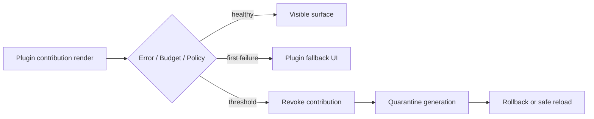

# 05 · UI Contribution Runtime

> 主线入口：[Mossx Plugin Platform](README.md)

## 1. 双模式不是两级质量，而是两级风险

Mossx UI 插件采用三种交付形态、两个主要信任模式：

| 形态 | 默认对象 | Renderer 执行插件代码 | 适用场景 |
|---|---|---:|---|
| Declarative Widget | verified/local | 否 | 列表、表单、状态、简单详情 |
| Sandbox iframe/WebView | 复杂 verified/local | 独立 realm | 浏览器式工作台、复杂交互 |
| Trusted React Contribution | system、特别审核 verified | 是 | 与 Core 高度融合的白名单 surface |

默认顺序是 Declarative → Sandbox → Trusted React。插件不能因为“实现方便”自行选择更高风险模式。

## 2. UI Slot

Core 提供白名单 slot，而不是任意 DOM 注入：

```text
workspace.main
workspace.rightPanel
sidebar.secondary
composer.toolbar
conversation.attachmentRenderer
settings.plugin
status.lowFrequency
```

每个 slot 定义：

- allowed contribution mode；
- props/event contract；
- layout constraints；
- render frequency budget；
- focus/keyboard/accessibility contract；
- dispose semantics；
- fallback UI。

高频对话流式链路默认不开放任意插件渲染。需要接入时必须使用受控 projection，不能把 plugin state 接回 AppShell root 高频 hook 链。

UI Contribution 默认必须在 Manifest 中 exact declare `contributionId + slot + entryId + mode`。Declarative/Sandbox/Trusted React surface 不得使用宽泛 dynamic template 临时选择任意 slot、mode 或 bundle；只有 Catalog 明确允许的重复型低风险 UI item 才能使用带 slot、key namespace、scope 和 maxInstances 上限的模板。

Lazy UI 在插件代码未启动时由 Core placeholder 占位。用户打开对应 View 后，Core 触发声明的 `onView` activation，surface 显示 bounded loading/error/retry；插件不能为了注册一个菜单或侧边栏入口而常驻 renderer。placeholder 文案、icon 与 permission summary 来自签名 Manifest，不执行 UI bundle。

## 3. Declarative Widget

插件发送受版本控制的 UI schema，由 Core component library 渲染：

- text、badge、button、list、table、form、empty/error state；
- action 只引用已注册 command id；
- data binding 使用显式 value，不执行表达式或任意 JavaScript；
- Core 负责 theme、i18n、accessibility 与交互一致性。

优势是最安全、最容易跟随设计系统；代价是交互表达力有限。

## 4. Sandbox Surface

复杂 UI 使用独立 iframe/WebView realm：

- 严格 CSP；
- 禁止访问 parent DOM；
- 禁止任意 top navigation；
- message bridge 使用 schema validation；
- 每次 activation 获得短期 channel token；
- network、filesystem、clipboard 仍经过 Capability Broker；
- Core 拥有 loading、crash、permission 与 fallback chrome。

Sandbox 不能依靠 `postMessage('*')` 或隐式共享 localStorage 建立通信。

## 5. Trusted React Contribution

Trusted React 允许插件向白名单 slot 注册 React component，但必须遵守保险丝：

1. artifact 必须签名并通过允许 trusted React 的 policy。
2. bundle 以 content hash/version URL 加载，不能原地覆盖 active 文件。
3. contribution 返回 disposable handle，绑定 generation。
4. 每个插件包裹独立 Error Boundary 和 circuit breaker。
5. 禁止修改 global prototype、Core DOM root、全局 event bus 或未声明 store。
6. 禁止注册无法追踪和撤销的 window/document listener。
7. 插件 state 不得进入 AppShell root 高频更新链。
8. dispose 失败时立刻撤销 surface，并升级到 renderer safe reload。

JavaScript ESM 加载后不能保证从内存真正卸载，因此 Trusted React 的“热回退”定义是撤销旧 contribution、重新挂载 LKG bundle，而不是宣称旧 module 消失。

## 6. UI Fuse



UI fuse 触发项：

- Error Boundary 连续失败；
- render/update 超出 budget；
- contribution 不响应 dispose；
- 未声明的 slot 或 bridge action；
- sandbox CSP/navigation violation；
- stale generation 继续推送 UI state。

## 7. 当前模块的 UI 模式建议

| 模块 | 初始模式 | 说明 |
|---|---|---|
| 便签 | Trusted React **system** plugin | D-048 第一 Feature Pilot；V1 Trusted React 仅 system |
| 项目知识地图 | Sandbox，成熟后评估 Trusted React | 图形交互复杂、资源消耗高 |
| 内置浏览器 | 独立 WebView/Sandbox surface | 必须隔离 navigation、permission 与 crash |
| 意图画布 | Trusted React system plugin | 与会话上下文结合深，但需严格 slot contract |
| CLI diagnostics/settings | Declarative 或 Trusted React 小面板 | 主 runtime 不应依赖 UI 是否加载 |
| 第三方工具面板 | Declarative/Sandbox | V1 对 verified/local **关闭** Trusted React（D-048） |

## 8. 更新与回退

UI 更新遵循通用 lifecycle：

1. 新 bundle staged；
2. 在不可见容器中完成 contract/health 校验；
3. dispose 旧 generation；
4. 原子替换 contribution handle；
5. 出错立即恢复旧 handle；
6. 如果旧模块产生全局污染，执行 renderer safe reload 后加载 LKG。

## 9. 设计和验收门禁

- 新 Marketplace/Extensions 交互进入实现前必须先产出独立 HTML prototype。
- 每个 slot 必须测试 empty/loading/error/permission denied/quarantined 状态。
- 键盘焦点、关闭/返回、窗口 resize 和 theme 必须由 Core contract 约束。
- 插件停用后不得残留 DOM、快捷键、listener、timer 或 store subscription。
- 单插件 UI 崩溃不得导致对话幕布和 composer 消失。
