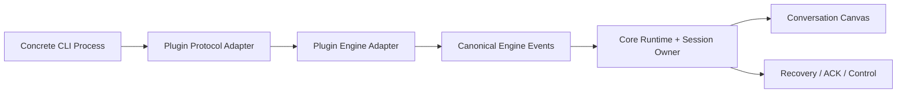
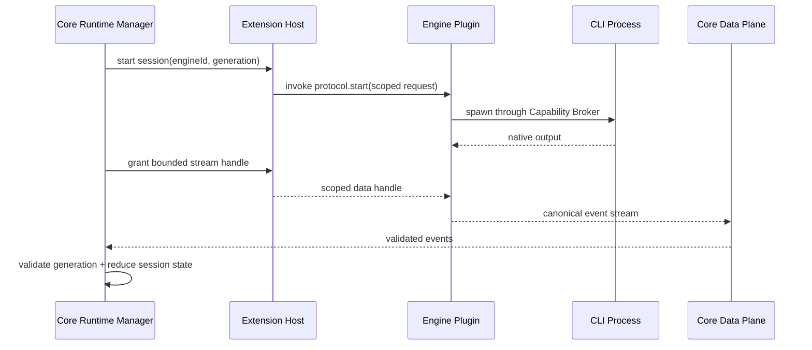

# 06 · Engine Plugin Contract：具体 CLI 全插件化

> 主线入口：[Mossx Plugin Platform](README.md)
> 上游基石：[Multi-CLI Provider Session Foundation](../../research/mossx-multi-cli-provider-session-foundation-design.md)
> 当前接入核对：[New CLI Onboarding Guide](../../research/mossx-new-cli-onboarding-guide.md)

## 1. 目标边界

最终状态：

- Core 拥有 Engine Contract、canonical schema、session identity 和 runtime control plane；
- Claude、Codex、Pi 以及未来任何具体 CLI 都是独立 Engine Plugin；
- 默认 Engine 可以是 `system` plugin，但不能成为 Core 特例；
- UI、session recovery、provider binding 不直接依赖某个 CLI 的私有输出格式。



## 2. Core 保留什么

### Stable Identity

- opaque `EngineId`；
- plugin id 与 engine id 的绑定；
- provider/model binding；
- logical session 与 native session identity。

### Canonical Runtime

- start/resume/send/interrupt/abort/close；
- runtime handle generation；
- stale handle rejection；
- ACK、timeout、settlement 与 recovery；
- normalized status、usage 和 diagnostics。

### Canonical Data

- user/assistant/tool/system message；
- tool call/result ordering；
- stream delta 与 settled message；
- permission、elicitation、error、completion event；
- context attachment 与 file edit evidence。

### Governance

- Engine capability matrix；
- conformance harness；
- permission mediation；
- observability 与 safe mode；
- compatibility negotiation。

## 3. Engine Plugin 拥有什么

每个 Engine Plugin 独立拥有：

- executable discovery 与 version probing；
- spawn arguments、environment projection、working directory；
- protocol parser、stdout/stderr framing、wire ACK/cancel；
- adapter capability declaration；
- native session mapping；
- engine-specific event → canonical event 转换；
- recovery cursor 与 history loader；
- conformance fixtures；
- 可选的 auth/model/diagnostics UI contribution。

Engine Plugin 不得直接修改 conversation store、session sidebar 或 AppShell state。它只发布 canonical events，由 Core owner 消费。

## 4. Engine Contribution

Engine 必须 exact declare，字段对齐 [`14` §10](14-v1-contract-freeze.md)：

```yaml
contributions:
  - id: claude.engine
    type: mossx.engine.provider
    entryId: claude-worker
    engineId: claude
```

关联 Process / Worker 通过 Physical DAG `dependsOn` 表达，不再使用隐式路径推断。

注册流程：

1. 校验 artifact、manifest 和 `mossx.engine.provider` capability。
2. 校验 `EngineId`、publisher、source 和 compatibility。
3. 加载 protocol/adapter 到该插件自己的 Worker 或 Restricted Process。
4. 执行 capability/conformance handshake。
5. 将 Engine contribution 原子发布到 Core registry。
6. Core runtime manager 才允许创建 session handle。

这解决当前 external registration 只登记 metadata、没有真正 executable adapter/protocol 的问题。

Engine Provider 属于稳定身份型 Contribution，V1 必须 exact declare，不允许用 dynamic template 在运行时生成任意 `EngineId`。运行时发现的 model、account、CLI version 或 session 是该 Engine Contribution 的动态数据，不是新增 Engine Contribution。

Engine Plugin 默认可通过 `onEngine:<engineId>` lazy activation：Engine selector 从 Manifest placeholder 展示已安装 Engine identity，用户选择或恢复该 Engine session 时，Core 才 single-flight 启动对应 Entry DAG。默认 Engine 是否允许预热属于 system policy，不能由普通 Engine Plugin 自行声明无条件 `onStartup`。

## 5. Runtime 与进程关系

Engine Plugin 使用已确认的复合 Artifact 模型：通常由 Worker Entry 承担 protocol adapter、canonical event mapping 与 contribution lifecycle，由 Process Entry 承担具体 CLI executable/PTY/session transport。两者按 plugin generation 绑定，并通过 Extension Host 管理的 Control Plane 协作。

Engine Contribution 必须显式引用拥有它的 Worker `entryId`；Worker 需要调用 CLI 时，再通过 Manifest 声明的关联引用对应 Process `entryId`。Core 不根据文件名、package name 或进程 argv 推断两者关系。

典型 Engine Plugin 在 Physical Entry DAG 中声明 `engine-worker dependsOn cli-process`，由 Host 决定二者启动/停止顺序；在 Runtime Capability Graph 中，Worker 再动态 provide Engine capability，并 require 对应 process endpoint readiness。Process 存活不等于 Engine Contribution 已可见，只有 runtime dependency、registration 与 health gate 全部通过后才能进入 Engine Registry。

Engine 主执行 endpoint 通常是 `required`；缺失时新 generation 不能成为 active Engine。登录、远端账号或稍后才出现的 workspace integration 可以声明为 `deferred`，基础插件先激活并展示 waiting/recovery surface；遥测和非关键附加视图可声明为 `optional`。最终取值必须由具体 Engine Manifest 明确声明，Core 不按 capability 名称猜测。

Core 不链接 Engine Plugin 的 native library，也不根据 Rust/Go/Node 等实现语言建立 ABI 分支。Engine Process Entry 对 Core 只表现为受限 executable endpoint。

标准 Engine Worker Entry 运行在 QuickJS 中，不依赖 Node builtin。若现有 adapter 依赖 npm/Node Stream/PTY library，则把该部分封装为 Node Restricted Process Entry；QuickJS Worker 仍拥有 Engine contribution、canonical mapping 与 lifecycle owner，防止 Node implementation detail 反向进入 Core Contract。

Engine 的 lifecycle、session command、capability、health 和 generation 走 Control Plane；高频 text/reasoning/tool-output 与大型 payload 走 Core-issued Data Plane。Control Plane 必须可以在 Data Plane 拥塞时继续执行 interrupt、abort、fuse 和 revoke。

Engine Control 使用 JSON-RPC/JSON Schema contract；Engine Streaming 使用 binary StreamHandle。具体 transport/framing 见 [IPC Transport and Wire Protocol](10-ipc-transport-and-wire-protocol.md)。

Engine Plugin 本身和它启动的 CLI process 是两个身份：



- Core runtime handle generation 与 plugin generation 都必须匹配。
- 插件被替换后，旧 generation 不能继续接管 session。
- CLI process 是由 Broker 授权的 child resource，插件 fuse 时必须被回收。
- Data Plane 拥塞不能阻塞 Control Plane 的 interrupt/abort/kill；旧 generation 的 data frame 必须 fail closed。
- live handle 不写入插件持久数据；恢复只保存 plain data/cursor。

## 6. Compatibility

至少存在四个 compatibility 维度：

- Core Engine Contract version；
- Engine Plugin version；
- CLI executable version range；
- session/history format version。

安装成功不代表 runtime 可用。CLI 不存在、版本不兼容或 auth 未完成时，Engine identity/provenance 仍保留，但 availability 单独标记 unavailable。

## 7. UI 与 Engine 解耦

- model selector 消费 canonical model catalog，不 import 具体插件模块；
- provider auth 通过 settings/view contribution 注入；
- timeline renderer 消费 canonical event，不按 engine name 到处开分支；
- engine-specific raw diagnostics 只能进入诊断 surface；
- 插件 UI 停用不能导致已有 canonical session 无法读取。

确实无法标准化的特性必须先进入 capability matrix，再由 UI 做 capability-aware projection，不能偷偷写 `if engine === ...`。

## 8. Conformance Gate

每个 Engine Plugin 发布前至少通过：

- identity/provenance/manifest validation；
- executable unavailable/version mismatch；
- start/send/stream/settle；
- interrupt/abort/close；
- stale generation；
- native history load/resume；
- tool call/result ordering；
- permission/elicitation；
- crash/restart/recovery；
- capability matrix parity；
- no direct Core store mutation。

当前 onboarding guide 中的静默失败点应逐步转化为共享 conformance tests，而不是继续依赖人工记忆。

## 9. 迁移策略

1. 先抽出 Contract 和 conformance harness，不移动默认 Engine。
2. 选择 `com.mossx.engine.claude` 做 Engine Pilot（D-048）。它是 0.8.9 唯一残留 compatibility adapter；不要把已删除的 CLI 拷回 Core。
3. 同一 Engine 暂时保留 Core compatibility adapter 与 plugin adapter 双路径，但同一时刻只能有一个 active owner。
4. 对比 session identity、history、stream、ACK、recovery 和 UI evidence。
5. plugin 路径稳定后删除该 Engine 的 Core 实现。
6. 最后迁移默认 Engine，且保留一键恢复上一 LKG artifact。

每个 CLI 都进入独立 Git 仓库、独立 release cadence 和独立 rollback，不因“官方内置”回到 Core 源码。

## 10. 验收底线

- 新增 CLI 不需要修改 Core engine enum 的执行分支。
- 插件停用后 Engine 从可选 surface 原子消失，但历史 canonical session 仍可读。
- Engine Plugin crash 不导致其他 Engine session manager 崩溃。
- old generation event/handle 被拒绝。
- Core 无具体 CLI artifact 时仍能启动和进入 Extensions recovery surface。
- 每个 Engine repository 可以独立构建、签名、发布和回退。
