# 07 · Repository, Distribution & Marketplace

> 主线入口：[Mossx Plugin Platform](README.md)

## 1. 独立仓库是 Ownership Boundary

所有正式插件最终使用独立 Git 仓库，包括第一方插件。目标不是“为了拆仓而拆仓”，而是建立清晰的：

- code ownership；
- release cadence；
- dependency boundary；
- security/review boundary；
- artifact provenance；
- 单插件 rollback。

仓库位置与 trust tier 正交。官方 GitHub/GitLab 仓库发布的 artifact 仍需签名、权限声明和 compatibility gate；本地 clone 的同一份源码默认仍走 `local` flow。

插件机器身份采用 Reverse-DNS stable `pluginId`，例如 `com.mossx.notes`、`com.mossx.engine.codex` 或 `io.github.alice.project-map`。仓库改名、迁移 GitHub/GitLab、display name 变化或 publisher 展示名变化不得自动改变 `pluginId`；Registry 另行维护 publisher ownership 与 repository provenance。

## 2. 推荐仓库结构

```text
mossx-plugin-<name>/
  .mossx-plugin/plugin.json
  src/
    runtime/
    ui/
  migrations/
  fixtures/
  tests/
    contract/
    integration/
  package.json / Cargo.toml
  README.md
  CHANGELOG.md
  SECURITY.md
  LICENSE
```

具体语言和 build system 可以不同，但 manifest、artifact layout、conformance result 和 signature envelope 必须统一。

Manifest 采用 Closed Declarative Schema，是 Core 在不执行插件代码时可读取的安装与授权事实源。插件启动后仍通过 SDK 动态注册实际 Contribution，但注册结果必须是 Manifest 声明的子集。完整两阶段模型见 [Manifest & Runtime Registration](11-manifest-and-runtime-registration.md)。

## 3. 发布制品

Plugin Artifact 是不可变发布单元，至少绑定：

- stable plugin id 与 version；
- repository URL 与 commit SHA；
- publisher identity；
- manifest hash；
- bundle/file hashes；
- Core Contract range；
- capability set 与 scopes；
- runtime placement requirement；
- UI mode；
- storage schema/migration metadata；
- SBOM；
- builder/workflow provenance；
- publisher signature。

已发布 artifact 不能原地覆盖。修复必须发布新版本，以便 lockfile 和 LKG 指向唯一内容。

### 3.1 三轴版本模型

```yaml
manifestVersion: 1
version: 1.4.2
compatibility:
  coreApi: ">=1.2 <2.0"
```

- `manifestVersion`：Manifest Schema 版本，决定 Core 使用哪套静态解析与校验规则；
- `version`：插件业务/制品 release 的 SemVer；
- `compatibility.coreApi`：该 release 可运行的 Mossx Plugin Contract range。

三者独立演进。Manifest Schema 升级不要求所有插件发布同版本号，插件 patch release 也不能隐式扩大 Core Contract range。Registry 必须保证同一 `pluginId + version` 永远绑定同一个 artifact hash；发现冲突视为供应链完整性错误，而不是选择“最新上传”的内容。

### 3.2 已确认的复合包结构

正式发布采用统一 `.mossx-plugin` 复合包。文件名与必需 sidecar 以 [`14` §16](14-v1-contract-freeze.md) 为准：

```text
<plugin-id>-<version>.mossx-plugin
  manifest.json
  integrity.json
  signature.json
  dist/
    worker.js                 # optional Worker Entry
    ui/                       # optional UI Entry/assets
    schemas/
  bin/
    darwin-arm64/<executable> # optional Process Entry
    windows-x64/<executable>
    linux-x64/<executable>
  migrations/                # optional Migration Entry
```

约束：

- 一个 artifact 可以组合 Worker、Process、UI、Migration 多个入口；
- Git 仓库、npm package 或本地源码目录不是正式安装制品；
- Registry 分发的是 immutable、content-addressed、signed artifact；
- Process Entry 可以由不同语言实现，但必须构建成平台对应的独立 executable；
- Worker Entry 以 QuickJS-compatible bundled JavaScript 发布，不允许 runtime `npm install`、Node builtin 或 native addon；
- 需要 Node/npm 的实现打包为独立 Restricted Process Entry，而不是进入共享 Extension Host；
- `.dll`、`.dylib`、`.so` 等插件动态库禁止装入 Mossx Core 主进程；
- artifact 缺少当前平台 Process Entry 时，Registry/Installer 必须在激活前明确判定 incompatible。

Manifest 入口采用 discriminated list，而不是固定的单例字段：

```yaml
entries:
  - id: main-worker
    kind: worker
    path: dist/worker.js
  - id: cli-engine
    kind: process
    platforms:
      darwin-arm64: bin/darwin-arm64/engine
      windows-x64: bin/windows-x64/engine.exe
  - id: sidebar
    kind: ui
    mode: declarative
    path: dist/ui/sidebar.json
  - id: schema-v2
    kind: migration
    path: migrations/v2.js
```

`id` 在同一 artifact 内唯一，并作为 lifecycle/diagnostics reference；`kind` 决定严格字段集合和 runtime placement。一个 artifact 可以包含多个同类 Entry，但不能通过自定义 `kind` 绕过 Manifest Schema。所有路径必须是 artifact 内相对路径并落入 integrity file set。per-kind 字段见 [`14` §5](14-v1-contract-freeze.md)。

## 4. 发布链路

```mermaid
flowchart LR
    Repo["Independent Git Repository"] --> CI["Build + Tests + Conformance"]
    CI --> SBOM["SBOM + Provenance"]
    SBOM --> Sign["Sign immutable artifact"]
    Sign --> Registry["Plugin Registry"]
    Registry --> Market["Mossx Marketplace"]
    Market --> Verify["Core verify hash/signature/policy"]
    Verify --> Stage["Stage + checkpoint + health gate"]
    Stage --> Lock["plugin-lock.json"]
```



Registry 是制品事实源，Marketplace 是面向用户的治理与发现 surface。两者不能混为一个网页列表。

## 5. Registry

Registry index 负责：

- plugin identity 与 publisher ownership；
- version/channel 列表；
- immutable artifact URL/hash；
- signature/provenance；
- capability summary；
- compatibility range；
- audit status；
- revoked/blocked versions；
- replacement or security advisory。

Registry resolution 必须先按 Core 支持的 `manifestVersion` 过滤，再按 `compatibility.coreApi` 判定可安装 release，最后在 channel/policy 允许范围内选择插件 `version`。不能先下载执行插件，再依赖 runtime handshake 猜测是否兼容。

Core 必须缓存已安装版本需要的 metadata，短暂离线不能让已验证插件失去启动能力；但新安装与在线安全状态检查可以要求联网。

官方命名空间保留为 `com.mossx.*`。社区插件可使用经过 Registry 验证的自有域名；没有域名的 GitHub 发布者可使用 `io.github.<owner>.*`。域名验证、GitHub owner rename 和 publisher transfer 见 `14` §1（D-040）。

Registry 不能接受“运行插件代码后才能知道它会贡献什么、申请什么权限”的 artifact。动态运行时行为必须被 Manifest 的静态最大包络覆盖，Registry 才能生成可信的权限摘要、兼容性结论和版本差异。

Capability ownership 也属于 Registry 校验面：V1 的 `mossx.*` 必须解析到随 Core Contract 发布的 Platform Catalog；`<pluginId>.*` 只能在同一插件内引用，不能产生跨插件 resolution edge。V2 若开放 Publisher-owned exported Capability，Registry 必须保存其 signed Contract Artifact、owner、Contract version、schema hash、revocation 和 consumer lock，不能只登记一个全局字符串。

Marketplace Contribution 摘要必须区分 exact declaration 与 bounded template：exact 项展示稳定 ID/slot/type；template 展示允许产生的 type、key namespace、scope、实例上限和触发来源。`maxInstances` 增大、key/scope 放宽或 template type 改变属于 Manifest envelope 扩大，必须进入 permission/policy diff，不能作为普通无感更新。

## 6. Marketplace 安装体验

安装前必须展示：

- publisher 与 repository/source；
- trust tier 与 verification 状态；
- requested capabilities 和 scope；
- Worker/Restricted Process placement；
- Declarative/Sandbox/Trusted React UI mode；
- storage schema、数据占用和 migration 风险；
- 自动更新策略；
- 最近 audit、版本与撤回信息。

安装流程：discover → inspect → permission review → download → verify → stage → health gate → activate → commit lockfile。

## 7. Update 与 Revocation

- 更新权限不变：可以按用户策略自动 staged update。
- 更新扩大权限：暂停并展示 permission diff。
- destructive migration：单独确认，不与普通更新授权合并。
- signature/hash mismatch：拒绝安装并删除 candidate 临时文件。
- Registry revocation：默认禁用受影响版本并建议安全版本。
- publisher key rotation：必须有可验证的 old-to-new delegation 或人工恢复流程。

V1 **不允许**用户绕过 revocation（D-041）。已安装 LKG 可继续运行到 bounded drain，但不能把被撤回 version 重新激活。

## 8. Lockfile

Core 维护原子 `plugin-lock.json`，记录：

```text
pluginId
resolvedVersion
artifactHash
sourceRegistry
publisherIdentity
contractVersion
grantedCapabilitiesHash
runtimePlacement
storageSchemaVersion
lastKnownGood
updateChannel
```

lockfile 不保存 secret，不复制插件业务配置。更新 commit 前不得把 candidate 写成 active resolution。

## 9. Local Development Flow

本地开发必须方便，但不能绕过安全模型：

- `local path` / arbitrary Git URL 一律显示 `local`；
- 默认 Restricted Process；
- dev watch 只替换该插件 generation；
- 权限仍按 capability scope 授予；
- 开发制品与 Marketplace verified artifact 使用不同 identity/provenance 标记；
- 从 local 切到 verified 版本时重新核对 storage compatibility 和 publisher lineage。

## 10. 插件依赖

V1 **禁止** artifact 级 plugin-to-plugin dependency（D-045）。禁止插件直接 import 另一个已安装插件的内部文件。跨插件能力只能通过：

- Core contribution contract；
- Registry 可解析的显式依赖；
- 或独立发布的普通 library dependency。

## 11. Core 仓库保留什么

- Plugin Contract、SDK 与 schema；
- conformance harness/fixtures；
- Registry client、Marketplace shell；
- system plugin pins 与 LKG lock；
- migration compatibility adapter（临时）；
- 不保留已独立插件的长期源码副本。
