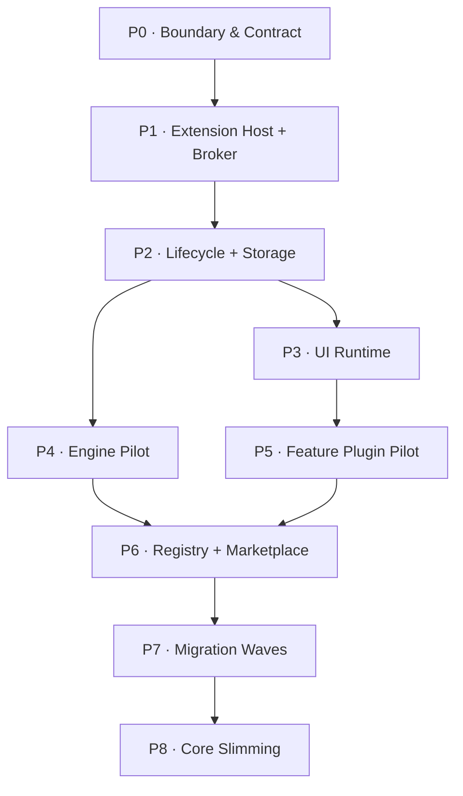

# 08 · Migration Roadmap & Task Breakdown

> 主线入口：[Mossx Plugin Platform](README.md)
> 状态说明：本文是架构级实施地图，不表示任务已进入开发；每个 Phase 开始前需单独建立 OpenSpec change 和基线证据。
> Contract 事实源：[`14-v1-contract-freeze.md`](14-v1-contract-freeze.md)（D-031～D-048）。P0 不得再把 Catalog / framing / event / budget 当成未决项。
> 当前工作树开工图：[`15-implementation-wave-plan.md`](15-implementation-wave-plan.md)。第一批 OpenSpec：`plugin-kernel-ownership-inventory`、`plugin-manifest-v1-parser`。

## 1. 总体路线



原则：每个 Phase 都必须可独立验收、可独立关闭、可退回上一稳定状态。禁止建立一个持续数月、无法判断完成度的“大插件化分支”。

## 2. P0 · Core Boundary 与 Contract Freeze

**目标**：先定义插座，再搬电器。

任务：

- [ ] P0.1 建立当前 feature/engine/storage/process ownership inventory（对照 D-048：Claude 仍是唯一 Core compatibility adapter；Notes 是第一 Feature Pilot）。
- [ ] P0.2 按 `14` §1–§2 实现 Manifest parser：Reverse-DNS `pluginId`、publisher、三轴 version、channel、`coreApi` range（禁止 `*` / 无上界）。
- [ ] P0.3 按 `14` §9–§10 实现 Contribution / Capability / template schema。
- [ ] P0.4 建立 Core Boundary fitness checks。
- [ ] P0.5 定义 Plugin SDK package boundary 和 generated types（D-047：TS + Rust；Go 仅 types）。
- [ ] P0.6 把 `14` §19 转成第一批小型 OpenSpec change，不做总包式实现。
- [ ] P0.7 建立 Manifest envelope 与 Runtime Registration subset validator，禁止未声明 Contribution/capability 在 activation 阶段获得可见性。
- [ ] P0.8 建立 install-time no-code-execution gate，证明 permission preview、compatibility check 与 diff 不加载插件入口。
- [ ] P0.9 建立 `pluginId + version -> artifactHash` uniqueness gate，并覆盖重复发布、hash 冲突、未知 Manifest Schema 与不兼容 Core Contract fixtures。
- [ ] P0.10 按 `14` §5 实现 discriminated `entries[]` parser、per-kind Closed Schema、artifact-relative path/integrity checks 与 `entryId` reference validator。
- [ ] P0.11 按 `14` §6 实现 Physical Entry DAG 静态规则：cycle / missing / runtime mutation 拒绝。
- [ ] P0.12 实现 Runtime `required/deferred/optional` Readiness Schema，并把 deadline 接到 `14` §8（默认 10s / 上限 30s）。
- [ ] P0.13 把 `14` §9 Catalog 落成 schema 文件与 `mossx.*` / `<pluginId>.*` rejection gate。
- [ ] P0.14 实现 exact + bounded template matcher（dynamic-eligible 仅 tool/search/context/status；maxInstances 1–256）。
- [ ] P0.15 实现 `14` §3–§4 Activation Unit / Event Catalog、`onStartup` 白名单与 first-interactive fitness check。
- [ ] P0.16 实现 `14` §13 MXPC/MXPD framing fixtures（非法 magic/超限/NDJSON 全部 fail closed）。
- [ ] P0.17 实现 `14` §11 schema evolution：未知字段拒绝；仅 `extensions.<publisherDns>.*` 可忽略。

验收：没有插件 runtime 时 Core contract tests 可运行；新增具体 CLI 不需要扩大 Core contract 类型集合；仅凭 artifact metadata 即可完成安装前审计；运行时越界注册稳定 fail closed；同一 `pluginId` 在 display name、repository 与 publisher metadata 变化后仍映射到同一 Storage/permission/lockfile identity；相同 `pluginId + version` 的 hash 冲突、未知 Manifest Schema 和不兼容 Core Contract 均在执行插件前 fail closed；重复/未知 Entry、越界路径和悬空 `entryId` reference 均被拒绝。

回滚：仅 contract/SDK 未接生产路径，可撤销新入口，不影响当前功能。

## 3. P1 · Extension Host 与 Capability Broker

**目标**：建立控制面和隔离执行面。

任务：

- [ ] P1.1 Extension Host Controller 启停、IPC、heartbeat。
- [ ] P1.2 per-plugin Worker supervisor 与 generation token。
- [ ] P1.3 Restricted Process supervisor、child cleanup、platform matrix。
- [ ] P1.4 Capability Broker 初始 read-only workspace/storage APIs。
- [ ] P1.5 per-plugin logs、metrics、quota 与 diagnostics。
- [ ] P1.6 Core kill switch 与 Plugin Safe Mode。
- [ ] P1.7 分离 Control Plane 与 Data Plane，保证 bulk stream 拥塞不阻塞 lifecycle/interrupt/fuse。
- [ ] P1.8 Core-issued bounded data channel：identity/generation/scope/quota/backpressure/cancel/revoke contract。
- [ ] P1.9 Rust Extension Host 内嵌 per-plugin QuickJS Runtime，默认只暴露 Mossx SDK/IPC bridge。
- [ ] P1.10 Node/npm/CLI/native 作为 Restricted Process Entry 的 supervisor、sandbox policy 与 conformance fixture。
- [ ] P1.11 JSON-RPC/JSON Schema Control Contract、length-prefixed framing 与 Rust/TypeScript SDK generation。
- [ ] P1.12 Windows Named Pipe、macOS/Linux UDS、Process framed stdio 的 platform conformance。
- [ ] P1.13 binary StreamHandle open/revoke/backpressure/cancel/abnormal-close fixture。
- [ ] P1.14 Physical Entry DAG supervisor：拓扑启动、反向停止、cycle/missing reference rejection 与 partial-start cleanup。
- [ ] P1.15 Runtime Capability Graph：generation-bound provide/require、provider-loss propagation、staging visibility 与 rebind fixtures。
- [ ] P1.16 Readiness supervisor：required deadline/rollback、deferred waiting/rebind、optional omission/provider-loss 与 status projection fixtures。
- [ ] P1.17 Contribution Envelope matcher：exact/template 唯一匹配、per-generation/per-scope quota、越界注册与 generation cleanup fixtures。
- [ ] P1.18 Lazy Activation Coordinator：placeholder、single-flight、caller cancellation、partial-start cleanup、retry/LKG 与 structured surface error fixtures。

验收：crash/hang/quota/policy fixtures 证明单插件故障不扩散；stale token 全部 fail closed；Data Plane 注入拥塞时 Control Plane 仍能 interrupt、fuse 和 revoke；QuickJS Worker 不能访问 Node/OS API，Node Process Entry 故障不影响 Host 与其他插件；跨平台 framing/schema/stream conformance 全部通过；Physical DAG 与 Runtime Capability Graph 的 activation/deactivation 顺序可重复验证，runtime registration 无法新增 physical edge 或改变 placement；required 不会永久 pending，deferred/optional 缺失不会错误触发整个插件 rollback；普通插件数量增长不扩大 Core first-interactive activation set，同一 target 的并发触发只产生一个 generation。

回滚：runtime 默认关闭，不接真实插件；回到当前内置实现。

## 4. P2 · Lifecycle、Storage 与 Update Transaction

**目标**：没有可靠回退之前，不开放真实第三方代码。

任务：

- [ ] P2.1 lifecycle state machine 与 atomic contribution registry。
- [ ] P2.2 per-plugin physical Storage Namespace。
- [ ] P2.3 consistent checkpoint/restore。
- [ ] P2.4 compatible/destructive migration runner。
- [ ] P2.5 staged candidate、health gate、LKG、atomic lockfile。
- [ ] P2.6 code+data rollback 与 retention cleanup。
- [ ] P2.7 crash-during-migration / disk-full / corrupted-checkpoint tests。
- [ ] P2.8 required/optional Contribution activation gate、动态撤销与 generation cleanup tests。

验收：任何更新注入故障后，都只能得到“旧版本可用”或“插件被安全隔离”，不能出现未知 schema 继续运行。

回滚：关闭动态安装入口，保留 namespace 与 checkpoint，不删除用户数据。

## 5. P3 · UI Contribution Runtime

**目标**：先交付低风险 UI，再开放 trusted React。

任务：

- [ ] P3.1 UI Slot catalog 与 props/event contract。
- [ ] P3.2 Declarative Widget renderer。
- [ ] P3.3 Sandbox surface、CSP、message bridge。
- [ ] P3.4 Trusted React loader、versioned bundle、Disposable handle。
- [ ] P3.5 Error Boundary、render budget、circuit breaker、safe reload。
- [ ] P3.6 Extensions recovery UI 与 permission/error states。
- [ ] P3.7 独立 HTML prototype 与用户验收后再实现 Marketplace UI。

验收：停用后无 DOM/listener/timer/subscription 残留；单插件 UI 崩溃不影响会话幕布。

回滚：按模式逐项 feature flag；保留 Extensions recovery surface。

## 6. P4 · Engine Plugin Pilot

**目标**：证明具体 CLI 能真正脱离 Core，而不是只登记 metadata。

任务：

- [ ] P4.1 抽取 Engine Plugin SDK 与 conformance harness。
- [ ] P4.2 建立 `com.mossx.engine.claude` 独立仓库（D-048）。它是当前唯一 Core compatibility adapter，迁出后删除 Core 执行实现。
- [ ] P4.3 迁移 protocol、adapter、history、recovery、diagnostics。
- [ ] P4.4 运行 onboarding matrix 全量 parity。
- [ ] P4.5 建立 Core compatibility adapter 与单 owner switch。
- [ ] P4.6 发布签名 artifact，验证独立更新与 LKG rollback。
- [ ] P4.7 pilot 稳定后删除该 Engine 的 Core 执行实现。

验收：Core 不含该 CLI artifact 仍能启动；插件 version 可独立升级/回退；既有 session identity 不改变。

回滚：切回 Core compatibility adapter，恢复同一 logical session owner。

## 7. P5 · 第一方 Feature Plugin Pilot

**目标**：验证 UI + storage + migration 的完整插件链。

第一 Feature Pilot 已确认为便签 `com.mossx.notes`（D-048）。随后：项目知识地图 → 内置浏览器 → 意图画布。

任务：

- [ ] P5.1 以 Notes 为 pilot，确认 storage schema 与 Trusted React system slot。
- [ ] P5.2 建立独立仓库、manifest、storage schema。
- [ ] P5.3 选择 Declarative/Sandbox/Trusted React 模式。
- [ ] P5.4 从 Core 数据迁入 plugin namespace，保留可逆 checkpoint。
- [ ] P5.5 验证 install/disable/update/destructive migration/rollback/uninstall。
- [ ] P5.6 删除 Core duplicate owner。

验收：pilot 的源码、数据、更新和故障均可独立管理，Core 只消费 contribution。

回滚：恢复 Core adapter/feature flag 与迁移前数据 checkpoint。

## 8. P6 · Registry 与 Marketplace

**目标**：先建立 curated supply chain，再扩大来源。

任务：

- [ ] P6.1 artifact format、hash、signature、SBOM、provenance。
- [ ] P6.2 curated Registry index、channel、revocation、key rotation。
- [ ] P6.3 Marketplace inventory、detail、permission diff、update/rollback UI。
- [ ] P6.4 local path/Git development flow。
- [ ] P6.5 offline cache 与 Registry unavailable behavior。
- [ ] P6.6 security blocklist 与 emergency disable drill。
- [ ] P6.7 versioned Capability Graph、provider resolver 与 stable binding。
- [ ] P6.8 structured InstallPlan、permission/egress consent 与 audit trail。
- [ ] P6.9 staged install 后动态刷新 capability/tool schema。
- [ ] P6.10 idempotent TaskContinuation，支持最小域 reload 后续跑原任务。
- [ ] P6.11 Plugin SDK/CLI/testkit、dependency resolver 与 independent-repo conformance。
- [ ] P6.12 publisher/private Registry/team policy/key rotation/revocation governance。
- [ ] P6.13 评估 V2 Publisher-owned Capability Contract Artifact；未完成签名、版本/schema hash、consumer lock、revocation 与 offline cache 前不得开放跨插件消费。

验收：签名异常、权限扩大、版本撤回、Registry 离线均有明确且安全的产品行为；“缺少读图能力”类场景可以在当前对话内完成 discovery、consent、transactional install、capability refresh 和原任务续跑，且失败不重复副作用。

回滚：关闭远程发现/安装，已安装 LKG 按本地缓存继续运行。

## 9. P7 · 迁移波次

建议顺序（D-048）：

1. `com.mossx.engine.claude`（0.8.9 唯一残留 compatibility adapter）；
2. `com.mossx.notes`；
3. 项目知识地图；
4. 内置浏览器；
5. 意图画布；
6. 其他具体 CLI（独立仓库接入，不回灌 Core）；
7. 高级 Git/Search provider 等扩展能力。Git/Search foundation V1 仍留 Core。

每次只迁移一个 owner，禁止同一数据域同时存在 Core 和 Plugin 双写事实源。

## 10. P8 · Core Slimming 与兼容层退役

任务：

- [ ] P8.1 删除已迁出插件源码与未使用依赖。
- [ ] P8.2 删除 engine-specific Core branch。
- [ ] P8.3 删除过期 compatibility adapter。
- [ ] P8.4 收紧 architecture fitness checks。
- [ ] P8.5 校准 ADR、dev-guidelines、主 specs 和 release runbook。
- [ ] P8.6 执行全平台 install/update/rollback/safe-mode 演练。

兼容层只有在：目标插件稳定、LKG 可恢复、数据迁移已验证、回退窗口结束后才能删除。

## 11. Decision Freeze Gates

18 个 Decision Package 已于 2026-08-16 全部确认（D-031～D-048）。取证与对照摘要在 [`12-open-decisions-and-deepseek-comparison.md`](12-open-decisions-and-deepseek-comparison.md) §8；字段正文在 [`14-v1-contract-freeze.md`](14-v1-contract-freeze.md)。实施阶段不得在代码里另写默认答案。

| Gate | 状态 | 解锁范围 |
|---|---|---|
| Contract Freeze | CONFIRMED D-031～D-039、D-046 | P0 Contract、P1 Extension Host/SDK 稳定实现 |
| Pilot Freeze | CONFIRMED D-042、D-047、D-048 | P4 Engine Pilot = Claude；P5 Feature Pilot = Notes |
| Marketplace Freeze | CONFIRMED D-040、D-041、D-043～D-045 | P6 远程发现仅 curated Registry；V1 禁止 plugin-to-plugin |

推翻冻结项必须新增 superseding Decision，并同步改 `14` 与本路线图。

## 12. Critical Path

```text
Contract
  → Host isolation
  → Capability Broker
  → Lifecycle + Storage transaction
  → Engine/Feature pilots
  → Registry + Marketplace
  → Migration waves
  → Core slimming
```

Marketplace UI 不是最先做的部分。没有隔离、权限、checkpoint 和 LKG 的市场，只会把下载能力放大成供应链与数据风险。

对话式安装也不是让 Agent 直接执行 `install`：它依赖 Capability Graph、deterministic resolver、InstallPlan、Policy/Consent、staged transaction、dynamic generation refresh 和 TaskContinuation。详细设计见 [Conversational Plugin Acquisition](../client-modernization/11-conversational-plugin-acquisition.md) 与 [Developer Platform and Ecosystem Governance](../client-modernization/12-plugin-developer-platform-and-ecosystem-governance.md)。

## 13. 全阶段 Gate

每个 Phase 都要显式回答：

- 基线测试是否为绿，已有失败是否被隔离记录；
- 该阶段新增了什么 trust/capability/data boundary；
- 单插件故障是否局部化；
- 是否提供 feature flag、LKG 或 compatibility rollback；
- 是否扩大 AppShell root 高频状态；
- Windows/macOS/Linux 哪些结论已证实、未验证；
- 是否需要更新 Engine foundation ADR；
- 是否通过对应 OpenSpec strict validation。
- 是否证明 Core first-interactive 不依赖 Registry/普通插件；
- 是否证明对话式安装不会静默提权或重复外部副作用。
- 本阶段依赖的 Decision Package 是否已经完成 DeepSeek 对比、用户确认和 Contract 回写。

## 14. 主要风险

| 风险 | 缓解 |
|---|---|
| 平台骨架过度设计 | 以两个 pilot 驱动 Contract，不先造完整生态 |
| Worker 被误当安全沙箱 | local/高权限强制受限进程 |
| Trusted React 污染 renderer | 白名单 slot、dispose、fuse、safe reload |
| 独立仓库版本矩阵爆炸 | Contract semver、conformance、Registry channel、lockfile |
| 数据迁移不可回退 | pre-update checkpoint 与 code+data LKG |
| Core/Plugin 双 owner | 单 owner switch，禁止长期双写 |
| Marketplace 先于治理上线 | 隔离和回退作为 Marketplace 前置 gate |
