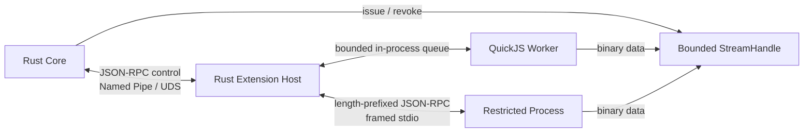

# 10 · IPC Transport and Wire Protocol

> 主线入口：[Mossx Plugin Platform](README.md)
> 决策状态：方案 A 已确认；DP-016 / D-046 已冻结 exact frame、codec、handshake 与“无压缩 / 无 shm / 无跨进程 resume”。字段正文见 [`14` §13](14-v1-contract-freeze.md)。

## 1. 已确认的协议分层

Mossx Plugin IPC 使用两套职责不同的协议：

- Control Plane：JSON-RPC 2.0 semantics + Mossx metadata envelope + JSON Schema；
- Data Plane：Core-issued bounded StreamHandle + binary channel。

Control Plane 优先可解释、可调试和 schema evolution；Data Plane 优先 throughput、backpressure 和 bounded resource。禁止把 Streaming、Tool Output 或大文件持续塞进 JSON-RPC payload。



## 2. Physical Transport Matrix

| Link | Control Transport | Data Transport |
|---|---|---|
| Core ↔ Extension Host · Windows | Named Pipe | Core-issued local pipe/stream handle |
| Core ↔ Extension Host · macOS/Linux | Unix Domain Socket | Core-issued local pipe/stream handle |
| Extension Host ↔ QuickJS Worker | in-process bounded queue | in-process bounded binary channel |
| Extension Host ↔ Restricted Process | length-prefixed framed stdio | 独立 pipe/stream handle |

不使用 local TCP 作为默认 transport，避免端口生命周期、防火墙和误暴露问题。将来如果 Remote Plugin 成为明确产品能力，应建立独立 remote protocol/trust model，不能复用本机 IPC 后直接开放端口。

## 3. Control Plane Envelope

概念 envelope：

```json
{
  "jsonrpc": "2.0",
  "id": "req-123",
  "method": "engine.session.start",
  "params": {},
  "meta": {
    "protocolVersion": "1.0",
    "pluginId": "mossx.engine.codex",
    "pluginVersion": "1.2.0",
    "generation": 17,
    "deadlineMs": 10000
  }
}
```

`meta` 至少需要表达：

- protocol version；
- plugin id/version/generation；
- request/correlation identity；
- deadline/cancellation identity；
- session/workspace identity（仅适用时）；
- trace/audit identity（不得携带 secret）。

`meta` 必填字段以 [`14` §13](14-v1-contract-freeze.md) 与即将生成的 JSON Schema 为准。本文示例只说明语义，不得另写一套字段。

## 4. Framing

Control message 使用 length-prefixed frame，不使用 newline-delimited JSON：

- JSON string、日志和用户内容可以安全包含换行；
- 接收方先验证 frame length，再分配 buffer；
- frame size 有硬上限；
- 超限、截断、非法 JSON 或 schema mismatch 必须 fail closed；
- parser error 归属到具体 plugin/process generation。

V1 使用 10 字节 MXPC header：`magic u32be "MXPC"` + `version u8=1` + `flags u8=0` + `payload_len u32le`，payload 上限 1 MiB。完整布局见 `14` §13.1。

## 5. JSON Schema and SDK Generation

Control Contract 由 versioned JSON Schema 驱动，至少生成：

- Rust Core/Host types and validators；
- TypeScript QuickJS/Node SDK types；
- Go Process SDK types（若进入官方 SDK V1）；
- conformance fixtures；
- method/version compatibility table。

手写类型只能作为 generated contract 的 adapter，不能让 Rust、TypeScript、Go 各自维护一份“差不多一样”的 schema。

## 6. Data Plane Open Flow

插件通过 Control Plane 请求 Data Channel：

```json
{
  "jsonrpc": "2.0",
  "id": "req-open-stream",
  "method": "data.open",
  "params": {
    "direction": "plugin-to-core",
    "codec": "engine-event-v1",
    "quotaBytes": 67108864
  }
}
```

Core 返回 logical StreamHandle：

```text
streamId
pluginId / version / generation
direction
codec
quota
deadline / cancellation identity
transport descriptor
```

只有 Core 可以签发和撤销 StreamHandle。Extension Host 负责把 handle 交付到正确 generation，并追踪其 lifecycle；插件不能自行打开任意 pipe、共享内存或 Core endpoint。

## 7. Data Plane Invariants

- bounded queue 与明确 high-water mark；
- producer/consumer backpressure；
- timeout、cancel、half-close 和 abnormal-close 语义；
- stale generation frame fail closed；
- plugin disable/update/fuse 时撤销全部 handle；
- bulk stream 拥塞不阻塞 Control Plane；
- payload codec/version 在 open 时协商；
- unsupported codec 在传输前拒绝；
- binary channel 不暴露 Core memory address 或 raw database/file handle。

## 8. Control Plane Error Model

Error 必须区分：

- protocol/schema error；
- compatibility/version error；
- permission/policy denial；
- invalid or stale generation；
- deadline/cancellation；
- plugin unavailable/crashed；
- resource quota/backpressure；
- Core internal/transient failure。

插件不得通过 error detail 获得其他插件、Core filesystem、secret 或内部 stack 的敏感信息。Core diagnostics 保留完整 correlation，返回插件的是 stable error code 与最小可操作信息。

## 9. Compatibility

- handshake 先协商 Control Protocol major/minor 与 supported method set；
- major incompatible：拒绝激活；
- minor/additive：按 capability negotiation 使用；
- unknown method/field 不得导致 Host crash；
- required field 缺失必须明确失败；
- Data codec version 独立于 Control Protocol version；
- Core/Host/Plugin 三方 version 组合进入 conformance matrix。

## 10. Security Boundary

Named Pipe/UDS/stdio 只是 transport，不等于 authorization。IPC Contract 实施时还必须冻结：

- endpoint ownership/ACL；
- Core-spawned Host 与 Process 的 handshake identity；
- replay protection；
- startup nonce/token 的安全交付；
- process inheritance/handle leakage 防护；
- malformed frame、slow reader、flood 与 decompression-bomb fixture。

这些安全细节不能用“只监听 localhost”替代。

## 11. 明确不采用

- gRPC/Protobuf 作为所有 Control/Data 链路的统一默认；
- MessagePack + 私有 RPC 作为 Control Plane；
- newline-delimited JSON；
- local TCP 作为默认本机 IPC；
- 把大 Tool Output/base64 blob 持续塞入 JSON-RPC；
- 插件自行创建未登记 Data Channel。

Protobuf/MessagePack 可以作为某个 versioned Data codec 候选，但不能改变已确认的 Control Plane contract。

## 12. V1 已冻结 / V2 仍关闭

已冻结（D-046 / `14` §13）：

1. MXPC / MXPD magic、little-endian length、1 MiB 上限；
2. codec 仅 `engine-event-v1` / `blob-v1` / `log-v1`；
3. `mossx.handshake.hello` + 一次性 nonce；
4. 32 帧或 8 MiB 窗口；CANCEL 后丢弃；generation 切换不 resume。

V1 明确关闭，需要新 Decision 才能打开：

1. compression；
2. shared memory；
3. 跨进程 reconnect/resume；
4. 自定义 codec；
5. local TCP。

OpenSpec `plugin-ipc-v1-framing` 只实现上述冻结项，并把 generated schema 放到 `packages/plugin-contract`。
