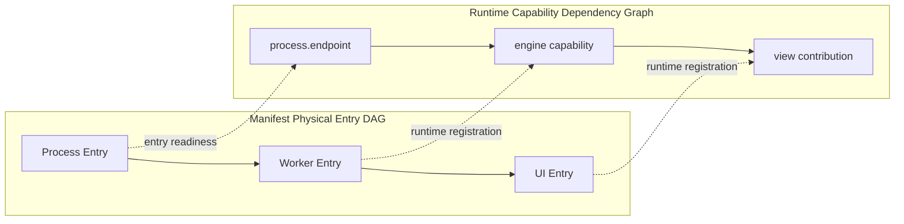
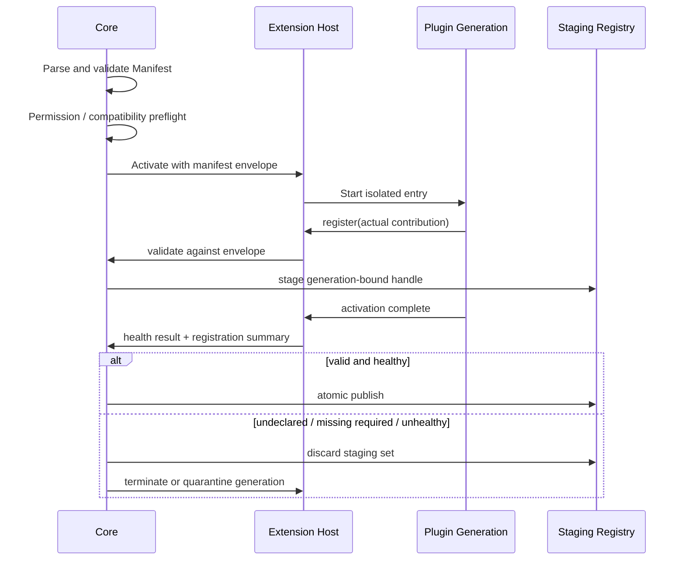

# 11 · Manifest & Runtime Registration

> 主线入口：[Mossx Plugin Platform](README.md)
> 决策状态：D-021 已确认两阶段模型；DP-001～DP-009 / D-031～D-039 已冻结 Manifest V1 字段。解析器以 [`14-v1-contract-freeze.md`](14-v1-contract-freeze.md) 为准。

## 1. 决策

Mossx 插件采用：

```text
Manifest A
Closed Declarative Schema
安装前审计与最大授权包络
        ↓
Runtime Registration B
SDK-driven Dynamic Registration
当前 generation 的实际贡献集合
```

两者不是互斥方案。Manifest 回答“这个 artifact 最多被允许做什么”；Runtime Registration 回答“这个 generation 现在实际提供什么”。

核心约束：

```text
Runtime Contributions ⊆ Manifest Contribution Envelope
Runtime Capabilities  ⊆ Granted Manifest Capabilities
Runtime Placement     = Manifest-approved Placement
```

运行时只能实现、选择或收窄声明，不能通过动态代码静默扩大权限和扩展面。

## 2. 为什么不采用纯 Manifest A

纯声明式 Manifest 很适合安装前审计，但无法合理表达所有运行时状态：

- Engine 是否已发现本机对应 CLI；
- 当前 workspace 可用的命令、provider 或动态实例；
- 某项可选能力是否通过 health probe；
- 用户配置改变后应该出现或撤销哪些 Contribution；
- Plugin generation 切换时如何原子替换实际注册集合。

如果把这些全部静态展开，Manifest 会退化成运行时状态快照，并导致 schema 频繁变化。

## 3. 为什么不采用纯 Runtime Registration B

纯动态注册只有执行插件代码后才能知道它会：

- 注册哪些 UI、Command、Engine、Search 或 Tool Contribution；
- 请求哪些 filesystem、network、process、storage scope；
- 运行在哪种 Worker/Process/UI placement；
- 是否触及 migration 和用户数据；
- 是否与当前 Core Contract 兼容。

这会让 Marketplace 无法在安装前生成可信的权限提示、兼容性结论和版本 permission diff，也会让恶意代码在被审计前先获得执行机会。

## 4. 两阶段职责

### 4.1 Manifest A：安装与授权事实源

Manifest 必须使用 versioned、Closed Declarative Schema。Core 在不加载 Worker、Process、UI 或 Migration Entry 的情况下完成：

- artifact identity、publisher、integrity 与 provenance 检查；
- Core Contract、platform 与 architecture compatibility；
- entry 与 runtime placement 检查；
- Contribution 最大包络解析；
- capability/scope 权限预览与版本 diff；
- storage schema、migration 风险与 checkpoint plan；
- resource policy 和 activation policy 预检。

安装阶段禁止执行插件提供的 `preinstall`、`postinstall`、`prepare` 或其他任意 lifecycle script。正式 artifact 必须包含预构建入口。

### 4.2 Identity：Reverse-DNS stable `pluginId`

`pluginId` 采用永久不可变的 Reverse-DNS 格式：

```text
com.mossx.notes
com.mossx.engine.codex
io.github.alice.project-map
```

规则：

- `pluginId` 是机器身份，不是产品展示名称；
- 首次发布后不得因 display name、repository、publisher 展示名或公司品牌变化而修改；
- `com.mossx.*` 为官方保留命名空间；
- 社区作者使用 Registry 验证过的自有域名，或 `io.github.<owner>.*`；
- Storage Namespace、permission grant、plugin lock、checkpoint、generation 与 audit record 均以 `pluginId` 为 identity root；
- publisher ownership、repository URL、commit SHA 和签名 key 是独立 provenance 字段，不能从字符串前缀直接推断信任等级。

域名/GitHub ownership verification、publisher transfer、丢失签名 key 后的恢复流程见 `14` §1（D-040）：TransferStatement 双签 + 7 天公示；丢 key 冻结新发布，不自动接管。

### 4.3 Versioning：Schema / Artifact / Contract 三轴

```yaml
manifestVersion: 1
version: 1.4.2
compatibility:
  coreApi: ">=1.2 <2.0"
```

三个字段承担不同职责：

| 版本轴 | 含义 | 变化原因 |
|---|---|---|
| `manifestVersion` | Closed Manifest Schema generation | Manifest 语法或静态校验规则发生不兼容变化 |
| `version` | 插件 immutable artifact release | 插件功能、修复、迁移或权限包络发生版本变化 |
| `compatibility.coreApi` | 支持的 Mossx Plugin Contract range | 插件采用或停止支持某个 Core Contract 版本 |

约束：

- `version` 使用 SemVer；
- 同一 `pluginId + version` 只能对应一个 artifact hash，禁止覆盖发布；
- Core 不支持 `manifestVersion` 时，在安装前拒绝；
- 当前 Core Contract 不满足 `compatibility.coreApi` 时，在下载/激活前判定 incompatible；
- 运行时 handshake 负责再次证明实际 Contract，不替代安装前 compatibility check；
- Manifest Schema、插件 release 与 Core Contract 不得使用一个版本字段互相推导。

pre-release / channel / range 见 `14` §2（D-043）：仅 `stable|beta`；`stable` 拒绝 pre-release；`coreApi` 禁止 `*` 与无上界。

### 4.4 Entry：`id + kind` Discriminated List

Manifest 用统一列表表达复合 Artifact 的所有可执行或可挂载入口：

```yaml
entries:
  - id: main-worker
    kind: worker
    path: dist/worker.js

  - id: cli-engine
    kind: process
    platforms:
      darwin-arm64: bin/darwin-arm64/engine
      windows-x64: bin/windows-x64/engine.exe

  - id: sidebar
    kind: ui
    mode: declarative
    path: dist/ui/sidebar.json

  - id: schema-v2
    kind: migration
    path: migrations/v2.js
```

共同规则：

- `id` 在当前 artifact 内唯一，并在该 release 内稳定；
- `kind` 是 Closed discriminant，V1 只接受 Schema 已知值；
- 每个 `kind` 使用独立 Closed Schema，不能把 Process 字段塞入 Worker Entry；
- Contribution、activation、health、placement、日志和故障记录通过 `entryId` 引用；
- 一个 artifact 可以有多个同类 Entry，不依赖数组顺序决定 owner；
- `path` 必须是规范化的 artifact-relative path，禁止绝对路径、`..` escape、symlink escape，并且目标必须进入 integrity file set；
- 当前平台缺少 required Entry 时，在启动插件代码前判定 incompatible。

Entry 是 artifact 内的 lifecycle identity，不是全局 plugin identity。跨版本比较使用 `pluginId + entryId`；文件路径可以随新版本变化，但不能被 Core 当成稳定主键。

### 4.5 双图模型：Physical Entry DAG + Runtime Capability Graph

Mossx 同时维护两张不能混用的图：



Physical Entry DAG：

- 来源是签名 Manifest，可在不执行插件代码时静态验证；
- 节点是 Worker/Process/UI execution unit，边是 `entryId` 之间的 physical dependency；
- Core/Host 按拓扑顺序启动、反向拓扑停止；
- cycle、missing reference、当前平台缺失 required Entry 在 activation 前拒绝；
- Migration Entry 不进入常规 DAG，由 update transaction 单独调度。

Runtime Capability Dependency Graph：

- 来源是通过 SDK/IPC 提交的 generation-bound provide/require registration；
- 节点是 capability/provider/contribution，边表示逻辑可用性依赖；
- provider 出现或消失时，关联 Contribution 可以 staged、撤销、暂停或重新绑定；
- 所有节点和边必须位于 Manifest envelope 内；
- 不能 spawn execution unit、修改 Physical DAG、改变 runtime placement 或执行 migration。

两张图的联动原则是：Physical Graph 决定 Entry 能否存在，Runtime Graph 决定其 Contribution 当前能否对外可见。停用时先撤销逻辑可见性，再按物理图停止执行单元，避免消费者继续调用正在退出的 provider。

这一模型吸收 Cordis Service Injection Graph 的动态重绑定能力，同时增加桌面 Marketplace 所需的静态物理编排、权限预检、activation deadline 和事务回退。

### 4.6 Readiness：Required / Deferred / Optional

Runtime Capability requirement 必须声明 Readiness：

```yaml
budgets:
  activationDeadlineMs: 10000

requires:
  - capability: mossx.engine.provider
    readiness: required
  - capability: com.mossx.engine.claude.private.auth
    readiness: deferred
  - capability: com.mossx.engine.claude.private.telemetry
    readiness: optional
```

语义：

- `required`：阻塞关联 activation unit 的 atomic publish；在 effective deadline 内未满足则 activation 失败并按更新事务回退；
- `deferred`：不阻塞基础 activation，但进入可观测 waiting set；provider 到达后重新做 envelope/health validation，再动态发布关联 Contribution；
- `optional`：缺失不进入 waiting set，也不产生恢复承诺；存在时可以启用声明范围内的增强 Contribution。

effective deadline 由 Core Policy 的 default/min/max 与 Manifest request 共同确定，插件无权请求 infinite。超时结果必须进入 structured diagnostics，包含 missing capability、consumer entry、等待时长和候选 generation。

已激活后 provider loss：

- required：先撤销受影响公开能力，进入 bounded recovery；恢复失败则 suspend/quarantine 对应 activation unit；
- deferred：撤销关联能力并回到 waiting，provider 恢复后重新绑定；
- optional：撤销增强能力，不制造插件级故障。

Readiness 修饰 Runtime Capability edge，不改变 Physical Entry DAG。Physical Entry 使用 required/optional criticality；lazy/on-demand Entry 由 activation policy 定义，不能用 deferred capability 偷偷创建进程。

### 4.7 Capability Ownership：Platform 与 Extension Namespace

V1 使用双层命名空间：

```text
mossx.engine.provider                 # Core-owned Platform Capability
mossx.workspace.read                  # Core-owned brokered resource Capability
com.example.notes.private.index       # plugin-private Capability
```

Platform Capability：

- ID 使用保留的 `mossx.*` namespace；
- Contract 由 Core Platform Catalog 定义并随 Plugin Contract 发布；
- 插件可以按 Manifest 声明 provide/require，但无权创建、覆盖或改变 Contract；
- Capability ID、Contract version、request/response/event schema hash 与允许的 provider/consumer role 一起校验；
- 跨插件 Runtime Graph 在 V1 只能使用这类 Capability。

Plugin-private Capability：

- ID 必须位于 `<pluginId>.*`，owner 从已验证的 Manifest identity 推导；
- 默认只允许同一 `pluginId` 的 Entry/generation 之间 provide/require；
- 不能进入其他插件的 Manifest dependency、permission grant 或 Registry resolution；
- 名字带 publisher 前缀不自动获得 public/exported 资格。

V2 可以引入 Publisher-owned exported Capability，但必须以独立 signed Capability Contract Artifact 治理，至少绑定：

```text
capabilityId
ownerPluginId / publisher
contractVersion
schemaHash
artifactHash + signature
consumer version range
revocation status
```

Registry 必须能够离线缓存已锁定 Contract，并在 owner transfer、schema 冲突或 revocation 时给出确定结果。在这些机制完成前，跨插件引用 `<pluginId>.*` 一律拒绝。

这一分期保留 DeepSeek/Cordis federated Service Definition 的生态方向，但不依赖同进程 TypeScript declaration merging 作为跨语言、跨进程安全约束。

### 4.8 Contribution Envelope：Exact + Bounded Template

稳定 Contribution 必须精确声明：

```yaml
contributions:
  - id: notes-sidebar
    type: mossx.ui.sidebar.view
    entryId: notes-ui
    slot: sidebar.secondary
```

确实依赖运行时发现的重复型 Contribution 使用 bounded template：

```yaml
contributionTemplates:
  - id: discovered-tools
    type: mossx.tool
    entryId: main-worker
    keyPrefix: com.example.mcp.
    scopes: [workspace]
    maxInstances: 100
```

规则：

- UI Slot、Command、Engine Provider 等稳定身份型 Contribution 使用 exact declaration；
- Tool discovery、动态数据源等只有在 Platform Catalog 将该 type 标为 `dynamicEligible` 时才能使用 template；
- template 必须限定 type、owner `entryId`、key namespace/pattern、允许 scope 和 `maxInstances`；
- `maxInstances` 按 plugin generation 和声明 scope 计数，disable/fuse/update 时随 generation 清零；
- Runtime Registration 必须匹配唯一 exact declaration 或唯一 template；零匹配或多重歧义都拒绝；
- template 不能动态产生 Trusted React bundle、任意 UI slot、未知 Capability、额外 permission 或新的 Process Entry；
- template envelope 扩大属于 Manifest 权限/策略变化，必须展示 diff。

动态 model/account/session/workspace item 通常是某个稳定 Contribution 发布的数据，不应为了每条业务数据创建 Contribution。只有需要独立 lifecycle、routing 和 disposable handle 的实例才进入 template。

### 4.9 Activation：Declarative Events + Lazy by Default

```yaml
activationUnits:
  - id: notes-main
    entries: [notes-worker]
    events:
      - type: onView
        viewId: notes.main
      - type: onCommand
        commandId: notes.create
  - id: claude-engine
    entries: [claude-worker]
    events:
      - type: onEngine
        engineId: claude
```

Core 在不执行插件代码时，根据签名 Manifest/lockfile 注册轻量 Contribution placeholder。事件命中后，Lazy Activation Coordinator 才启动目标 Entry 及其 Physical DAG dependencies，并建立对应 Runtime Capability Graph。

约束：

- event kind 必须来自 Core Activation Event Catalog；
- target 必须引用当前 Manifest 中存在的 Activation Unit（`14` §3）；unit 再点名其 Entry required closure；
- 同一 target 的并发请求 single-flight，避免重复 generation、Process 和 migration；
- 调用方 cancellation 不自动杀死其他调用方共享的 activation；
- failure/timeout 必须清理 partial state，并把 retry/rollback 信息投影到触发 surface；
- `onStartup` 只允许必要 system plugin 或 policy whitelist，不能由普通插件用来绕过 lazy default；
- placeholder metadata 来自签名 Manifest，不能通过执行 bundle、访问 Registry 或调用网络生成；
- activation event 不是 permission grant，不能静默绕过 consent；
- Core first-interactive 只依赖 Microkernel 与必要 system foundation，不等待普通插件、Marketplace 或 Registry。

Event Catalog 与 Activation Unit 粒度见 `14` §3–§4（D-031、D-032）。Entry 的 deferred startup 使用 activation policy 表达，与 Runtime Capability 的 `readiness: deferred` 保持语义分离。

### 4.10 Runtime Registration B：当前 generation 的实际能力

通过 Manifest gate 后，Extension Host 为插件创建绑定以下信息的 registration session：

```text
pluginId
artifactHash
generation
manifestHash
grantedCapabilitySnapshot
registrationDeadline
```

插件只能通过 Mossx SDK/IPC 注册实际 Contribution。每次注册由 Core/Host 执行：

1. 验证 plugin identity 与 generation；
2. 验证 contribution type/key/scope 是否在 Manifest envelope 内；
3. 验证所需 capability 已授权；
4. 把 contribution 写入 staging registry；
5. 返回 generation-bound disposable handle。

插件不得直接操作全局 Registry，也不得自行使 Contribution 对 renderer、Engine Router 或其他消费者可见。

## 5. Activation 与 Atomic Publish



Manifest 声明不等于 Contribution 已生效。只有本次 generation 完成注册、通过 envelope validation 和 health gate，并由 Core atomic publish 后，消费者才能看到它。

## 6. Dynamic 的允许范围

允许：

- 从 Manifest 声明的多个可选 Contribution 中注册当前可用子集；
- 在声明允许的 scope 内注册 workspace/session scoped instance；
- 因配置、health 或资源变化撤销并重新注册；
- 同一 artifact 的新 generation 构建新集合后原子切换。

禁止：

- 注册 Manifest 未声明的 Contribution Point；
- 运行时临时申请 Manifest 中不存在的 capability；
- 把 Worker Entry 升级成 Process Entry；
- 把 Declarative/Sandbox UI 升级成 Trusted React；
- 用动态 key 绕过 scope、数量或资源上限；
- 安装阶段执行代码来“补全”Manifest。

确需扩大包络时，必须发布新 artifact/version，并重新进入 permission diff 与用户授权流程。

## 7. Generation 与撤销

Runtime Registration 的每个 handle 都绑定 plugin generation：

- generation 进入 `Deactivating` 后停止接受新注册；
- Core 先从公开 Registry 撤销整组 handle，再停止事件投递；
- 插件 disposer 负责优雅清理，但 Core 不依赖 disposer 才能完成熔断；
- 旧 generation 的迟到注册、事件和 Data Channel 操作全部拒绝；
- 新 generation 必须构建自己的完整 registration set，禁止继承旧 handle。

这保证 HMR、更新、熔断与回退都使用同一套撤销语义。

## 8. 与 DeepSeek Harness/Cordis 的取舍关系

DeepSeek Harness/Cordis 使用轻量 package/profile metadata 与 `cordis.yml` 选择插件树，具体 Tool、Service、Event、UI Slot 主要由插件 `apply(ctx)` 在运行时注册；注册作为可逆 effect 支持 unload/reload。它证明了 Runtime Registration B 对组合与 HMR 的价值。

Mossx 不直接复制其 trusted Node/process model。桌面 Marketplace 还需要安装前权限审计、受限 runtime、Storage Namespace、migration/checkpoint、签名与 rollback，因此在动态注册外增加 Manifest A 安全包络。

## 9. Manifest V1 已冻结项

D-021 冻结两阶段关系；D-031～D-042 冻结字段。实施时对照 [`14`](14-v1-contract-freeze.md)，不要在 parser 里另写默认值：

1. identity / publisher / repository coordinates → `14` §1；
2. 三轴 version + channel + range → `14` §2；
3. Entry kind、physical edge、criticality → `14` §5–§6；
4. Capability Catalog → `14` §9；
5. exact + template → `14` §10；
6. Activation Unit + event catalog → `14` §3–§4；
7. Storage / migration metadata → `14` §12；
8. budget / health → `14` §8；
9. integrity / signature / SBOM → `14` §16；
10. schema evolution → `14` §11。

## 10. 验收不变量

- Core 不执行插件代码即可完成安装前审计和权限展示；
- 运行时越界注册在 publish 前稳定失败；
- permission expansion 只能通过新 Manifest/version 进入授权流程；
- activation 失败不会留下部分可见 Contribution；
- disable/fuse/update 后旧 generation 无残留注册；
- Marketplace 显示内容可从签名 Manifest/Registry metadata 推导，而不是依赖插件自述代码。
