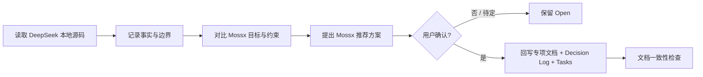

# 12 · Open Decisions & DeepSeek Comparison Protocol

> 主线入口：[Mossx Plugin Platform](README.md)  
> 决策日志：[Decision Log](09-decision-log.md)  
> 状态：D-030 治理方式已确认；DP-001～DP-018 于 2026-08-16 全部 `CONFIRMED`（D-031～D-048）。字段正文见 [`14-v1-contract-freeze.md`](14-v1-contract-freeze.md)。

## 1. 目的

插件平台已经形成方向性基线，但还没有完成 Contract Freeze。原 Decision Log 中列出了 10 个主问题，其中 `Plugin Manifest V1`、首个 Pilot 和产品迁移边界都包含多个可以独立改变架构或实施顺序的选择。

为避免把“大问题”误判成“只剩一个字段没定”，本文件把它们拆成 **18 个 Decision Package**，作为后续架构讨论、DeepSeek Harness 源码对比、文档回写和任务解锁的唯一排队入口。

DP-001～DP-018 已于 2026-08-16 全部确认。本文件保留取证协议，供 superseding Decision 复用。新项仍必须依次经过：



## 2. 计数口径

这里的“18 个”不是 18 个字段，而是 18 个能够独立拍板、独立影响实现或独立形成 OpenSpec change 的决策包。

- 紧密耦合、必须一起决定的字段合并为一个 Decision Package；
- 同一个问题在 Manifest、Marketplace、Roadmap 中重复出现时只计算一次；
- 尚未形成源码证据的 DeepSeek 行为不计入已知事实；
- 一个 Decision Package 可以在落盘时继续拆成多条 task，但不因此重复计数。

因此：**Decision Log 保留 10 个原始主问题作为来源视图，本文件维护去重后的 18 个执行视图。**

## 3. Decision Package 总表

状态枚举：`OPEN`、`COMPARING`、`RECOMMENDED`、`CONFIRMED`、`DEFERRED`。

| ID | Decision Package | 要冻结的问题 | Freeze Gate | DeepSeek 候选观察面 | 状态 |
|---|---|---|---|---|---|
| DP-001 | Named Activation Unit | event 激活单个 Entry、命名单元还是整个 Plugin；共享 Entry 如何引用计数和回收 | Contract | Cordis plugin group、fork/context disposal、Web boot composition | CONFIRMED D-031 |
| DP-002 | Activation Event Catalog | V1 支持哪些 `onView/onCommand/onEngine/onWorkspace/onStartup` 事件；prewarm 与白名单规则 | Contract | Cordis lifecycle/event、profile/config 启动树、Web 启动路径 | CONFIRMED D-032 |
| DP-003 | Entry Kind Schema | `worker/process/ui/migration` 的必填字段、Closed Schema、health 与 placement 字段 | Contract | package metadata、bundle/client 声明、plugin loader 输入 | CONFIRMED D-033 |
| DP-004 | Physical Entry DAG | physical edge、required/optional criticality、共享 Entry、partial-start cleanup 和失败传播 | Contract | Cordis inject graph、plugin group/fork、dispose 顺序 | CONFIRMED D-034 |
| DP-005 | Platform Artifact Selection | Windows/macOS、arm64/x64 的 artifact 选择、缺失平台、fallback 与完整性校验 | Contract | npm package exports、平台包、bundle 产物与安装脚本 | CONFIRMED D-035 |
| DP-006 | Capability Catalog V1 | 第一版 `mossx.*` capability 的 ID、Contract version、schema hash、provider/consumer role | Contract | Cordis Service Definition、inject/require、CLI/Web service seams | CONFIRMED D-036 |
| DP-007 | Contribution Template Contract | dynamic-eligible 类型、key pattern、scope、`maxInstances`、歧义和 quota 规则 | Contract | Tool/Service/UI Slot 的 runtime registration 与 dispose | CONFIRMED D-037 |
| DP-008 | Runtime Budget & Health | activation deadline、CPU/内存/并发、heartbeat、health gate、熔断和恢复数值策略 | Contract | Cordis pending/ready/error、loader timeout、runner/boot health behavior | CONFIRMED D-038 |
| DP-009 | Manifest Schema Evolution | unknown field、deprecated field、extension namespace、版本升级和 fail-closed 规则 | Contract | package/profile/config schema 的兼容与加载策略 | CONFIRMED D-039 |
| DP-010 | Publisher Identity & Recovery | publisher、repository、artifact 坐标、ownership transfer、丢失签名 key 的恢复 | Marketplace | npm/GitHub identity、package ownership 与发布 metadata | CONFIRMED D-040 |
| DP-011 | Supply Chain Security | hash、signature、SBOM、provenance、key rotation、revocation、offline block policy | Marketplace | 插件下载/安装链、npm/pnpm trust boundary、release artifact | CONFIRMED D-041 |
| DP-012 | Storage Migration Metadata | schema version、migration entry、checkpoint plan、破坏性阈值和导出用户数据规则 | Pilot | plugin/profile/config persistence 与版本迁移方式 | CONFIRMED D-042 |
| DP-013 | Release Channel & Auto-update | stable/beta、pre-release、range resolver、灰度、自动更新默认值和 LKG | Marketplace | package version resolution、plugin upgrade/reload 流程 | CONFIRMED D-043 |
| DP-014 | Marketplace Sources | curated Registry、Git URL、本地目录、私有 Registry 的准入和 trust tier 映射 | Marketplace | `dsh plugin` 安装来源、pnpm/Git package flow | CONFIRMED D-044 |
| DP-015 | Plugin-to-Plugin Dependency | V1 是否禁止；若允许，如何声明、lock、解析、撤销和避免依赖地狱 | Marketplace | npm dependency graph 与 Cordis service injection 的关系 | CONFIRMED D-045 |
| DP-016 | IPC Binary Contract | frame header、codec、compression、StreamHandle、背压、取消、handshake、重连与 resume | Contract | SDK/ACP/JSON-RPC/stdio transport 与流式数据路径 | CONFIRMED D-046 |
| DP-017 | Process Entry SDK Languages | V1 官方 SDK 覆盖 TypeScript、Python、Rust、Go 中哪些；其他语言如何走 conformance | Pilot | DeepSeek SDK/package 语言边界与 CLI adapter 方式 | CONFIRMED D-047 |
| DP-018 | Product Migration Boundary | 第一个 Plugin Pilot；Git/Search 的最终归属；Trusted React 对 `verified` 的开放范围 | Pilot | DeepSeek package/plugin 拆分、UI client plugin 与核心 service 边界 | CONFIRMED D-048 |

“DeepSeek 候选观察面”只是检索入口，不是已经成立的对比结论。正式结论必须附具体 repo-relative 文件路径、symbol/config key 和行为说明。

## 4. Freeze Gate 与讨论顺序

### 4.1 Contract Freeze：先稳定插座

第一批必须完成：

1. DP-001 Named Activation Unit；
2. DP-002 Activation Event Catalog；
3. DP-003 Entry Kind Schema；
4. DP-004 Physical Entry DAG；
5. DP-005 Platform Artifact Selection；
6. DP-006 Capability Catalog V1；
7. DP-007 Contribution Template Contract；
8. DP-008 Runtime Budget & Health；
9. DP-009 Manifest Schema Evolution；
10. DP-016 IPC Binary Contract。

这些问题没有冻结前，可以做调研和 prototype，但不得宣称 Extension Host、Plugin SDK 或 `.mossx-plugin` V1 Contract 已稳定。

### 4.2 Pilot Freeze：用真实插件验证 Contract

第二批必须在首个真实插件迁移前完成：

- DP-012 Storage Migration Metadata；
- DP-017 Process Entry SDK Languages；
- DP-018 Product Migration Boundary。

Pilot 的作用不是展示 Marketplace UI，而是证明 Plugin code、runtime、UI、storage、update 和 rollback 能真正脱离 Core 管理。

### 4.3 Marketplace Freeze：最后扩大生态入口

第三批必须在开放远程发现和第三方安装前完成：

- DP-010 Publisher Identity & Recovery；
- DP-011 Supply Chain Security；
- DP-013 Release Channel & Auto-update；
- DP-014 Marketplace Sources；
- DP-015 Plugin-to-Plugin Dependency。

Manifest 可以提前为这些能力预留 versioned 字段，但 Registry governance 未完成前不得把预留字段解释成已经开放的生态能力。

## 5. DeepSeek 对比协议

### 5.1 证据优先级

每个 Decision Package 的 DeepSeek 对比按以下优先级取证：

1. 实际执行路径中的源码与测试；
2. package manifest、schema、profile、`cordis.yml` 等机器可读配置；
3. 仓库内设计文档和 README；
4. 示例代码；
5. 仅在本地仓库无法回答且确有必要时，再查询官方外部资料。

不得用聊天印象、框架类比或“看起来应该如此”替代源码证据。DeepSeek 没有对应机制也是有效结论，必须明确写成“未发现统一实现”，不能替它补设计。

### 5.2 每项固定输出模板

```text
Decision Package:

1. DeepSeek 源码事实
   - 文件 / symbol / config
   - 实际行为
   - 生命周期与失败语义

2. DeepSeek 适用边界
   - trusted 还是 untrusted
   - same-process 还是 isolated process
   - package composition 还是 marketplace governance

3. Mossx 差异
   - Core boundary
   - trust / permission / process isolation
   - storage / update / rollback
   - Windows / macOS desktop constraints

4. 方案对比
   - A / B / C
   - 适用场景
   - 代价与不可逆点

5. 推荐
   - V1 选择
   - 暂缓到 V2 的能力
   - 需要冻结的 Contract

6. 用户确认
   - confirmed / rejected / deferred

7. 落盘影响
   - Decision Log
   - 专项设计文档
   - Roadmap tasks / gates
```

### 5.3 对比时必须分开的三种结论

| 结论类型 | 含义 | 是否可直接采用 |
|---|---|---|
| Mechanism Fact | DeepSeek 的代码确实这样执行 | 只能作为事实，不自动成为 Mossx 方案 |
| Transferable Pattern | 生命周期、动态注册、依赖注入等机制可迁移 | 经过 Mossx trust/data/platform 约束后采用 |
| Governance Gap | DeepSeek 未覆盖 Marketplace 隔离、签名、数据回退等 | Mossx 必须补充，不能用“DeepSeek 也没做”跳过 |

## 6. 确认与落盘规则

每次只处理一个 Decision Package，除非两个问题在 Contract 上不可分割。处理状态按以下方式推进：

```text
OPEN
  → COMPARING
  → RECOMMENDED
  → CONFIRMED
  → 对应 D-xxx + 正文 Contract + Roadmap task
```

- DeepSeek 对比完成但用户尚未确认：状态最多到 `RECOMMENDED`；
- 用户选择方案后：在 [`09-decision-log.md`](09-decision-log.md) 新增 D-xxx；
- 影响 Manifest/IPC/Storage/UI/Engine 的决定：同步更新对应专项分册；
- 影响阶段或依赖顺序：同步更新 [`08-migration-roadmap-and-tasks.md`](08-migration-roadmap-and-tasks.md)；
- 开始实现时：再按独立 Decision Package 或内聚小组建立 OpenSpec change；
- 新证据推翻旧结论：禁止静默改文档，必须新增 superseding decision 并标明迁移和回滚影响。

## 7. 原 10 项主问题到 18 项的映射

| Decision Log 原主问题 | 对应 Decision Package |
|---|---|
| Plugin Manifest V1 其他字段与校验粒度 | DP-001～DP-013、DP-016 中与 Manifest/Wire 相交的部分 |
| IPC Binary Contract 细节 | DP-016 |
| 第一个 Plugin Pilot | DP-018 |
| Process Entry SDK V1 语言 | DP-017 |
| Marketplace V1 来源 | DP-014 |
| 自动更新默认策略 | DP-013 |
| 破坏性 migration 门槛 | DP-012 |
| 插件依赖 | DP-015 |
| Git/Search 最终归属 | DP-018 |
| Trusted React 开放范围 | DP-018 |

DP-018 是一个产品迁移边界包，内部包含三个需要在同一 Pilot 策略下保持一致的选择。真正讨论时可以依次确认，但在 Roadmap 上只形成一个 Pilot Boundary Gate，避免 Core ownership、首个迁移对象和 UI 信任策略互相打架。

## 8. 冻结记录（2026-08-16）

18 个 Decision Package 已全部 `CONFIRMED`。字段、数值与样例见 [`14-v1-contract-freeze.md`](14-v1-contract-freeze.md)。下文只保留取证摘要，避免把证据写成第二套 Contract。

取证范围：本地 `@deepseek-ai/dsh` checkout（`lib/`、`config/`、`node_modules/@deepseek-ai/*`）。这是已发布 CLI 闭包，不是完整 monorepo；找不到的机制记为 Governance Gap。

### 8.1 Contract Freeze

| DP | DeepSeek 事实 | Mossx 选择 | 理由 |
|---|---|---|---|
| 001 | `cordis:group` + `isolate` 是命名启停组；`fiber.dispose()` 回收子树；同名 service 二次 `provide()` throw | **Activation Unit** + generation-scoped Entry refcount | 需要安装前可审计的启停单元，且共享 Process 不能复制 |
| 002 | profile 启动树静态 compose；无 `onView` catalog；preset 整树 mount；pending 等 service | Closed event catalog + lazy default；`onStartup` 仅 system 白名单 | DeepSeek 是 trusted boot composition，Mossx 不能把 Marketplace 插件放进 first-interactive |
| 003 | 入口是 npm package + `apply(ctx)` / `dsh.client` / `dsh.bundle.patch` | 四 kind Closed Schema | 桌面需要 Worker/Process/UI/Migration 分 placement |
| 004 | inject graph 运行时形成；失败 `boot()` dispose 整棵 partial tree | Manifest Physical DAG；required 失败 rollback unit | 逻辑 inject 不得 spawn 进程 |
| 005 | `!!js process.platform` 只禁用工具行，无跨平台 artifact 选择 | 六平台精确匹配，禁止 fallback | Windows/mac 桌面缺 executable 必须 incompatible |
| 006 | Service 是同进程字符串名；`inject` 硬依赖、`get` 可选 | 冻结 `mossx.*` Catalog + schema hash | 跨进程不能靠 TS declaration merging |
| 007 | Slot/Tool 用 `key` 动态注册；无 maxInstances；dispose 跟 fiber | exact + 有界 template；keyPrefix ∈ pluginId；max 256 | 防止任意 ID / Trusted React / 新 Engine |
| 008 | fiber PENDING/ACTIVE/FAILED；shutdown grace 5s；pending 当启动失败 | 10s/30s deadline、心跳与熔断表 | 禁止无限 waiting |
| 009 | 缺 required config fail loud；id-targeted patch 整段替换 | 未知字段拒绝；仅 `extensions.*` 可忽略 | Marketplace 审计不能吞未知权限字段 |
| 016 | MCP SDK 用 newline JSON-RPC；LSP 用 `Content-Length`；无 MX 自有 framing | MXPC/MXPD u32le；无压缩/shm/resume | 已确认不使用 NDJSON；大包走 Data Plane |

### 8.2 Pilot Freeze

| DP | DeepSeek 事实 | Mossx 选择 | 理由 |
|---|---|---|---|
| 012 | 各存储自带 version 或明确无 version；mismatch fail-loud；**无**统一 migrator | schemaVersion + migration entry；destructive 需确认；`exportRequired` 才强制导出 | 桌面用户数据必须可回退 |
| 017 | 官方面是 TypeScript/Node；动态插件禁 import/TS/JSX | TS + Rust 官方 SDK；Go 仅 types | Host 已是 Rust；Worker 是 QuickJS/TS |
| 018 | host composition vs agent preset 分平面；Web 用 disable-not-delete | Engine pilot = Claude；Feature = Notes；Git/Search 留 Core；Trusted React 仅 system | 0.8.9 只剩 Claude adapter；Notes 数据边界最清晰 |

### 8.3 Marketplace Freeze

| DP | DeepSeek 事实 | Mossx 选择 | 理由 |
|---|---|---|---|
| 010 | npm `name` + `repository.directory`；无 `author`/owner/transfer；仅 `healProfilesModuleFallback` 修 symlink | Reverse-DNS publisher.id + TransferStatement | Governance Gap 必须补 |
| 011 | `lib/plugin-9h8shc4d.js` `runPlugin` 原样 `spawnSync(pnpm)`；`dsh-client-modules` `shortHash` 只做 cache-bust | Ed25519 + merkle + SBOM；禁止绕过 revocation | pnpm 信任链与 HMR hash 都不是供应链完整性 |
| 013 | 全树无 `autoUpdate`/`releaseChannel`；`reconcilePlugins` 按已安装状态 | stable/beta；system 自动、verified 确认、local 禁止 | 权限扩大必须停下来 |
| 014 | 任意 pnpm spec 同等信任；`anchorPathSpec` 把相对路径锚到 invoking cwd | curated Registry + local + Git-as-local | Git 不得升为 verified |
| 015 | npm graph ≠ Cordis inject graph；无第三种 plugin-depends-on-plugin | V1 禁止 artifact 依赖 | 避免撤回/回退级联 |

补充可核对路径（晚到的闭包报告，不改变选择）：

- 安装器：`lib/plugin-9h8shc4d.js` `runPlugin` / `reconcilePlugins` / `anchorPathSpec`
- boot：`lib/profile-boot-DG5t9aNs.js` `composeProfile`、`PROCESS_SHUTDOWN_TIMEOUT_MS = 5000`
- 激活审计：`node_modules/@deepseek-ai/dsh-app-boot/lib/index.js` `assertEntriesActivated`、`boot()` 失败 dispose 整棵树
- 存储：`dsh-storage-json` `version-mismatch` fail-loud、**无 migrator**；`dsh-session` `SESSION_FORMAT_VERSION = 0`
- 平面：`config/agent-presets/standard/agent.cordis.yml` 与 `editing-cordis-compositions/SKILL.md` 的 host vs preset；Web 用 **disable-not-delete**
- Settings：`dsh-host-apiproxy` allowlist，仓外插件不能自助上 Settings
- 取证限制：本地是 `@deepseek-ai/dsh@0.1.0-rc.6` 已发布闭包，不是完整 monorepo；`src/*.ts` 多数不在树内

### 8.4 下一项

架构排队结束。实施入口改为 [`14` §19](14-v1-contract-freeze.md) 的五个小型 OpenSpec change，从 `plugin-manifest-v1-parser` 开始。新证据若推翻冻结项，新增 superseding Decision，禁止静默改 `14`。

> 🛠 **深度推演**：DeepSeek 证明了动态注册、命名 group 和 fail-loud boot 的工程可行性；它没有证明 Marketplace 可以没有签名、隔离和数据回退。Mossx 吸收前者，补上后者，才把“可插拔”变成可实施 Contract。
