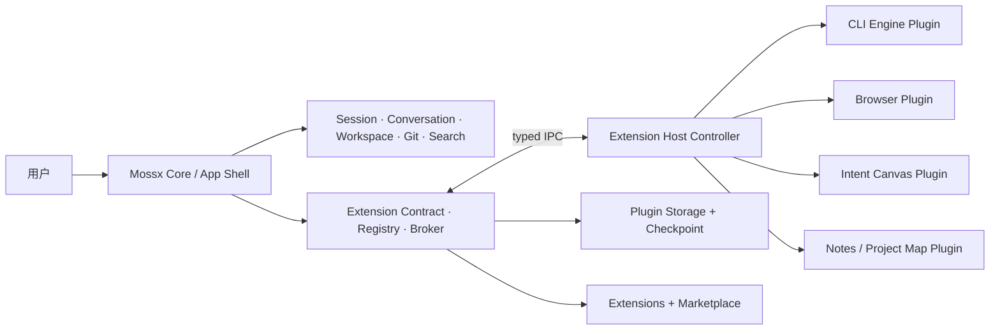

# Mossx Plugin Platform 主线设计

> **状态**：Architecture baseline + V1 Contract Freeze（2026-08-16）
> **最后更新**：2026-08-17
> **进度快照**：[`16-progress-dashboard.md`](16-progress-dashboard.md)（2026-08-17；允许线 46% / 终态 14% / 真实卸载 40%）
> **目标读者**：产品设计、平台架构、Core 开发、插件开发、Release 与安全治理
> **一句话目标**：把 Mossx 从“持续增长的桌面应用”演进成“稳定 Core + 可隔离、可撤销、可回滚的独立插件生态”。
> **实施入口**：字段级 Contract 以 [`14-v1-contract-freeze.md`](14-v1-contract-freeze.md) 为准；实现前仍按 Phase 拆小型 OpenSpec change。

## 1. 文档边界

本目录是 Mossx 插件平台的长期架构设计与任务拆分入口，负责回答：

- 最终形态是什么；
- Core 与 Plugin 的边界在哪里；
- 插件如何隔离、授权、更新、熔断和回退；
- 具体 CLI 如何全部迁出 Core；
- 独立 Git 仓库、Registry 与 Marketplace 如何协同；
- 整个平台如何按阶段实施，而不是一次性重写。

本文档不是已经交付的产品行为声明。当前实现以代码为准，行为变更实施时仍需建立对应 OpenSpec change。已有调研可参考 [`mossx-plugin-market-and-cli-foundation-design.md`](../../research/mossx-plugin-market-and-cli-foundation-design.md)。

## 2. 已确认的架构结论

以下决定已由产品与架构对话确认，后续设计不得静默推翻：

1. Mossx Core 采用 Microkernel，核心价值是“插排”和少量稳定基础部位。
2. Core 只保留 Engine Contract 与 runtime control plane，具体 CLI Engine 全部插件化。
3. 采用一个 Extension Host 控制进程，每个普通插件运行在独立 Worker。
4. 高权限 C 插件以及全部 `local` 插件升级为独立受限进程。
5. 插件信任等级为 `system / verified / local`；代码仓库位置不等于信任等级。
6. UI 采用双模式：trusted React contribution 与 declarative/sandbox UI。
7. 即使进入 trusted React 白名单，也必须有 Error Boundary、熔断、快速拔除和版本回退。
8. 每个插件拥有独立 Storage Namespace。
9. 更新前由 Core 创建 snapshot/checkpoint。
10. 普通更新必须保持数据向后兼容。
11. 破坏性 migration 必须明确提示用户。
12. 回退代码时必须同步恢复对应数据 checkpoint。
13. 插件不能直接修改其他插件或 Core 数据表。
14. 第一方插件也逐步迁移到独立 Git 仓库，通过相同 Contract 与发布链路交付。
15. 内置浏览器、意图画布、便签、项目知识地图等非核心模块逐步插件化。
16. Plugin Artifact 采用统一复合包：允许同时携带 Worker、独立 Process、UI 与 Migration 入口；插件 native code 只能作为独立 executable，禁止以动态库形式装入 Core 主进程。
17. Plugin IPC 明确分离 Control Plane 与 Data Plane：Extension Host 负责生命周期、权限、注册、generation、health 与熔断；Streaming 和大数据使用 Core 发放的 bounded data channel，不与控制消息争用同一执行路径。
18. Runtime 采用 QuickJS + Restricted Process 组合：普通 Worker Entry 运行于 Rust Extension Host 内的 per-plugin QuickJS Runtime；需要 Node/npm、CLI、native 或系统能力的逻辑进入独立受限 Process Entry，Node 不作为共享 Extension Host Runtime。
19. IPC 采用 JSON-RPC + JSON Schema Control Plane 与 binary StreamHandle Data Plane；Core↔Host 使用 Windows Named Pipe 或 macOS/Linux Unix Domain Socket，Host↔Process Control 使用 length-prefixed framed stdio。
20. 插件采用 Manifest A + Runtime Registration B：安装前由 Closed Declarative Manifest 给出可审计的最大授权包络，激活后由插件通过 SDK 动态注册实际 Contribution；运行时注册不得越过 Manifest 声明。
21. `pluginId` 采用永久不可变的 Reverse-DNS stable ID；名称、仓库和发布者展示信息与机器身份分离，官方命名空间为 `com.mossx.*`，社区可使用已验证域名或 `io.github.<owner>.*`。
22. 版本采用 Schema/Artifact/Contract 三轴：`manifestVersion` 管 Manifest Schema，`version` 使用 SemVer 标识不可变 Artifact release，`compatibility.coreApi` 声明可安装的 Mossx Plugin Contract range。
23. Artifact Entry 采用带稳定 `id` 与 `kind` discriminant 的严格列表；`worker / process / ui / migration` 使用各自 Closed Schema，Contribution 必须引用明确 Entry，禁止靠路径或加载顺序隐式绑定。
24. 插件编排采用双图模型：Manifest Physical Entry DAG 由 Core 管理 Worker/Process/UI 的启动停止与故障域；Runtime Capability Dependency Graph 由 Host/Core 根据动态 provide/require registration 管理能力可用性、撤销和重绑定。Migration 独立进入 Core-owned update transaction。
25. Runtime Capability dependency 采用 `required / deferred / optional` 三态 Readiness Contract：required 在 Core-bounded activation deadline 内必须满足；deferred 不阻塞基础激活但保留可观测 waiting/rebind；optional 缺失不形成等待或恢复义务。
26. Capability Ownership 分阶段治理：V1 只有 Core-owned `mossx.*` Platform Capability 可跨插件 provide/require，`<pluginId>.*` 默认仅同一插件 generation 内私有；V2 在 signed Contract Artifact 与 Registry governance 就绪后，再开放 Publisher-owned Capability 跨插件消费。
27. Contribution Envelope 采用 Exact Declaration + Bounded Template：稳定 UI/Command/Engine 等逐项声明；只有 Platform Catalog 明确允许 dynamic 的类型才能使用受 type、entry、key namespace、scope 与 maxInstances 限制的模板。
28. Activation Policy 采用 Declarative Activation Events + Lazy by Default：Core 从签名 Manifest 建立轻量 placeholder，普通插件只在 View/Command/Engine/Workspace 等受控事件命中时 single-flight 激活；`onStartup` 仅允许必要 system plugin 或显式白名单。

## 3. 最终形态

Core 是平台所有者，不再是所有功能代码的容器。插件通过稳定的 Contribution 注册能力，通过 Capability Broker 访问资源，通过 Core-owned lifecycle 进入或退出系统。

## 4. “热部署”的准确含义

Mossx 不使用一个模糊的“全部无重启热部署”承诺，而是区分五类动作：

| 动作 | 目标承诺 | 失败兜底 |
|---|---|---|
| 插件热启停 | 无需重启 Core，原子注册/撤销 contribution | 强杀插件故障域 |
| Worker 插件更新 | staged 新 generation，通过 health gate 后切换 | 恢复旧 Worker 与 checkpoint |
| 受限进程更新 | 启动新进程并原子切换 endpoint | 杀新进程并恢复旧进程 |
| Trusted React 更新 | dispose 旧 contribution，挂载版本化 bundle | renderer safe reload + LKG |
| Core/Contract major 更新 | 不承诺热替换 | 正常应用升级与兼容检查 |

这里真正需要保证的不是“永不重启”，而是：**故障插件能立即退出服务，影响不扩散，并恢复到 last-known-good code + data。**

## 5. 文档导航

| 文档 | 回答的问题 |
|---|---|
| [01 · Core Boundary](01-core-boundary.md) | Mossx 最终还剩什么，什么必须迁成插件？ |
| [02 · Runtime Isolation & Trust](02-runtime-isolation-and-trust.md) | Worker、受限进程、system/verified/local 怎么协作？ |
| [03 · Lifecycle, Hot Swap & Rollback](03-lifecycle-hot-swap-and-rollback.md) | 插件如何安装、激活、熔断、升级和回退？ |
| [04 · Storage, Migration & Checkpoint](04-storage-migration-and-checkpoint.md) | 数据如何隔离，更新和回退如何不损坏数据？ |
| [05 · UI Contribution Runtime](05-ui-contribution-runtime.md) | React 插件与 sandbox UI 如何动态注册且可拔除？ |
| [06 · Engine Plugin Contract](06-engine-plugin-contract.md) | Core 只保留 Engine Contract 后，CLI 怎么接入？ |
| [07 · Repository, Distribution & Marketplace](07-repository-distribution-marketplace.md) | 独立仓库、签名、Registry、Marketplace 怎么串起来？ |
| [08 · Migration Roadmap & Tasks](08-migration-roadmap-and-tasks.md) | 如何按阶段实施、验收和回退？ |
| [09 · Decision Log](09-decision-log.md) | 哪些已经确认，哪些还需要继续讨论？ |
| [10 · IPC Transport & Wire Protocol](10-ipc-transport-and-wire-protocol.md) | Control/Data 分离后，JSON-RPC、Named Pipe/UDS、stdio 与 StreamHandle 如何组合？ |
| [11 · Manifest & Runtime Registration](11-manifest-and-runtime-registration.md) | 如何同时获得安装前可审计性与运行时动态扩展能力？ |
| [12 · Open Decisions & DeepSeek Comparison](12-open-decisions-and-deepseek-comparison.md) | 18 个决策包的取证协议、DeepSeek 证据与确认记录 |
| [13 · Core Shell Subtraction Implementation](13-core-shell-subtraction-implementation.md) | 0.8.9 减法阶段实际删除了什么、保留了什么，数据与冷启动如何保护？ |
| [14 · V1 Contract Freeze](14-v1-contract-freeze.md) | 18 个 Decision Package 冻结后的可实施字段、数值、Catalog 与样例 |
| [15 · Implementation Wave Plan](15-implementation-wave-plan.md) | 当前工作树怎么开工：先插排、再一根根拔、瘦身跟插头走 |
| [16 · Progress Dashboard](16-progress-dashboard.md) | 允许线 / 终态 / 真实卸载三把尺子；插头九步与 08 Phase 对照 |
| [Client Modernization 综合改善](../client-modernization/README.md) | 插件性能、冷启动、对话式安装、Developer Platform 与 W0-W12 如何协同？ |

## 6. 双写协议

从本架构主线建立开始，后续讨论按以下方式同步：

1. 幕布先给出本轮结论、理由和影响。
2. 已确认结论同步写入对应设计分册与 [`09-decision-log.md`](09-decision-log.md)。
3. 未确认内容只能进入 Open Questions，不得伪装成架构决定。
4. 设计变化影响开发范围时，同步更新 [`08-migration-roadmap-and-tasks.md`](08-migration-roadmap-and-tasks.md)。
5. 真正开始实现某个阶段前，再建立小而独立的 OpenSpec change；不把本设计直接当成已实现行为。
6. 未决架构项统一进入 [`12-open-decisions-and-deepseek-comparison.md`](12-open-decisions-and-deepseek-comparison.md)；固定执行“DeepSeek 源码事实 → Mossx 边界对比 → 推荐 → 用户确认 → 落盘”，没有源码证据时不得声称已经完成 DeepSeek 对比。
7. 2026-08-16 起，V1 字段、Catalog、数值与 fail-closed 规则以 [`14-v1-contract-freeze.md`](14-v1-contract-freeze.md) 为单一事实源。专项分册解释动机与不变量，冲突时以 14 为准。新证据若推翻冻结项，必须新增 superseding Decision，禁止静默改数字。

## 7. 架构不变量

1. **Core owns contracts; plugins own features.**
2. Control plane 与 execution plane 必须分离。
3. Trust tier、artifact source、runtime placement 必须正交。
4. 每个 contribution 必须 disposable 且绑定 plugin generation。
5. 每个高权限操作必须经过 Capability Broker。
6. 每个插件必须拥有独立 Storage Namespace。
7. 更新和回退必须把代码与数据视为同一事务。
8. 具体 CLI 实现不得重新进入 Core。
9. 独立仓库不得绕过签名、兼容性和权限审核。
10. 无法安全停止的插件不得成为动态安装插件。
11. Agent 只能提议结构化 InstallPlan，不能绕过 Policy/Consent/Install Manager。
12. Marketplace/Registry 与普通插件 activation 不得成为 Core first-interactive 依赖。
13. Plugin Artifact 可以组合多个入口，但每个入口仍按声明的 placement、trust policy 与独立 lifecycle 管理。
14. Data Plane 不能绕过 Capability Broker；任何 channel 都必须绑定 plugin identity、generation、scope、quota 与 revocation lifecycle。
15. QuickJS Worker 默认没有 filesystem/network/process/environment/Node builtin；Node 生态兼容性通过 Restricted Process Entry 提供，不能以便利为由扩大普通 Worker authority。
16. Control message 必须 schema-versioned 且 length-prefixed；bulk payload 必须退出 JSON-RPC，进入可撤销、可背压的 Data Channel。
17. Manifest 是安装前的最大授权包络，Runtime Registration 是当前 generation 的实际贡献集合；动态注册只能收窄或实现声明，不能静默扩权。
18. `pluginId` 一经发布不可因 display name、仓库迁移、publisher rename 或产品改名而变化；Storage、permission、lockfile 和 generation identity 均以该稳定 ID 为根。
19. 同一 `pluginId + version` 只能解析为一个 immutable artifact hash；Manifest Schema、插件 release 与 Core Contract compatibility 不得共用同一版本轴。
20. 每个 Entry 必须有 artifact 内唯一、版本内稳定的 `entryId`；Entry lifecycle、placement、health、日志和故障归因不得只绑定文件路径。
21. Physical Entry DAG 决定“执行单元能否存在”，Runtime Capability Graph 决定“Contribution 当前能否可见”；逻辑能力变化不得隐式 spawn Entry、改变 placement 或绕过 Physical DAG。
22. required capability 不能永久静默 `PENDING`；activation deadline 必须由 Core Policy 给出默认值和硬上限，插件不能请求无限等待或自行把 timeout 当作成功。
23. 未经 Catalog/Registry 授权，插件不能占用 `mossx.*`、导出全局 Capability 或让另一插件消费自己的 private Capability；Capability identity、Contract version 与 schema hash 必须共同参与校验。
24. Runtime Contribution 必须匹配唯一的 exact declaration 或 bounded template；模板不能成为任意 ID、无限实例、Trusted React bundle 或新的 Capability/permission 的通配授权。
25. Core first-interactive 不得等待普通插件、Marketplace 或 Registry；lazy placeholder 只能来自已验证的本地 Manifest/lockfile metadata，不能通过执行插件代码计算 activation event。
26. 推荐方案不等于架构决定；未决项必须完成源码证据、边界对比和用户确认后，才能写入 confirmed Decision 与 Contract 正文。

> 🛠 **深度推演**：插件平台最危险的反模式不是“插件不够多”，而是 Core 表面上提供插件 API，实际仍由插件直接共享 renderer、数据库和全局状态。那只是动态模块，不是可治理的平台。本设计用进程边界、Capability Broker、数据 checkpoint 和 disposable contribution 把“可插拔”变成可验证能力。
